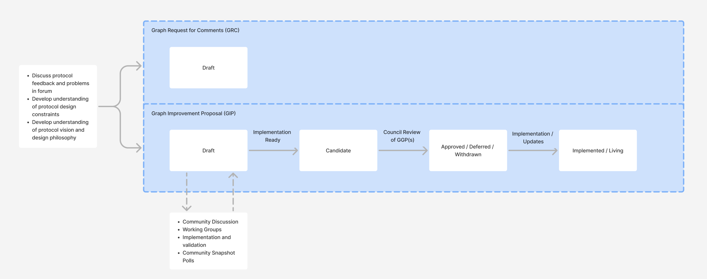
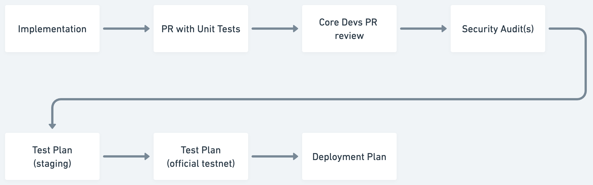

# Abstract

This proposal describes the Graph Improvement Proposal (GIP) process. A GIP, depending on its type, describes a proposed improvement to processes, economics, technical implementations, functionality, or community standards relevant to The Graph's protocol and community. The GIP process is intended to be light-weight and specify how any contributor can champion a proposal through a community review process that builds legitimacy and support for some change in the protocol.

# Motivation

The Graph is currently governed by a decentralized Graph Council that is representative of key stakeholder groups in The Graph community. The GIP process not only defines a way for contributors to champion some idea for the protocol but gives Graph Council members a way to gauge the viability and community support for improvements to the protocol. As The Graph's decentralized governance evolves, some of the community polling described in this proposal can act as a prototype for what a future version of The Graph's governance might look like.

Having clearly defined standards around proposals that are tracked in a version-controlled repo, along with references to common metadata such as reference implementations and dependencies, also makes it easier for implementers and the broader community to track the progress of proposed improvements to the protocol.

# Prior Art

We reviewed the processes surrounding Synthetix Improvement Proposals (SIPs), LivePeer Improvement Proposals (LIPs), Ethereum Improvement Proposals (EIPs), Bitcoin Improvement Proposals (BIPs), Python Enhancement Proposals (PEPs), and Javascript's TC39.

This proposal was heavily inspired by those processes and borrows similar language in numerous places.

# High-Level Process

The GIP process includes both the stages and acceptance criteria that a proposal hits as it is fleshed out in this repo, as well as a meta-process that takes place before, during, and after a GIP is written in order to build credibility and community consensus behind an idea.

The high-level process is captured in the diagram below.

## Before a proposal is written

The author(s) should do the leg work to assess whether their idea is a good one that is likely to be supported by the community. This includes discussing the idea in public spaces such as [Discord](https://discord.gg/graphprotocol), [Twitter](https://twitter.com/graphprotocol), and [The Graph forum](https://forum.thegraph.com/).

The author should also make sure the proposal is in line with the values and mission of The Graph. This may include reading past blog posts that allude to The Graph's design philosophy as well as talking to existing contributors to The Graph.

Talking to active contributors of The Graph's various software repositories is also a good strategy to discern early on whether such an idea has already been considered in the past as well as its technical feasibility.

All this being said, authors are welcome to post an initial draft of a GIP that just includes Abstract and Motivation, and use the forum discussion as a way to refine the proposal to flesh out the specification.

## Writing a proposal

There are two primary types of documents that are tracked in this repo. These are tracked in separate folders with their own numbering:

- **Graph Improvement Proposals (GIPs).** Describes some improvement to the protocol rules, interfaces, software functionality, protocol charters, protocol parameters, processes, etc.
- **Graph Requests for Comment (GRCs)** Specifies an application-level community standard. For example, this could be a common way of designing subgraphs for specific use cases or to support better composability between applications.

Depending on the type of proposal, they will move through the following stages, as indicated by the diagram up above:

1. **Draft.** Day 0 through to Candidate stage
2. **Candidate.** The Author may move their GIP to the candidate stage in Github to indicate to the Council and to the public that they believe enough support has been gathered from the community and sufficient due diligence has been completed for the Council to make a decision for approval. A minimum of 1 week draft on forum for public review is required.
3. **Approved | Deferred | Withdrawn | Implemented | Living.** These are resolution stages for a proposal:
    1. "Approved" Council approval has been obtained for the GIP
    2. "Deferred" The GIP is on hold or otherwise working through remediations to obtain Council approval
    3. "Withdrawn" The submission was withdrawn by the Author or was withdrawn due to Inactivity. If more than 6 months have elapsed with no activity editors may move the status of a GIP to withdrawn. Authors may still          contact editors to re-activate their proposal if the Author would still like to proceed with their submission at a later date.
    4. "Implemented" Indicates that a GIP has either been deployed in the case of a code change or is in use today for procedure changes or other non-code based changes.
    5. "Living" proposals are documents that are never in a finalized state, but rather are actively changing in response to feedback and community input. This proposal is such an example.

The above describes the stages that all GIPs may move through. GRCs, on the other hand, always stay on "Draft" stage, as their intent is not to be accepted by governance or community consensus, but act as a document that is well thought-out and can be easily referenced, discussed, and used by the rest of the community.

## While a proposal is being worked on

The author should take strides to solicit insights from as many protocol contributors and community members as possible to produce a proposal that best serves the entire protocol. Activities an author may participate in during this time, include, but are not limited to:

- Evangelizing their proposal in the forums.
- Present at Indexer Office Hours, Core Dev Calls, and other community calls and receive feedback from community.
- Form working groups with other community members interested in a similar idea.
- Advocate for community polls, Council votes on the proposal when it is sufficiently mature.
- Develop the implementation of the proposal, get security audits (potentially with support from The Graph Foundation), or request participation from Core Devs in the implementation.

The sections below elaborate more on these activities and the steps to get a GIP accepted after it's published.

# Anatomy of a GIP

The GIP structure is intended to be flexible enough to describe a variety of categories of proposals. Rather than be overly prescriptive, we encourage authors to choose a document structure that best conveys their ideas.

The only required parts are the *front matter—* which includes metadata such as the author's name, the date the protocol was created, and the stage the proposal is at—and the "Abstract" and "Motivation" sections of the body of the proposal.

A template has been added to this repo called "0000-template.md" which provides additional detail on these sections and should be kept up to date with the latest process as described in this proposal.

# Editors

Editors are the maintainers of this repo and the managers of this process. As the name implies, their role is purely editorial, and they should advance proposals to stages on the basis of whether specific criteria have been met, rather than based on the likelihood for the proposal to be included in the protocol.

Editors do not play a role in decentralized governance, but rather lend their expertise to help proposals get written that are clear, concise, and advocate effectively for their respective ideas.

The Editors' role is not to act as gatekeepers, so proposals can advance up to being accepted by the Council even in case of Editor inactivity.

The current GIP editors are:

- Michael Macaulay
- Pedro Diogo

Over time, as more community members build deep familiarity with the protocol design and associated software, more editors can be added to this list.

# Submitting a Proposal

The GIPs repository is [hosted on GitHub](https://github.com/graphprotocol/graph-improvement-proposals).

Proposals can be submitted by forking the repository and creating a Pull Request to include the proposal in Markdown format, following the GIP-0000 template.

Discussions around proposals should be directed to the [GIPs and Governance](https://forum.thegraph.com/c/governance-gips/) category of The Graph's forum.

**To avoid conflicts in GIP numbers, proposals should be posted as a Pull Request on GitHub with a GIP number _before_ being posted to the forum**.

After creating the Pull Request, post a thread in the GIPs and Governance category with a link to the Pull Request. The post should have the same title as the GIP, and include the Abstract and Motivation sections but linking to GitHub for the full GIP text. (Older GIPs may include the full proposal text in the forum post, but this is now discouraged as it is hard to keep the forum and GitHub versions in sync).

Editors will merge the PR into the main branch of the repo when it meets acceptance criteria, but the PR being merged is not a prerequisite for the community to discuss the GIP, or even for it to be implemented, accepted by the Council and deployed.

After opening the Pull Request and posting on the forum, your proposal should be updated to have the URL of the forum thread in the "Discussions To" field of your proposal front matter. In this way, anyone viewing the proposal can find the conversation where a given proposal was discussed.

## Choosing a GIP number

Authors may attempt to self-assign the next available GIP number when submitting the Pull Request to the GitHub repo and before posting to the forum. When doing so, they should ensure:
- That the GIP number is not used in an existing GIP in the repo, and
- That the GIP number is not used in an open Pull Request in the repo.

When creating the Pull Request, the title of the Pull Request should begin with the full GIP number (e.g. "GIP-0000"), to make it easier for other contributors to know that the number is taken.

In case of conflicts, Editors may change the number for a GIP or ask the authors to change it, both in the repo and the forum post.

If they prefer, authors may also ask the Editors to assign a number rather than self-assigning.

# After submitting a proposal

Publishing a GIP does not guarantee inclusion in the protocol. Protocol upgrades are implemented via decentralized governance, while the GIP Process is geared towards surfacing and building legitimacy for valuable protocol upgrades that can be considered in that process. Multiple GIPs may be bundled together into a release and be voted on as a single Graph Governance Proposal (GGP - more on this [below](#getting-a-proposal-accepted-by-the-council)).

GGPs may also include protocol upgrades that did not go through the GIP Process, such as bugs that were reported as responsible security disclosures, or enhancements that were too minor to justify a full-fledged GIP.

Once a GIP is published on the GitHub repo and the forum, some time should be left for the community to discuss. Some more complex or controversial proposals may require more time and discussion, while others that are more straightforward may be accepted more quickly, always at the Council's discretion.

After publishing, the authors are encouraged to present the GIPs in one or many of the relevant community calls, for instance, Indexer Office Hours that happen weekly on Discord, or the monthly core developer calls. To request a speaking slot in one of these calls, you can use [this form](https://thegraph.typeform.com/to/UIKoy6ys) to get in touch with organizers from core dev teams and The Graph Foundation.

# Implementing a proposal

Proposal authors are welcome to begin implementing the changes needed for a proposal at any time before or after submitting the proposal. They do so at their own risk, as there is no guarantee that the community and the Council will move forward with the proposal.

If the author is unable to do the implementation of a GIP, and would like instead for core developers to implement it, this should be expressed in the GIP or the forum discussion, and the author may use [this form](https://thegraph.typeform.com/to/UIKoy6ys) to request core devs for help implementing a GIP. The author may need to present evidence of community support for the proposal, and core devs' may accept or reject the request at their discretion.

## Proposals requiring off-chain software changes

For proposals requiring changes in the behavior of off-chain components (e.g. Graph Node, Indexer Agent, Indexer Service), changes must be made as Pull Requests to the corresponding repositories (generally under the [graphprotocol org on GitHub](https://github.com/graphprotocol)). Authors are encouraged to collaborate with core developers (and if necessary, the Technical Advisory Board), to ensure the changes meet the quality criteria for each repository. These changes generally do not require explicit Council approval, unless the behavior of the components changes in a way that requires changes to the [Feature Matrix](https://github.com/graphprotocol/indexer/blob/main/docs/feature-support-matrix.md) or the [Arbitration Charter](./0009-arbitration-charter.md). In particular, Graph Node versions are approved through a GGP.

If needed, a GIP could propose adoption of a new repository or package, in which case this should be mentioned in the proposal.

## Proposals requiring smart contract changes

For proposals that involve changes to protocol smart contracts, the authors are encouraged to work with core devs and the Technical Advisory Board to define a comprehensive plan to ensure the quality and security of the changes. The precise requirements will vary with the complexity of the changes, but generally, authors can expect the following process:

- **Pull request QA**: Core devs will review pull requests to the contracts repositories and may leave comments to note issues or improve code quality. Authors are encouraged to address these comments to get the code ready for audit. The protocol contracts keep a high standard of quality, including unit test coverage for most of the code, extensive NatSpec comments, and attempting to follow Solidity best practices as much as possible.
- **Audit**: Most changes will require an audit with a vetted auditor. Previous protocol audits have been performed with OpenZeppelin, Consensys Dilligence, Trust Security and 0xMacro. Audit contests in Code4rena have also been used in the past. Other audit firms may be accepted at the discretion of the Technical Advisory Board and Council. Authors can pay for audits at their own expense and risk, or request an audit slot from the Foundation using [this form](https://thegraph.typeform.com/to/UIKoy6ys). Depending on the complexity, some proposals might require more than one audit. The version of the code that is deployed must match the audited commit; any changes must be re-reviewed by the auditors, with few exceptions (for instance, changing event parameters).
- **Test Plan**: Besides unit tests, contract changes must be tested on a testnet. Often, the process involves testing on a "staging" testnet deployment, before deploying to the official testnet once the Council has given a clear signal that the GIP is close to approval. Authors are welcome to write automated scripts to execute the tests on a testnet, but it is generally accepted to document manual testing steps on a spreadsheet or Notion document (a "Test Plan"), and record the results and transaction hashes. The Test Plan should generally cover the main changes from the proposal and the most relevant edge cases. The authors are welcome to collaborate with core devs and the Technical Advisory Board in drafting this plan, and may request help from core devs in running it.
- **Deployment Plan**: Updates to protocol contracts are generally a multi-step process. To reduce the probability of human error, authors and/or core devs must develop a "Deployment Plan", i.e. a document (generally a spreadsheet or Notion page)  specifying the transactions that must be run, and any relevant off-chain actions that must be taken to deploy the GIP. Council transactions that can be batched together must be identified as such.

The following flowchart illustrates the usual process, though some of the steps could run in parallel, in different order, or be skipped, depending on the GIP and its complexity:

# Getting a proposal accepted by the Council

After the author has followed the process described above, the proposal has been discussed in relevant calls, and the changes have met the requirements to be ready for deployment, the proposal can advance to the Candidate stage. At this point, the author can request the Council to discuss the proposal for acceptance by filling in [this form](https://thegraph.typeform.com/to/UIKoy6ys) . The Council may rely on the Technical Advisory Board to filter these requests and validate that changes are really ready for deployment, and may invite the authors to a Council meeting to present the proposal. The Council may also request a community Snapshot vote (at this stage, or any earlier stage in the process) to gauge community consensus before making a decision.

To accept a proposal, the Council will use a Graph Governance Proposal or GGP. GGPs are executed through a vote on [Snapshot](https://snapshot.org/#/council.graphprotocol.eth) were each Council member can vote, and 6 positive votes mean that a proposal was Accepted.

Once a proposal has been Accepted, the authors, core devs and Technical Advisory Board can work together with the Council to execute the Deployment Plan (if it's a smart contracts change) or any other changes needed to deploy the proposal.

# Copyright Waiver

Copyright and related rights waived via [CC0](https://creativecommons.org/publicdomain/zero/1.0/).
