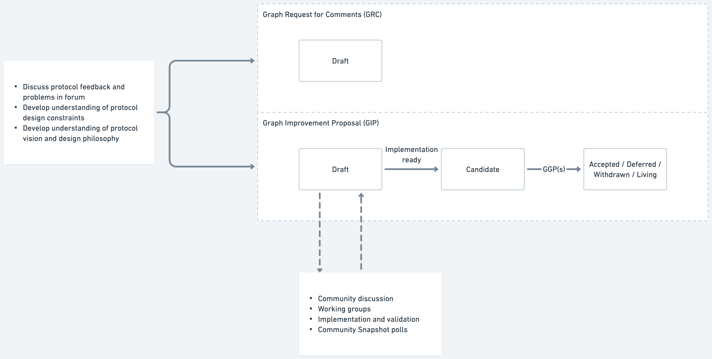

# Abstract

This proposal describes the Graph Improvement Proposal (GIP) process. A GIP, depending on its type, describes a proposed improvement to processes, economics, technical implementations, functionality, or community standards relevant to The Graph's protocol and community. The GIP process is intended to be light-weight and specify how any contributor can champion a proposal through a community review process that builds legitimacy and support for some change in the protocol.

# Motivation

The Graph is currently governed by a decentralized Graph Council that is representative of key stakeholder groups in The Graph community. The GIP process not only defines a way for contributors to champion some idea for the protocol but gives Graph Council members a way to gauge the viability and community support for improvements to the protocol. As The Graph's decentralized governance evolves, some of the community polling described in this proposal can act as a prototype for what a future version of The Graph's governance might look like.

Having clearly defined standards around proposals that are tracked in a version-controlled repo, along with references to common metadata such as reference implementations and dependencies, also makes it easier for implementers and the broader community to track the progress of proposed improvements to the protocol.

# Prior Art

We reviewed the processes surrounding Synthetix Improvement Proposals (SIPs), LivePeer Improvement Proposals (LIPs), Ethereum Improvement Proposals (EIPs), Bitcoin Improvement Proposals (BIPs), Python Enhancement Proposals (PEPs), and Javascript's TC39.

This proposal was heavily inspired by those processes and borrows similar language in numerous places.

# High-Level Process

The GIP process includes both the stages and acceptance criteria that a proposal hits as it is fleshed out in this repo, as well as a meta-process that takes place before, during, and after a GIP is written in order to build credibility and community consensus behind an idea.

The high-level process is captured in the diagram below.

## Before a proposal is written

The author(s) should do the leg work to assess whether their idea is a good one that is likely to be supported by the community. This includes discussing the idea in public formus such as Discourse, Discord and Twitter.

The author should also make sure the proposal is in line with the values and mission of The Graph. This may include reading past blog posts that allude to The Graph's design philosophy as well as talking to existing contributors to The Graph.

Talking to active contributors of The Graph's various software repositories is also a good strategy to discern early on whether such an idea has already been considered in the past as well as its technical feasibility.

## Writing a proposal

There are three primary types of documents that are tracked in this repo. These are tracked in separate folders with their own numbering:

- **Graph Improvement Proposals (GIPs).** Describes some improvement to the protocol rules, interfaces, software functionality, protocol charters, protocol parameters, processes, etc.
- **Graph Requests for Proposals (GRPs)** Formalizes a problem or opportunity for the protocol to address without putting forth a specific solution.
- **Graph Requests for Comment (GRCs)** Specifies an application-level community standard. For example, this could be a common way of designing subgraphs for specific use cases or to support better composability between applications.

Depending on the type of proposal, they will move through the following stages, as indicated by the diagram up above:

1. **Strawperson.** A proposal at this stage describes an idea or problem that the proposal aims to solve but doesn't expand too much on the specifics of a solution. In terms of the document sections outlined below, a proposal at this stage would have a well-defined "Abstract" and "Motivation" and optionally a rough draft of a "High-Level Description.".
2. **Proposal.** Describes how a proposal works at a high level, without getting too in the weeds with specific APIs and technical implementation details. Sections relevant to this stage might include a more well-developed "High-Level Description", "Prior Art," "Dependencies," "Backwards Compatibility", etc.
3. **Draft.** This is a detailed technical specifical of a proposal. It includes specific API changes, implementation details, architecture, etc. Relevant document sections might include "Detailed Specification", "Risks and Security Considerations," "Validation," "Rationale and Alternatives".
4. **Candidate.** A proposal at this stage has a reference implemenetation that has been linked in the document and can be used to validate the idea described in the protocol.
5. **Accepted | Deferred | Withdrawn | Living.** These are resolution stages for a proposal:
    1. "Accepted" indicates that the proposal has been adopted. For GIPs this would typically mean a protocol upgrade initiated by The Graph Council, but for process changes, it could simply represent a rough consensus of the community.
    2. "Deferred" changes have been voted on at least once as protocol upgrades and have been rejected. Deferred proposals may be included in future governance votes.
    3. "Withdrawn" proposals have been withdrawn by the creator either because they have been superseded by another proposal or are no longer relevant for another reason.
    4. "Living" proposals are documents that are never in a finalized state, but rather are actively changing in response to feedback and community input. This proposal is such an example.

The above describes the stages that all GIPs may move through. GRPs and GRCs, on the other hand, only advance to the "Draft" stage, as their intent is not to be accepted by governance or community consensus, but act as a document that is well thought-out and can be easily referenced, discussed, and used by the rest of the community.

## While a proposal is being worked on

The author should take strides to solicit insights from as many protocol contributors and community members as possible to produce a proposal that best serves the entire protocol. Activities an author may participate in during this time, include, but are not limited to:

- Evangelizing their proposal in the forums.
- Present at Protocol Townhalls and other community calls and receive feedback from community.
- Form working groups with other community members interested in a similar idea.
- Advocate for community polls on the proposal when it is sufficiently mature.

## After a proposal is worked on.

Advancing through the stages of the GIP Process does not guarantee inclusion in the protocol. Protocol upgrades are implemented via decentralized governance, while the GIP Process is geared towards surfacing and building legitimacy for valuable protocol upgrades that can be considered in that process. Multiple GIPs may be bundled together into a release and be voted on as a single Graph Governance Proposal (GGP).

GGPs may also include protocol upgrades that did not go through the GIP Process, such as bugs that were reported as responsible security disclosures, or enhancements that were too minor to justify a full-fledged GIP.

# Anatomy of a GIP

The GIP structure is intended to be flexible enough to describe a variety of categories of proposals. Rather than be overly prescriptive, we encourage authors to choose a document structure that best conveys their ideas.

The only requires parts are the *front matter—*which includes metadata such as the author's name, the date the protocol was created, and the stage the proposal is at—and the "Abstract" and "Motivation" sections of the body of the proposal.

A template has been added to this repo called "0000-Template.md" which provides additional detail on these sections and should be kept up to date with the latest process as described in this proposal.

# Editors

Editors are the maintainers of this repo and the managers of this process. As the name implies, their role is purely editorial, and they should advance proposals to stages on the basis of how well they have been constructed per the guidance in this proposal, rather than based on the likelihood for the proposal to be included in the protocol.

Editors do not play a role in decentralized governance, but rather lend their expertise to help proposals get written that are clear, concise, and advocate effectively for their respective ideas.

The current GIP editors are:

- Ariel Barmat
- Brandon Ramirez
- Jannis Pohlmann

Over time, as more community members build deep familiarity with the protocol design and associated software, more editors will be added to this list.

# Submitting a Proposal

The GIPs repository is hosted on [Radicle](https://radicle.xyz/), a crypto-native decentralized alternative to Github. Currently, Radicle does not support an issue or Pull Request workflow, although this is being worked on.

In the meantime, all discussions around proposals should be directed to the [GIPs and Governance](https://forum.thegraph.com/c/governance-gips/) category of The Graph's Discourse forum. Post a thread in there that includes the Radicle ID of your copy of the repo, along with the proposal title, and the branch that the proposal can be found on.

In this way, editors will be able to merge your changes into their repos once the proposals meet the respective acceptance criteria and request changes to you via Discourse.

Finally, your proposal should have the URL of the forum thread in the "Discussions To" field of your proposal front matter. In this way, anyone viewing the proposal can find the conversation where a given proposal was discussed.

# Copyright Waiver

Copyright and related rights waived via [CC0](https://creativecommons.org/publicdomain/zero/1.0/).
