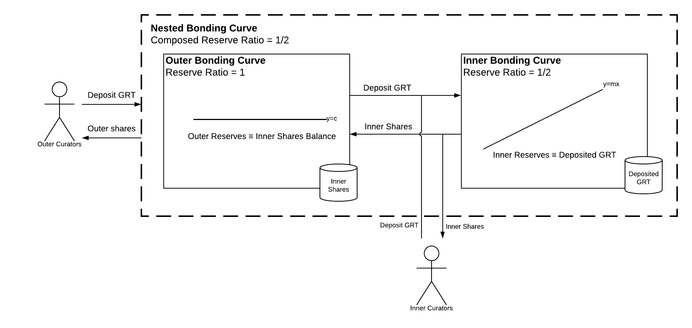
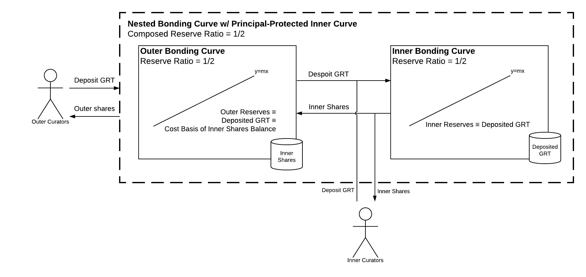

# Abstract

*We introduce **principal-protected bonding curves**, a new bonding curve construction in which shares are minted proportional to reserves deposited, using the Bancor formula[^1], but when burning shares, a user is guaranteed to be able to withdraw the amount they had deposited for those shares. In other words, the user of such a bonding curve incurs no principal risk.*

*We propose replacing the bonding curves currently used for subgraph deployments with principal-protected bonding curves. We additionally propose modifying the bonding curves in the **Graph Name Service (GNS)**, to compose with principial-protected bonding curves in a nested bonding curve design, without introducing adverse incentives. Minting shares at the GNS-level will continue to carry principal-risk.*

*Curation royalties will continue to be distributed proportional to ownership of curation shares, preserving the dynamic where being earlier to mint shares on a bonding curve, either at the GNS or subgraph deployment level, is still rewarded relative to minting later.*

# Background
The Graph's curation market is designed to elicit a market signal that acts as a proxy for demand for Indexer services on subgraphs that have been deployed to the network. This signal is used to direct indexing rewards to the subgraphs where there is a greater demand for Indexer service.

The curation market consists of Curators minting shares, also known as signaling, on bonding curves of one or more subgraphs, which entitles them to a royalty on future query fees generated by the respective subgraphs. There are two primary reasons for signaling on a subgraph:
1. A financially motivated Curator signals on a subgraph because they believe the present value (PV) of future curator royalties they will be entitled to is greater than the cost of minting shares.
2. A decentralized application (dapp) developer signals on a subgraph in order to bootstrap Indexer services on the subgraph to power their application.

The Graph's curation market uses a *nested bonding curve* design, as depicted above, where Curators may signal directly on an inner bonding curve representing a subgraph deployment or an outer bonding curve representing a subgraph that can have its version updated with new subgraph deployments while maintaining the same outer bonding curve state.

# Motivation
The current bonding curve design presents a number of challenges to dapp developers acting as Curators:

First is that they lead to unpredictable costs for using The Graph as a subgraph developer. Signaling on a subgraph today carries principal risk, which means that the subgraph developer that is simply interested in having their subgraph indexed may be required to put capital at risk in order to use the network. Principal-protection makes the costs of using the network much more predictable and unaffected by volatile curation market dynamics.

Furthermore, signaling enough to attract Indexers to a subgraph often implies a large outlay of financial capital for developers, many of which are independent or members of startups that do not have large amounts of excess capital on hand. Principal-protection enables third parties to rent signal to a subgraph developer at a nominal rate, providing a more familiar billing experience similar to software-as-a-service (SaaS) monthly or annual subscriptions.

Additionally, the current protocol design presents a broader problem to all Curators, namely that bonding curves are sensitive to initialization and decomissioning conditions. This is specifically a detriment to subgraph deployment bonding curves as these are replaced each time a subgraph is upgraded, which could happen as frequently as once every few days or weeks.

For example, when a subgraph is upgraded, it is in the best interest of all Curators on the current subgraph deployment to exit the bonding curve as quickly as possible, securing a higher price than other Curators exiting the curve. Because bonding curves are typically specified with a reserve ratio less than one, the incentives are similar to a run on a bank that doesn't have cash reserves backing all deposits. 

Similarly, when a new subgraph deployment bonding curve is deployed, it is in the best interest of Curators to mint shares before all other Curators, so-called "apeing in", in order to secure the lowest possible purchase price.

These problems are less pronounced for bonding curves at the GNS level becuse these are intended to be long-lived, on the order of years. For subgraph deployment bonding curves, principal-protection prevents perverse incentives from bonding curve initialization or decomissioning because there are no capital gains or losses possible at the expense of other Curators.

# Prior Art
Shares in a principal-protected bonding curve bear similarities to principal-protected notes (PPNs)[^2], which are investment contracts in which one is guaranteed to recover at least the amount invested plus fixed or variable gain.

# High-Level Description

## Principal-Protected Bonding Curves for Subgraph Deployments
Principcal-protected bonding curves mint shares according to the Bancor formula, which specifies an invariant that keeps the ratio $\frac{reserves}{price \cdot shares}$ constant for the bonding curve, where $reserves$ are the amount of GRT that have been deposited into the curve, $shares$ are the amount of shares that have been minted, and $price$ is the current price per share.

Principal-protected bonding curves compute reserves to withdraw based on the average cost basis of the shares being burned. This requires additional bookkeeping to track the average cost basis of any balance of shares that are minted by the bonding curve. When two balances are combined, for example, by transfering some amount of shares to an account that already has a balance of shares, the new balance must have an average cost basis that is a value-weighted average of the two previous balances.

This also implies that bonding curve shares are no longer completely fungible; while each share is entitled to an equal portion of Curator royalties, they are potentitally entitled to different amount of reserves to withdraw upon burning, due to differences in average cost basis.

## Modified GNS-level Bonding Curves for Subgraphs
### Average Cost-Basis Aware Bonding Curves
The non-fungibility of principal-protected bonding curve shares requires special considerations when designing any kind of secondary market, automated market maker (AMM) or pooled funds that accept such shares. To illustrate, consider two liquidity providers (LPs), Alice and Bob, depositing the same amount of shares, with cost bases of $a$ and $b$, respectively, where $a<b$. The average cost basis of shares in the liquidity pool will be $(a+b)/2$. If Alice is allowed to immediately withdraw the same amount of shares that she put in, then she will inherit this new average cost basis. If she then burns these shares, then she will realize an immediate capital gain of $(b-a)/2$, at the expense of Bob, despite no material change in the underlying value of shares in the subgraph deployment bonding curve over that time.

The GNS-level bonding curves, which currently use shares of subgraph deployment bonding curves as reserves, would suffer from a similar problem where shares of different cost bases would be pooled together, benefiting Curators that had shares with lower cost basis and harming Curators that had higher cost basis and would have been entitled to greater levels of principal-protection.

Rather than using shares of subgraph deployment bonding curves, or *inner shares*, as reserves, GNS-level bonding curves must use the total cost basis of all inner shares as the reserve quantity to be used in the Bancor formula. Similarly, they should use the average cost basis of deposited reserves as the reserves deposited quantity in the Bancor formula.

With this new composition design, **the reserve ratio of the GNS bonding curves should be changed from $1$ (a flat curve) to $1/2$** in order to the preserve the effective composed reserve ratio that currently exist in the protocol.

### Pass-Through Principal-Protection
The design we have presented thus far would have little benefit to most dapp developers who signal via the GNS-level nested bonding curves, where shares issued are not principal-protected. Note that this is a feature, not a bug, as the lack of principal-protection at this layer allows the GNS-level bonding curves to act as secondary markets that allow financially motivated Curators to realize capital gains, which strengthens the incentive to signal towards subgraphs that they expect to exhibit high demand for queries in the future.

Subgraph developers, however, are primarily motivated by the ability to get their subgraphs indexed, and not realizing capital gains or receiving curation royalties. Therefore, the GNS must be modified such that each subgraph has an outer bonding curve, which is not principal-protected, and one or more separate balances intended for the subgraph developer to deposit and withdraw from, which *are* principal-protected. Note that this must be implemented such that any account may deposit a principal-protected balance on behalf of a subgraph at the GNS level and have those funds only be withdrawable to the same account. This will enable third party smart contracts to be implemented in the future which rent signal to subgraph developers without incurring any principal risk.

Only shares in the outer bonding curve will be entitled to curation royalties, while the principal-protected balance will neither be eligible for capital gains nor curator royalties. Importantly, both Graph Tokens (GRT) deposited into the outer bonding curve and into the principal-protected pool at the GNS level, will be signaled to the principal-protected bonding curve at the subgraph deployment level. It's specifically the principal-protection at the subgraph deployment layer which enables the GNS to implement a principal-protected pool of GRT that can also be used productively for signaling.

### Removing Subgraph Version Upgrade Restrictions
Currently, the GNS has a feature that prevents a subgraph being upgraded to a subgraph deployment whose bonding curve has already been initialized. This is a protection that helps to prevent front-running of a subgraph version upgrade. It also protects Curators on a GNS-level bonding curve from being rugpulled by the owner of a subgraph. The hypothetical attack goes as follows:

1. Curators are signaled on a subgraph.
2. Owner of the subgraph signals on a new subgraph deployment using their own tokens.
3. Owner of the subgraph upgrades the new subgraph deployment, migrating Curators signanled tokens from the previous version's subgraph deployment.
4. Owner unsignals their own tokens from the subgraph deployment

Due to the bonding curve dynamics, this effectively steals tokens from the Curators on the subgraph because there would instantly be much fewer withdrawawble tokens in reserves than what the Curators initially signaled, while the subgraph owner realizes an immediate and sizable profit. With principal-protected bonding curves, this is no longer an issue, because the Curators of a subgraph deployment are guaranteed to receive at least their cost basis back upon unsignaling.

Therefore, the protection that limits what subgraph deployments a subgraph may be upgraded to must be removed. This will enable multiple GNS-level subgraphs to have the same subgraph deployment as their current version, which is important for the reuse and composability story of The Graph.

# Technical Specification
> TODO

# Protoype and Simulation
A prototype of this proposal has been implemented alongside other bonding curve prototypes in [this notebook](https://observablehq.com/d/ee23aa407cb16c01). The notebook includes some basic scenarios highlighting how principal-protection would protect subgraph developers from behaviors like sandwich attacks at the subgraph deployment level.

The prototype also includes the modified outer curve design of a nested bonding curve where the inner curve is principal-protected.

# Validation
## Audits
In addition to the prototyping and simulation described above, the implementation of this proposal should receive external audits, given the complexity of the design and the upgrade path, as well as the large sufrace area of the protocol that this proposal touches.

## Signal Renting
We should validate that the interfaces introduced in this proposal make it possible to design an external contract that is *locked down* to only allow usage of methods of the bonding curves that offer principal protection. This will ensure the implementation is future-proofed for signal renting.

# Upgrade Path and Backwards Compatibility
As noted elsewhere in this proposal, principal-protected bonding curves are not compatible with the current GNS-level bonding curves. Furtheremore, it is impossible to upgrade existing subgraph deployment bonding curves in-place, because they would have needed to have started tracking average cost basis for shares from the moment the curves were created.

Therefore, this proposal must be implemented in such a way that leaves existing subgraph deployment bonding curves unchanged, while changing all newly created subgraph deployment bonding curves to be principal-protected.

This complicates the upgrade strategy for the GNS-level bonding curves. This requires having both the legacy and new GNS bonding curve logic living side by side, and *switching* to the new logic as soon as the subgraph is upgraded to a subgraph deployment that has a principal-protected bonding curve.

# Rationale and Alternatives
## Full Principal-Protection
An alternative design that was considered was to offer principal-protection to all Curators in the protocol, including at the GNS level. A benefit of this is that approach is that it limits the downside risk of curating at the GNS level, and also mitigates certain behaviors like sandwich attachs at the GNS level.

This alternative has two major drawbacks:
1. For Curators with a very low cost basis for shares on a subgraph that has increased in value, the rational incentive is to seek a secondary market where there is price discovery and the potential for capital gains, as opposed to simply burning shares in return for cost basis. As these secondary markets require careful understanding of principal-protected bonding curves, they are unlikely to emerge organically or possibly Curators might be encouraged to use less secure or well designed secondary markets.
2. The possibility of principal loss also implies the possibility of capital gains, which is an important incentive for financially motivated Curators that want the possibility of realizing capital gains, rather than simply signaling on a subgraph indefinitely and collecting curation royalties. This ability to profitably exit a curve also frees up capital to be used for signaling in new subgraph bonding curves.

# Future Work
## Subgraph Developer Incentives
This proposal, for the first time, makes a formal separation in the protocol economics between the subgraph developer Curator and the financially-motivated Curator roles.

In the future, this distinction could be further emphasized with additional incentives tailored to the subgraph developer, for example like a mechanism to fairly determine the split of curation royalties between the financially motivated curators and subgraph developer, rather than simply setting the latter's share of curation royalties to zero.

## Front Running Prevention
This proposal mitigates many types of adverse behavior and incentives that exist in the protocol today, but does not address all harmful behaviors that we should expect to continue at the GNS layer, such as *apeing in*, *sandiwch attacks*, or other forms of front-running.

## Signal Renting
This proposal lays the foundation for *signal renting*, the ability for subgraph developers to pay a nominal subscription fee to borrow signal for use in the protocol. The actual design and implementation of this feature is intentionally left out of scope, so that it may either be covered in a future GIP or possibly left as an exercise for third party ecosystem contributors and kept separate from the core protocol design.

# Copyright Waiver
Copyright and related rights waived via [CC0](https://creativecommons.org/publicdomain/zero/1.0/).

# Notes

[^1]: Hertzog, E.H., & Benartzi, G. (2018). Bancor Protocol Continuous Liquidity for Cryptographic Tokens through their Smart Contracts.

[^2]: Principal protected note. (2021, October 23). Retrieved March 03, 2022, from https://en.wikipedia.org/wiki/Principal_protected_note