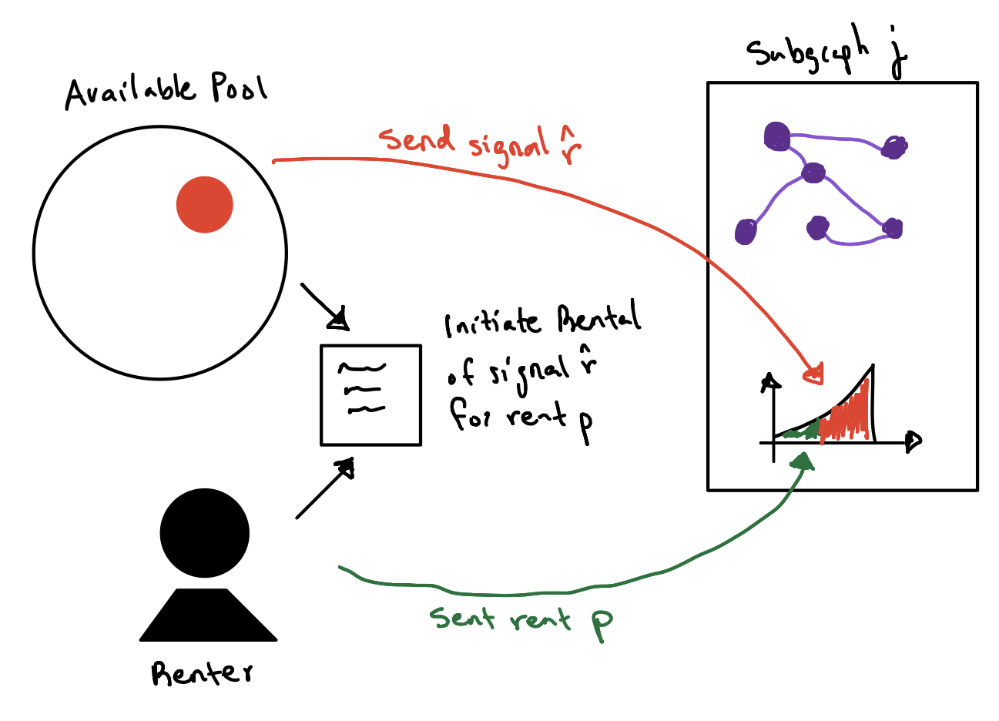
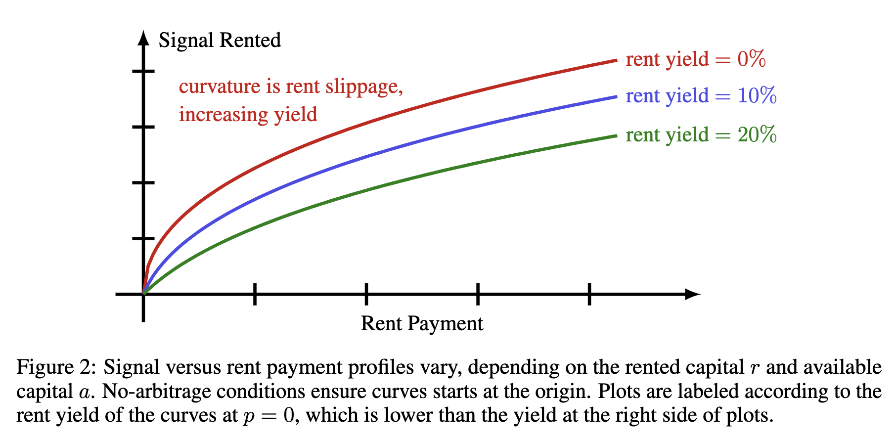
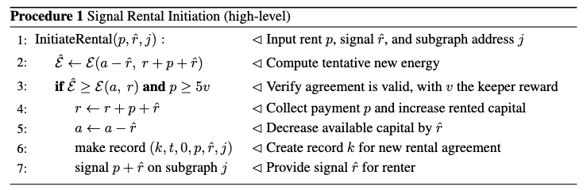
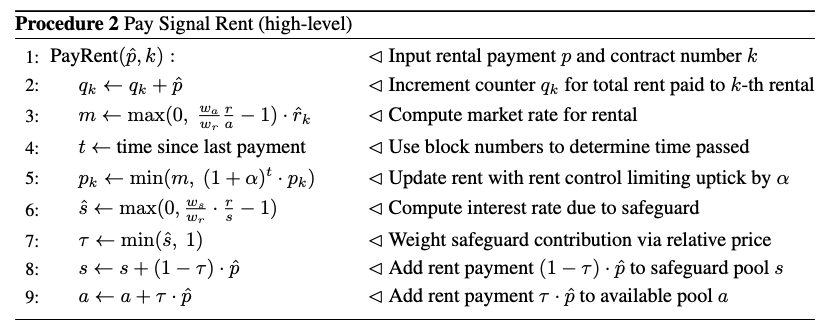
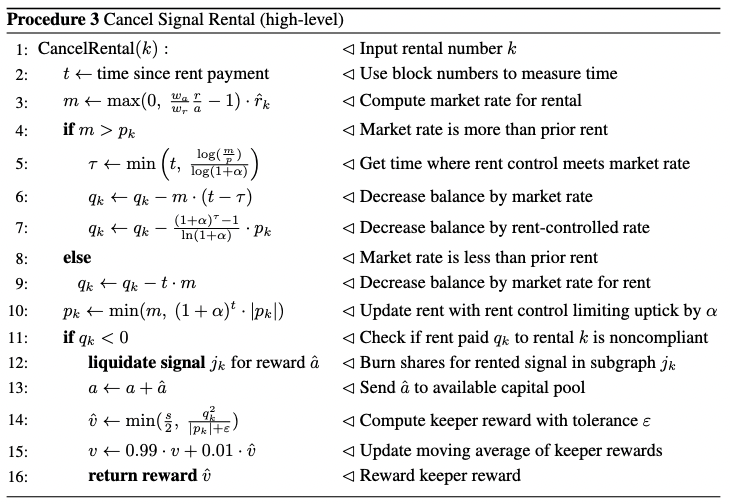

# GIP 0029 -- Signal Renting

# Abstract

We propose creation of an automated market maker (AMM) that enables curators to rent signal from a liquidity pool. Together with principal protected bonding curves, this will enable curators to efficiently boostrap signal on subgraphs of interest. Renters are incentivized by the ability to amplify signal via nominal   rent payments, and liquidity providers are rewarded by the profit rent payments provide in return for use of their capital. The proposed structure for rental agreements builds on familiar constant function market makers used in decentralized exchanges (DEXes).

# Motivation

This proposal aims to empower curators that are motivated by exogenous factors (*i.e.* dApp developers that neither seek capital gains nor curation royalties) and financially motivate liquidity providers to strengthen the level of signal in the curation space. The ability for curators to rent signal will empower   dApp developers to bootstrap getting subgraphs indexed by The Graph's APIs. This will also give the UX benefits of offering a familiar and predictable billing experience similar to SaaS products used by developers. Creating a framework for signal renting can be mutually beneficial to developers and liquidity providers and, thus, incentivize wider adoption of The Graph protocol. This provides a positive feedback loop since increasing the overall amount of signal in the network makes it more expensive to manipulate the distribution of indexing rewards for economic attacks.

# High Level Description

The Graph uses curation as an incentive mechanism (*i.e.* a cryptoeconomic primitive) to encourage network participants to identify high quality subgraphs and to foster information sharing in the ecosystem. To coordinate curation in the network and  identify quality subgraphs, The Graph forms a continuous organization (CO) for each subgraph, with ownership shares minted according to a bonding curve.  The number of shares minted on bonding curves signals to indexers which subgraphs are high quality and ought to be indexed.

We consider two archetypal curators (*i.e.* agents minting/burning shares for subgraph COs). Some agents curate solely for the reward of capital gains from bonding curves and curation royalties. Other agents curate solely to get a particular subgraph being indexed (as use of the  subgraph is relevant to the agents). We categorize curators based on motivation by exogenous or endogenous factors.
 
 * *Exo-Curators* are   motivated by external effects of a subgraph being indexed. 
 * *Endo-Curators* seek royalties and capital gains directly obtained from a CO by signaling.
 
The core idea of signal renting is to allow exo-curators to make rent payments to another entity to provide amplified signal on subgraphs. So long as the agent makes rent payments, a strong signal is ensured on their subgraph of interest and the liquidity providers obtain a satisfactory return on their provided capital (see Figure 1 for a comparison).

 
Two types of agents participate in signal renting: renters and liquidity providers. *Renters* are exo-curators seeking to boost signal to a particular subgraph via regular payments to a liquidity pool. On the other hand, *liquidity providers* provide   capital to a liquidity pool to obtain profits from curation royalties and rent payments. 

**Rental Market Maker.**  The core design of the signal renting proposal is an energy function with inputs given by the amount of capital separated between three accounts. These are the   rented capital $r$, available   capital $a$, and the safeguard capital $s$. The *rented capital* is the aggregate of all capital currently deployed in COs to provide signal for renters (*i.e.* actively rented capital). The *available capital* is what is available to renters for new rental contracts to signal on subgraphs. Lastly, *safeguard capital* is set aside and used to cover keeper rewards for agents that cancel rental agreements of nonpaying rentees. Three positive   parameters $w_a,w_r,w_s>0$ are chosen to control the relative size of each pool of capital (*i.e.* available, rent, and safeguarded, respectively). Each rental agreement must ensure nondecrease of the   energy
$$
   (\mbox{energy}) \triangleq \mathcal{E}(a,\ r)
    \triangleq  a^{w_a}\cdot r^{w_r},
$$
which coincides with a constant function market maker (CFMM) with zero transaction fees when strict equality is obtained in the valid transaction inequality. Specifically, a   contract to rent signal $\hat{r}$ for periodic rent payment $p$ is valid provided 
$$
    \mathcal{E}\left(a-\hat{r},\ r+p + \hat{r} \right)\geq \mathcal{E}\left(a,\ r \right)
$$
and the payment $p$ is more than a fixed constant $z > 1$ times the average keeper reward $k$, *i.e.* $$ p \geq  z\cdot k.$$ The rental contract is initiated by providing   payment $p$ and the gas costs to signal on the subgraph of interest. The contract remains intact until a rent payment is missed and an agent initiates a rental cancellation transaction. Once a payment is missed, agents can obtain a keeper reward (that increases linearly in time) for cancelling rental agreements. The initial payment $p$ is to the rented capital, and each payment thereafter is to the available capital   (thereby increasing $a$). The payment constraint $p \geq z\cdot k$ ensures, on average, the reward provided to agents that cancel rental agreements is less than the payment $p$ used to initiate rentals. This acts as an adaptive countermeasure to fluctuations in gas prices. 

**Rent Pricing.** The price of rent is determined implicitly by the energy definition and transaction inequality. For any rent $p > 0$, the largest rented signal $\hat{r}$ is obtained when the transaction inequality is a strict equality. Implicitly differentiating this equality reveals, for $a$ and $r$ satisfying a no arbitrage condition, the  marginal rent   relative to the signal is
$$
    (\mbox{rent yield})
    \triangleq 
    \left.\dfrac{\mathrm{d}p}{\mathrm{d}\hat{r}}\right|_{p=0}
    =  \dfrac{w_a}{w_r}\cdot \dfrac{r}{a} - 1, 
$$
That is, rent yield gives the   ratio between the rent $p$ and signal $\hat{r}$ of an infinitesimally small rental agreement. Rent yield may provide a useful metric for liquidity providers to determine the return on their investment. The average rent yield for a particular rental agreement may differ from the rent yield formulas since initiating an agreement changes the available capital $a$ and rented capital $r$. This price slippage is shown by the downward curvature in the plots below. 

 
# Detailed Specification

This section overviews high-level aspects of smart contract implementation for signal renting. Three primary processes are used in this process: rental initiation, rental payment, and rental cancellation. The $k$-th rental agreement record takes the tuple form
$$
     (\mbox{agreement #},\ \mbox{start block},\ \mbox{balance},\ \mbox{rent},\ \mbox{signal},\ \mbox{subgraph}) = (k,\ t_k,\ q_k,\ p_k,\ \hat{r}_k,\ j_k).
$$
The subscript $k$ is used to identify a quantity in the $k$-th agreement. Once an agreement is initiated, only the current balance $q_k$ and the rent $p_k$ are updated. We describe the processes of initiating an agreement, paying rent, and cancelling an agreement as follows.

**Initiation.**  Rental agreements are initiated via Procedure 1 below. As input, each renter provides tentative rent $p$,  signal $\hat{r}$, and a subgraph ID $j$ in the Graph Name Service (GNS) smart contract. If the inputs yield a nondecreasing energy $\mathcal{E}$ and are at least 5 times the keeper reward $v$, then the agreement is valid (as checked by Line 3). Lines 4 and 5 update the stored state of rented and available capital. Record of the rental agreement is made via Line 6 and signal is provided on subgraph $j$ via Line 7.

**Rent Payment.** Signal renters execute Procedure 2 to pay rent. Renters input a payment $\hat{p}$ and the contract number $k$ corresponding to their rental. Note $\hat{p} > 0$ may differ from the rent $p_k$ (*e.g.* a renter may provide payment for multiple periods in advance to save gas costs). The current balance of the rental is updated in Line 2. If $q_k < 0$, then renter has an outstanding balance and their agreement may be cancelled (discussed below). A portion of rent is returned to the available capital $a$ and a portion is also (possibly) provided to the safeguard capital $s$. The proportion of rent sent to the safeguard is based on the relative cost of capital in the safeguard relative to the rented capital (see Lines 6 and 7). If the safeguard is well supplied, then all of rent goes to the available capital pool $a$. If the safeguard has been notably depleted, then all of  rent goes toward the safeguard. This design  ensures an adequate safeguard supply and it possesses an adaptive "off switch" once the safeguard is sufficiently large compared to the rented signal.

**Cancellation.**  Rental agreements are canceled via Procedure 3. If a renter is not up-to-date on their rent obligations, anyone can run this contract to liquidate the signal on the associated subgraph and have the resulting reward returned to the pool of available capital. Renters do not have incentive to cancel their agreement due to missed payments. However, other agents are incentivized to monitor rental contracts thanks to a keeper reward. The process works by first identifying the current market rate for the rented capital $\hat{r}_k$ and the number of rental periods $t$ that have passed since the last rent payment (Lines 2 and 3). Rent-control ensures the rent due after a time $t$ is given by
$$ (\mbox{rent due after time $t$}) = \int_0^t \min(m,\ (1+\alpha)^\tau\cdot p_k)\ \mathrm{d} \tau. $$
If $m \leq p_k$, then the rent due is simply $t\cdot m$, which is accounted for in Lines 8 and 9. In the other case, the integral can be (possibly) split into two intervals to get rid of the minimum operation. This case is given by Lines 4 to 7. Line 10 computes the current rent and Line 11 checks whether there is an outstanding balance (*i.e.* $q_k < 0$). If so, the rental agreement is voided, with signal from the subgraph liquidated and returned to the available capital $a$ (Lines 12 and 13). In return, a keeper reward is computed and returned to the agent that executed the contract (Lines 14 to 16). 

# Backwards Compatibility

As this proposal is for a new feature rather than a feature upgrade, we do not foresee any issues with backward compatibility.

# Dependencies

This proposal is dependent on GIP-0025, which concerns principal protected bonding curves. A key aspect of signal renting is the fact rentals are made without providing collateral. This design choice is only plausible (without providing significantly increased risk to liquidity providers) if the signal provided is not at risk of capital losses when deployed to subgraphs.

# Risks and Security Considerations

Three primary considerations deserve close attention during implementation.

The primary security consideration involves depleting available  and/or the safeguard capital. In the associated yellow paper, we verify the liquidity pools exhibit no-depletion properties. This means no sequence of initiations of rental contracts and/or liquidations of available capital (by liquidity providers) can make the available pool of capital run out. Moreover, the design of the system ensures  both of these actions increase the rent yield, thereby incentivizing other agents to provide capital to the available capital pool. However, these results must be peer-reviewed for accuracy and the code must be audited to ensure it matches the proposed design.

Secondary concerns involve volatility of rent yield (for liquidity providers) and rent control (for renters). Liquidity providers may experience limited returns if in settings where a large portion of renters simultaneously stop paying rent. In this case, keeper rewards would be distributed for cancelling rental agreements and may deplete the safeguard capital to a level at which a large portion of continuing rent payments are deposited in the safeguard capital rather than the available capital pool. This could notably decrease the short-term profitability of providing liquidity to the available pool. On the other hand, if there is a large influx of renters, then existing renters may find, even with rent control, the resulting increase in price of their rentals unsustainable. This may make limit the ability of bootstrapped dApp developers to provide adequate signal on their subgraphs to be indexed by The Graph's APIs, which reveals the choice of rent control parameter $\tau$ is of importance. We note the likely severity of these effects decreases as the available, rented, and safeguard capital increase (*i.e* upon wider adoption).

A final risk worth documenting involves the inaccurate calculation of market rates for rentals. If a rental agreement is initiated at a state when $a$ and $r$ are such that the rent yield is *negative* (*e.g.* after a liquidity providers liquidates their capital from the available pool), then the renter could rent signal *for free* until rent control pushes the rent toward market rates. If market rates are inaccurately calculated or rent prices are not updated, this could result in permanent loss of capital from the available capital pool. 

# Validation

Multiple types of validation are available for signal renting. First, regarding potential concerns about capital depletion and liquidation abilities, we provide affirmative mathematical proofs (see the yellow paper); these ensure, if the smart contracts align with the design, then the available pool of capital cannot be depleted and all non-compliant rentals will eventually be cancelled (*i.e.* minimal crypto dust is expected due to the relation between rent and keeper rewards). Second, we provide mathematical modeling of the incentives for various agent roles within the system and ensure there are counteractive forces that are counteracting and stabilizing (*i.e.* no agent role can have fixed advantages). The third form of validation will entail simple parameter testing to analyze volatility properties (*e.g.* in a Jupyter notebook). Lastly, audits should be run to ensure there are no gaps/exploits in smart contract code to unintentionally drain capital from the system.

# Rationale and Alternatives

Several alternative design structures could be considered. These include modeling after Aave, Compound, DyDx, or other derivative/lending protocols. However, the design in this proposal is preferred as it is simpler (since it does not require use of collateral) and is similar to robust constant function market maker designs in use by DEXes (*e.g.* Uniswap). Next, multiple schemes were considered for managing the safeguard pool. For example, a fixed percentage of each rent payment could be contributed to the safeguard pool. We find such a choice to be undesirable as it is unable to adapt to variations in rental cancellation costs (*e.g.* due to varying gas prices). Instead, our approach adapts the contribution of rent payments to the safeguard to depending on how "well supplied" the safeguard is relative to the present level of rented capital.

# Copyright Waiver

Copyright and related rights waived via [CC0](https://creativecommons.org/publicdomain/zero/1.0/).