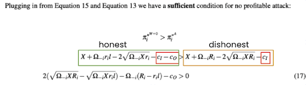
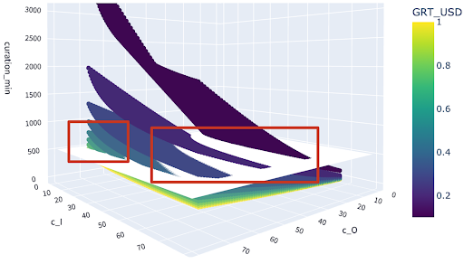
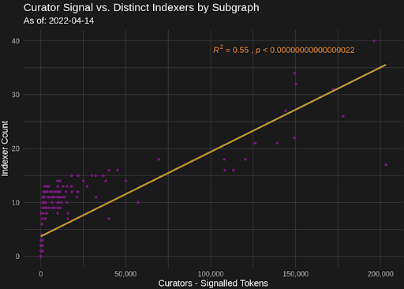

# Abstract

To mitigate economic security risks to the protocol, we propose initializing a new protocol parameter: minimum_signal, to an amount of 500 GRT in order for a subgraph to become eligible for receiving indexing rewards. We present a sensitivity analysis that indicates that a minimum curation parameter will make the proof of indexing spoofing attack identified in the protocol’s OpenZeppelin security audit unprofitable under specified economic conditions.

# Motivation

The OpenZeppelin audit identified an economic attack vector (C02) wherein a dishonest Indexer could:

- Minimize self-staking to reduce value at risk of slashing.
- Maximize self-delegation, which is eligible for receiving indexing rewards without slashing risk.
- Forego infrastructure and labor costs of indexing by spoofing PoIs, thereby taking on slashing risk while claiming indexing rewards.

Prysm Group, a team of economists specializing in mechanism design and game theory, received a grant from The Graph Foundation to develop a model and conduct an analysis of the viability of this strategy, as well as develop recommendations for mitigating the risk of such an attack. Edge & Node data scientists subsequently performed a numerical and sensitivity analysis to extend the Prysm models and identify values for protocol parameters that are capable of preventing this attack under different economic circumstances.

# Prior Art

- The OpenZeppelin [Audit](https://www.notion.so/thegraphfoundation/The-Graph-Protocol-Audit-316998b28dcd4fcd84297ab68e82d121) (Issue C02) provided a qualitative description of the proof of indexing spoofing attack.
- Prysm Group was contracted to develop a formal model and design a mechanism to protect against such an attack: [Initial Analysis of PoI Spoofing Attack Viability](https://forum.thegraph.com/t/openzeppelin-protocol-audit-prysm-groups-c02-economic-attack-resolution-summary/3280), PoI Spoofing Profitability Model and Analysis.
- Development work for implementing the minimum curation signal protocol parameter was completed in December and [subsequently audited](https://github.com/graphprotocol/contracts/blob/ariel/rewards-subgraph-threshold/audits/OpenZeppelin/2021-12-graph-rewards-signal-threshold.pdf), but establishing a value that would prevent the attack required further analysis based on the Prysm Group models. See: [Github PR for graphprotocol/contracts](https://github.com/graphprotocol/contracts/pull/528).
- Edge & Node Data Science did a parameter search based on the Prysm analysis. This was presented in [slides](https://docs.google.com/presentation/d/1GU-UyCWr3DXvhgJNCBXs-rdwnMMb8lOm3DcZNT6aqJE/edit#slide=id.ge6637c3d4c_0_37) on the March 31 Core Dev call and code for the analysis can be found in the notebook [here](https://edgeandnode.github.io/ds-notebooks/gip_min_curation_signal.html). 

# High Level Description

A critical factor determining attack profitability is the difference in costs borne by honest and dishonest Indexers of a subgraph. In equation 17 of Prysm’s Spoofing Attack Profitability Analysis, they modeled honest Indexers as facing both and  for a given subgraph, whereas dishonest indexers face only , such that a no-profit condition can be expressed as:

Therefore, is formally defined as any cost faced only by honest Indexers (infrastructure costs to correctly index the subgraph), whereas is any cost required of both dishonest and honest Indexers to collect indexing rewards (including minimal server costs to spoof and submit PoI to claim rewards, as well as gas costs for opening and closing allocations).

Further exploratory analysis showed that candidate values for minimum curation threshold were highly sensitive to the difference between and . Initial estimates for ($2800/month) and ($3200/month) were based on a colloquial understanding of how Indexers operated and did not match the formal definition in equation 17. According to a Foundation survey of Indexers, [the most competitively priced offerings](https://www.notion.so/edgeandnode/Copy-of-Indexer-node-cost-data-Prysm-Group-s-requirement-d8601a92a87b4245b653792a24c1a4b2) for a recommended setup is ~$600/month, and is capable of indexing and serving 30 or more subgraphs, which greatly reduces honest indexing costs on a per-subgraph level to ~$20 per subgraph per month. When we take this into consideration, we find that per-subgraph costs are currently dominated by the transaction costs associated with opening and closing allocations, which have ranged from $60-$300 per month per subgraph over the past 6 months. This is consistent with perception and discussion in the Indexer community, which rarely cites hardware requirements as an economic burden, but commonly cites transaction costs as such.

Since gas costs are borne by both honest and dishonest Indexers, we arrive at much lower minimum curation thresholds required to prevent the PoI spoofing attack than initially estimated.

# Detailed Specification

We performed a numerical simulation to solve for the minimum curation signal threshold required to prevent the PoI spoofing attack under a range of economic conditions. 

We fix the following parameters and simulate over a range of GRT prices and interest rates (which represent the annual opportunity cost of capital for executing the PoI spoofing strategy):

= $20, taken from Foundation estimates for most competitive hardware offering, assuming 30 subgraphs indexed on recommended setup (64 cores, 128GB RAM, 2TB NVME).

= $60, based on low end gas costs for opening and closing allocations, and minimal monthly server costs

= 0.2. We conservatively fix the likelihood of a spoofed PoI being detected to 20%. Indexers retain a table which contains the PoI hash at every block, so validating other Indexers PoIs is relatively straightforward and can be automated through the Indexer agent. There is a strong financial incentive for honest Indexers to act on a diverging POI, especially if the attacker is staking a sizeable amount of GRT; the Fishermen would receive 50% of the slashed amount if the dispute is accepted at no cost to themselves, and blatant attempts to spoof indexing rewards would almost certainly be detected at a much higher likelihood than this. 
 
Other protocol parameters are fixed to their current values.

With these values, a minimum curation signal of 500 GRT meets the no profit condition in the Prysm model in conditions where both the annual opportunity cost of capital is 22% or less (which corresponds to the peak junk bond index yield during the 2008 financial crisis) and where GRT price is at an all time low of $0.1. Further increases in GRT price or decrease in the opportunity cost of capital make the attack less viable in the Prysm model.

Figure 1, below, shows the minimum curation signal required to protect against a PoI spoofing attack in a 20% detection likelihood scenario. It shows that, in the Prysm model, the minimum signal required increases with reduced GRT prices and increased opportunity cost of capital.

*Figure 1: Minimum Curation Signal Required by Opportunity Cost of Capital and GRT Price*

*Figure 2:  and  Requirements Under Different GRT Prices*

Figure 2, above, shows the and  conditions under which the attack is prevented at different GRT prices. Points below the white plane are conditions in which the attack is prevented with a 500 GRT minimum signal, whereas areas above the plane, show the minimum signal required to prevent against the attack in scenarios with lower GRT prices, and a combination of higher honest Indexer costs and lower dishonest Indexer costs. It illustrates the fact that at higher GRT prices, the attack is prevented even with extremely unfavorable differences between honest Indexer and dishonest Indexer costs. On the other hand, it also illustrates that at low GRT prices, it’s important that honest Indexer costs per subgraph are favorable compared to dishonest Indexer costs.

Edge & Node Data Scientist Ricky Esclapon has also produced an interactive application that allows users to simulate minimum curation signal values given different economic assumptions [here](https://share.streamlit.io/rickyesclapon/prysmfollowups2/main/streamlit/formulas_each_heatmap.py).

As of April 14, 2022 this would impact 53.82% of subgraphs with less than 500GRT signaled. Excluding subgraphs with < 10 GRT signaled (some of which are tests), 22.04% of subgraphs would be affected by this change.

# Backwards Compatibility

Some Indexers who have allocated towards subgraphs with low curation amounts will stop receiving indexing rewards for subgraphs who do not meet the minimum curation threshold. Internal analysis has shown that legitimate subgraphs being used in production almost always have more than 500 GRT signaled on them, and curation signal lower than this amount would generally make it difficult to attract enough performant Indexers to generate high quality of service for production traffic. Nonetheless, some subgraphs being queried in low volumes may stop being indexed, which would be a breaking change for a small number of subgraph developers and users. Notice should be sent prior to the change so teams are aware of this possibility.

# Dependencies

The engineering work for this GIP has been completed. Initializing the value for the minimum curation signal protocol parameter to an agreed upon amount is the last remaining task.

# Risks and Security Considerations

The Prysm Group’s model depends on an assumption that increasing the curation signal on a subgraph will increase the amount of competing Indexers to allocate toward that subgraph, which decreases the profitability for a spoofing Indexer. While we believe that this assumption holds based on the strong positive association between curation signal and number of Indexers serving a subgraph, outliers might require additional scrutiny. 

*Figure 3: Relationship between curation signal and indexer count as of April 14, 2022*

Honest and dishonest Indexer cost profiles might change, which would require reassessing the effectiveness of the minimum curation signal parameter with the release of important features that materially impact gas costs. For example, if allocations moved to an L2 and reduced gas costs by 20x, we would need to evaluate the extent to which this change disproportionately benefited dishonest Indexers compared to honest ones. In this situation, it’s possible that honest Indexers could use the freed capital to allocate towards more subgraphs, which could bring down the honest Indexer cost per subgraph as well. We recommend refreshing the analysis whenever parameters from the Prysm model undergo substantial changes (e.g. 20x gas cost improvement from L2 migration, large increases in hardware costs, significant decrease in GRT price beyond all time low, etc.).

While we attempted to do a broad grid search of possible economic conditions, some model parameters may be misestimated or fall outside of the ranges we simulated over, in which case the proposed minimum curation parameter might not satisfy the zero profit condition (this can be evaluated by plugging values into the tool here).

The Prysm game theoretic model is a reduced form representation of expected economic behaviors, and some of its assumptions might not hold, which would undermine the efficacy of the proposed mechanism to prevent PoI attacks. This constitutes a best effort attempt to reduce the profitability of a PoI spoofing attack in the context of other tradeoffs associated with protocol viability (such as cost, user experience, accessibility, etc.), but success is not guaranteed and monitoring will be required. Nonetheless, errors in the analysis here are capable of being remedied through further adjustments to protocol parameters via decentralized governance in future GIPs.

While this proposal is designed to mitigate risks to the economic security of the network, it is not without tradeoffs. Introducing a minimum curation signal threshold adds friction to the subgraph onboarding process for the decentralized network. For capital constrained developers who cannot meet a 500 GRT curation threshold, it will be difficult to attract Indexers without recruiting independent curators to signal on the subgraph. 

# Rationale and Alternatives

The team considered modifying other protocol parameters, such as the delegation tax, delegation ratio, and slashing rate, which would also have had an impact on the viability of the strategy. However, these are already set fairly aggressively and would have required significant increases to have a material impact, leaving minimum curation signal as the most effective remaining parameter. Cryptographically verifying PoIs and query responses are also active lines of research and provide a promising long term solution to a broad range of economic attacks.

# Copyright Waiver

Copyright and related rights waived via [CC0](https://creativecommons.org/publicdomain/zero/1.0/).
