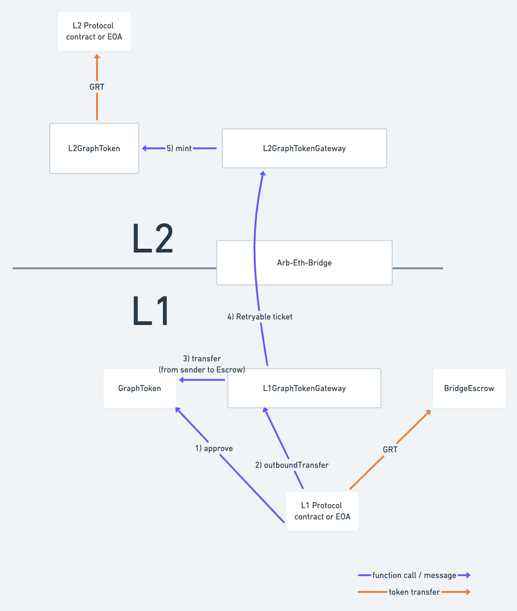
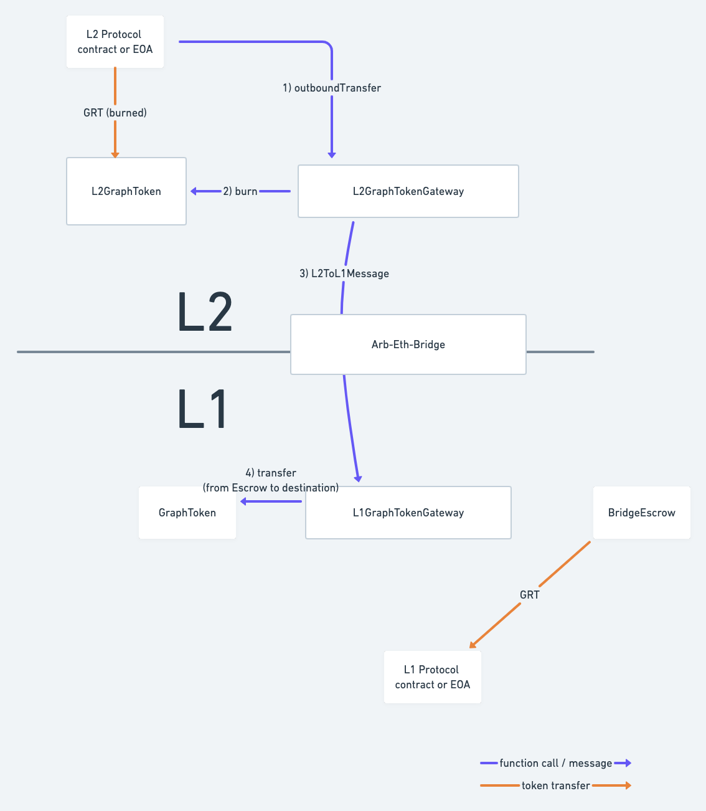

# Abstract

This proposal presents the specification for a set of contracts that will act as an Arbitrum bridge for GRT, i.e. allowing users (or contracts) to transfer GRT to the Arbitrum One Layer 2. It is based on the standard Arbitrum implementation and following Livepeer's example, but it gives the Graph Council the ability to pause, upgrade and generally control the bridge to recover from potential issues. This would be the first step towards a "devnet" deployment of The Graph protocol to Arbitrum One, that would allow the community to evaluate it as a potential L2 scaling solution.

# Motivation

Based on discussions that have been going on in the past few months (see this [Forum discussion](https://forum.thegraph.com/t/roadmap-to-l2-utilization/2695/1)), it seems that there is interest in the community for scaling through a Layer 2 network. Conversations between core dev teams point towards an Arbitrum Graph devnet as the most viable first step in this direction. This devnet would run the Graph protocol on Arbitrum One (connected to L1 Ethereum mainnet) with potentially some modifications, (e.g. without Indexer rewards at first). The full devnet specification is out of scope for this GIP and should be addressed separately, but it would work 1) similarly to the current Graph protocol on L1, and 2) as an experiment to inform and enable a full L2 deployment in a not-too-distant future.

This devnet would require, among other things, a way to bridge GRT from L1 into L2 and back. This bridge should be the canonical way to send GRT into Arbitrum, but it should be extensible to support any protocol-specific behavior that may be necessary, both for the initial devnet deployment and the eventual "mainnet” release. This GIP covers the specification of such bridge.

# Prior Art

The specification and implementation for this bridge are heavily based on Arbitrum's reference implementation (from [the Arbitrum GitHub repository](https://github.com/OffchainLabs/arbitrum/tree/master/packages/arb-bridge-peripherals/contracts/tokenbridge) and using the [Arbitrum docs](https://developer.offchainlabs.com/docs/l1_l2_messages) as reference) and Livepeer's custom bridge implementation ([from Livepeer's bridge repository](https://github.com/livepeer/arbitrum-lpt-bridge)). 

# High Level Description

The bridge consists of contracts on Ethereum (L1) and Arbitrum One (L2). The basic behavior is as follows; we recommend looking at the Arbitrum resources mentioned above to understand the message-passing mechanism.

To deposit GRT from L1 to L2 (as shown in Figure 1):
- On the L1 side, an L1 Gateway contract locks GRT in escrow and sends a message to its L2 counterpart using Arbitrum's retryable ticket mechanism.
- On the L2 side, the L2 Gateway mints GRT when it receives the message and sends it to the destination address.

To withdraw GRT from L2 to L1 (as shown in Figure 2):
- On the L2 side, the L2 Gateway burns GRT from the sender's account, and initiates sending a message to the L1 Gateway using Arbitrum's ArbSys interface.
- On the L1 side, when the dispute period is complete, a user initiates a transaction through the Arbitrum Outbox, which calls the L1 Gateway.
- The L1 Gateway releases the tokens from escrow and sends them to the destination address.

The L1 and L2 Gateway contracts are managed by the Graph Council (with a multisig deployed to L2), and are pausable and upgradeable so that governance can recover from issues or deploy new features as we move from devnet mode to mainnet release. We propose for the L2 Graph Token contract to also be upgradeable, for these same reasons, but the upgradeability can be relinquished (by setting the proxy owner to an invalid address) when the community is more confident with the L2 deployment.

The tokens are held in escrow by a separate BridgeEscrow contract, that can be reused in case we ever develop bridges to other L2s or other chains. This also provides an additional line of defense, as we can revoke the gateway's ability to transfer funds from the escrow.

# Detailed Specification

## Requirements for the bridge

- The bridge must be deployed through a proxy so that it’s upgradeable.
- All bridge (transfer) functions on L1 and L2 must be Pausable.
- The bridge can escrow tokens on L1, which triggers minting the same amount of tokens on L2.
- The bridge can burn tokens on L2, which triggers releasing the same amount of tokens escrowed on L1. This requires a second transaction, calling the Arbitrum Outbox after the dispute period, to finalize the transfer.
- Pausing the protocol through the Controller will not pause the bridge - pausing the bridge is done directly by calling setPause on the gateway contract on each layer.
- The bridge shall be integrated with Arbitrum’s L1GatewayRouter (assuming the Arbitrum team agrees after the Council signals intent).
- When sending tokens from L1, the bridge shall allow an allowlisted set of addresses to send arbitrary data to L2 together with tokens; this callhook transaction must be executed after the tokens are minted in L2 by calling a specific function at the address of the recipient for the tokens. The extra data will be included in the function call together with the L1 sender address and the amount of tokens received.

## Support for Arbitrum’s Gateway Router

Even if we’re implementing a custom bridge, Arbitrum provides a [Gateway Router](https://github.com/OffchainLabs/arbitrum/blob/master/packages/arb-bridge-peripherals/contracts/tokenbridge/ethereum/gateway/L1GatewayRouter.sol) where ERC20 contracts can register the address of the gateway contract to use for bridging. It would be desirable to use this router so that GRT bridging can still play nicely with the Arbitrum community, and for the bridge to be more easily recognizable as the canonical bridge for GRT. This will also allow users to use [https://bridge.arbitrum.io/](https://bridge.arbitrum.io/) to bridge GRT.

Sadly, the gateway router requires the L1 token to implement [an interface](https://developer.offchainlabs.com/docs/sol_contract_docs/md_docs/arb-bridge-peripherals/tokenbridge/ethereum/icustomtoken) that GRT doesn’t currently have, so the straightforward approach of using `L1GatewayRouter.setGateway` will not be feasible, as we can’t update the GRT contract. We've discussed this with the Arbitrum team, and they've said they can perform an admin registration for us (which will require the Council to publicly signal the intent to do this).

## Contracts and interfaces

The main components of the bridge will be a contract in L1 (L1GraphTokenGateway) with a separate escrow contract (BridgeEscrow) and a corresponding contract in L2 (L2GraphTokenGateway). Additionally, an L2GraphToken contract will exist in L2 instead of the GraphToken contract from L1.

### L1GraphTokenGateway

Implements the [ITokenGateway](https://github.com/OffchainLabs/arbitrum/blob/master/packages/arb-bridge-peripherals/contracts/tokenbridge/libraries/gateway/ITokenGateway.sol) interface:

- `outboundTransfer`: initiates a transfer to L2. Tokens will be put in escrow by being transferred to BridgeEscrow. The transfer of tokens must be approved by the sender before calling this. Only addresses that are allowlisted can include arbitrary calldata in the `data` parameter.
- `finalizeInboundTransfer`: to be called through `Outbox.executeTransaction` when a transfer from L2 has completed the dispute period. Will release the tokens from escrow and send to the specified address. Callable only from the L2GraphTokenGateway via the Arbitrum Bridge.
- `calculateL2TokenAdress`: returns the address for L2GraphToken (set by governance).

`outboundTransfer` and `finalizeInboundTransfer` are pausable through a  `paused` property, that is set by:

- `setPaused`: sets the `paused` property to true or false. Only callable by a pause guardian or the governor.

The contract will keep the addresses it needs in storage (Arbitrum Inbox, Gateway Router, L2GraphTokenGateway, L2GraphToken and BridgeEscrow) so the corresponding setter functions will also be available, callable only by the governor role.  The exception is the L2GraphToken contract address, that is already available through the Controller contract.

## BridgeEscrow

This contract's main role is to hold GRT and allow the gateway (or in the future, several gateways) to transfer them when appropriate. Therefore it only needs to expose two functions:

- `approveAll`: Approves a spender address for the maximum possible amount (2^256 - 1) of GRT transfers from this contract's balance.
- `revokeAll`: Revokes a spender address' permission to transfer GRT from this contract's balance.

## L2GraphTokenGateway

Also implements the [ITokenGateway](https://github.com/OffchainLabs/arbitrum/blob/master/packages/arb-bridge-peripherals/contracts/tokenbridge/libraries/gateway/ITokenGateway.sol) interface, but from the L2 side:

- `outboundTransfer`: initiates a transfer to L1. Tokens will be burnt on L2. The transfer of tokens must be approved by the sender before calling this.
- `finalizeInboundTransfer`: Callable only from the L1GraphTokenGateway’s L2 alias. Mints tokens on L2 and transfers them to the specified address. If the sender is allowlisted, any additional calldata sent in the `data` parameter will trigger a call to the destination address passing this calldata as the third parameter of the `onTokenTransfer` call (see [ICallhookReceiver](#icallhookreceiver) below).
- `calculateL2TokenAdress`: returns the address for L2GraphToken.

`outboundTransfer` and `finalizeInboundTransfer` are pausable through a `paused` property, that is set by:

- `setPaused`: sets the `paused` property to true or false. Only callable by a pause guardian or the governor role.

The contract will keep the addresses it needs in storage (Gateway Router, L1 GraphToken, L1GraphTokenGateway) so the corresponding setter functions will also be available, callable only by the governor role. The exception is the L2GraphToken contract address, that is already available through the Controller contract.

## L2GraphToken

Based on the GraphToken implementation but also implements the [IArbToken](https://github.com/OffchainLabs/arbitrum/blob/master/packages/arb-bridge-peripherals/contracts/tokenbridge/arbitrum/IArbToken.sol) interface (bridgeMint, bridgeBurn, l1Address).

It will *not* include the RewardsManager in its list of minters (and the list of minters will only include the governor). Minting should only happen through the `bridgeMint` function. Burning can be done as usual, or through the `bridgeBurn` function.

For now, tokens burned using `burn()` will not trigger any special behavior, but future iterations may sync back to L1 with a special call to burn tokens on the L1 side of the bridge or handle it some other way.

The L2 token contract will be upgradeable.

The contract will keep the addresses it needs in storage (L2GraphTokenGateway, L1 GraphToken) so the corresponding setter functions will also be available, callable only by the governor role.  

## ICallhookReceiver

This interface must be implemented by any contract that can receive callhooks from an allowlisted sender in L1. It includes a single function:

- `onTokenTransfer(uint256 _from, uint256 _amount, bytes _data)`: Triggers any additional behavior by the receiver after the tokens have been transferred. The L1 sender address is available in `_from`, the amount of tokens in `_amount`, and the additional (usually ABI-encoded) data sent from L1 is available in `_data`. If the function reverts, the token transfer will revert, so the retryable ticket can be retried until it expires. Therefore it's recommended that this function only reverts in critical failure scenarios, otherwise the transferred tokens will be lost.

# Backwards Compatibility

These changes would add a feature (the bridge) without affecting any existing contracts so it should be fully backwards-compatible.

# Risks and Security Considerations

Bridges and cross-chain communication have been shown to be risky business in general. It's very hard to predict all the possible failure modes, but we've identified this preliminary risk register:

| Risk | Impact | Likelihood | Criticality | Mitigation             |
|------|--------|------------|-------------|------------------------|
| Arbitrum goes down / stops existing | Escrowed tokens are lost in the bridge contract | Low | High | Bridge contracts being pausable + upgradeable allow adding an arbitrary escape hatch, and escrow's approveAll allows adding a Merkle proof contract to reclaim funds based on an L2 snapshot. |
| Bridge or Arbitrum vulnerability allows someone to pipe out tokens from the bridge contract | Escrowed tokens are lost | Low | High | Bridge contracts pausable + upgradeable should allow us to stop an ongoing breach. Consider monitoring solutions to detect an ongoing breach! |
| Bridging tokens from a vesting contract  allows someone to escape a vesting lock | Vesting contracts are circumvented, tokens are transferred before they should | Low | Med | This would only be possible after adding the bridge to the authorized targets for a locked wallet, so only add this feature after deploying the corresponding wallet manager on L2 and validating that the locks are still effective. |
| A large amount of tokens are bridged to L2 and burned on L2 (instead of being withdrawn back to L1) | Unless we sync back the burning, total supply on L1 will not be representative, and this also affects token inflation. Exactly what the consequences of this would be is not immediately clear. | Med | Med | Limit the total amount of GRT bridged? Account for bridged GRT as “burned” when considering total supply? Something else? Eventually syncing back the state should allow reconciling both layers, but this is not trivial; this is being considered for the devnet architecture. |

# Validation

Since potentially a lot of GRT will be held by the bridge, audits of the bridge code will be very important.

We should also deploy the bridge to the testnet, connecting Rinkeby to its Arbitrum testnet counterpart. At the time of this writing, the code from the PR has been deployed to a new deployment there, and to Görli / Arbitrum Nitro, but it'll be beneficial to test with the existing Graph testnet as well.

On the testnet, we should make sure to test several important things:
- Configuring the bridge using a governance multisig
- Transferring tokens to and from L2
- Pausing and unpausing the bridge
- Ensuring authentication for governance functions is enforced
- Granting and revoking the bridge's approval for escrowed funds

# Rationale and Alternatives

The following key design decisions have been considered:

## Choice of L2

This decision also affects the GIP for the devnet deployment, but is worth mentioning here as this is, so far, the first GIP related to L2 scaling.

This is quite a tough decision in general, but conversations with other core dev team
members have so far converged on Arbitrum for the following reasons:
- Arbitrum is the most popular L2 chain (by TVL).
- It's EVM-compatible (or, more precisely, provides an EVM-compatible abstraction on top of the AVM), unlike existing ZK rollups.
- It has a working deployment on mainnet (albeit in beta).
- It has a credible, concrete path towards proper decentralization. There's one key component -the Sequencer- that looks like it'll be harder to decentralize, but they're still ahead of Optimism, whose fraud proof mechanism is yet to be deployed (even though it sounds like it'll be as good as Arbitrum's or better).

Deploying a bridge, however, does not mean that we _have_ to stick with Arbitrum, and bridge plus devnet should allow the community to evaluate the viability of an Arbitrum deployment longer-term.

## Custom vs standard bridge

We propose using a custom bridge rather than Arbitrum’s standard ERC20 bridge because:

- We’d like protocol governance to have control over the bridge’s features, especially while developing and improving the devnet.
- We’d like governance to have control over the tokens locked in the bridge, to have an“escape hatch” so that tokens can be recovered in case of a critical issue with the L2 chain / protocol.
- We’d like governance to have the ability to upgrade the bridge to add new features or fix issues.
- We’d like governance to be able to pause the bridging in case of a critical issue with the bridge or the L2 chain / protocol.

It’s worth noting that creating custom bridges is still supported by Arbitrum, and as mentioned in [Prior Art](#prior-art), we're using Arbitrum's implementation as reference.

## Escape hatch, upgradeability and pause

In the default bridge implementation, tokens are escrowed in the L1 gateway contract during an outbound transfer, and released during an inbound transfer. 

Keeping the tokens locked ensures the GRT on both sides are fungible, as the same amount that’s locked is the total amount that exists on L2. There is, however, some risk, as the bridge escrow contract will potentially hold a huge amount of GRT. A critical issue in L2 could make those tokens become irretrievable, and a vulnerability in L2 or in the bridge could expose the tokens in the bridge to theft.

Considering these risks, there are three safety features that we could add to the bridge:

- Upgradeability: the bridge will be deployed through a proxy, like other Graph protocol contracts, so that it can be updated transparently.
- Pausability: the same addresses that are currently able to pause Graph protocol contracts should also be able to pause the bridge contracts in case of an issue; this should give the team time to investigate and fix any ongoing breaches without any more assets being lost.
- Escape hatch: In the event of a catastrophic L2 failure (i.e. the Arbitrum L2 completely stops working/existing), we'd like governance to have a way to help users recover the tokens locked in the escrow. The exact failure mode and state of the network at the time would affect how the community decides to react to it, but the proposed implementation does provide a viable escape hatch: governance could provide a Merkle tree based snapshot of the last valid L2 state, and use the escrow's approveAll function to use a contract that checks a user's proof of inclusion to release the funds.

## Support for allowlisted callhooks

Arbitrum's implementation of the custom gateway used to include support for an `escrowAndCall` behavior, where the tokens sender could include extra calldata together with the tokens transfer. This was removed in the initial release. In our case, however, there are several parts of the potential L2 architecture that could benefit from sending data together with the tokens. In particular, our indexing rewards calculation will likely rely on a supply of tokens for rewards being sent, together with a value for snapshotted token supply that is used in the rewards calculation. Other L1/L2 migration helpers might require sending tokens together with additional information like subgraph signal or indexer delegation.

For these reasons, we propose including the callhook functionality in the bridge, but only for an allowlisted set of addresses. This way, governance can enable callhooks for the trusted relevant contracts (e.g. the RewardsManager or GNS) while not allowing any untrusted calls. If the Arbitrum team release a similar feature in the future (as they are currently working on something like this), we can have a separate GIP to upgrade our implementation to be compatible with theirs.

The interface for the callhooks uses a well defined function (`onTokenTransfer`) to make this trust assumption less strict: with the L2 gateway functions being non-reentrant, and by limiting the function that can be called through callhooks, we protect against a compromised L1 sender or L2 receiver causing damage to the bridge or other protocol contracts.

## Repository structure

The bridge can either be set up in its own repository, or integrated into the [graphprotocol/contracts](https://github.com/graphprotocol/contracts) repo. For now, we propose integrating it into the same repository, as there will be some shared code in parts of the gateway contracts (e.g. for the pausable logic). It might also be more convenient when we start adding more protocol-specific behavior.

Arbitrum’s example code will have to be modified to use the same Solidity version as our contracts repo.

If this setup becomes unwieldy, it should be relatively straightforward to extract it into a separate repository later.

# Copyright Waiver

Copyright and related rights waived via [CC0](https://creativecommons.org/publicdomain/zero/1.0/).
