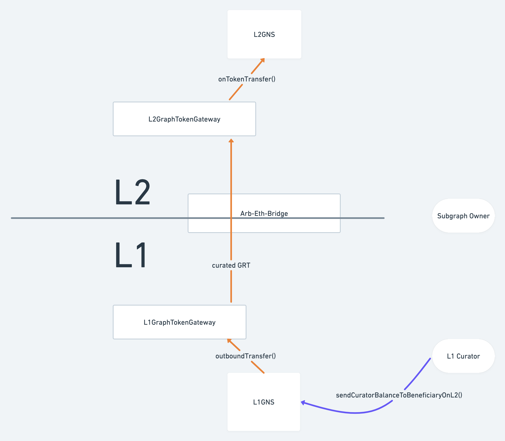
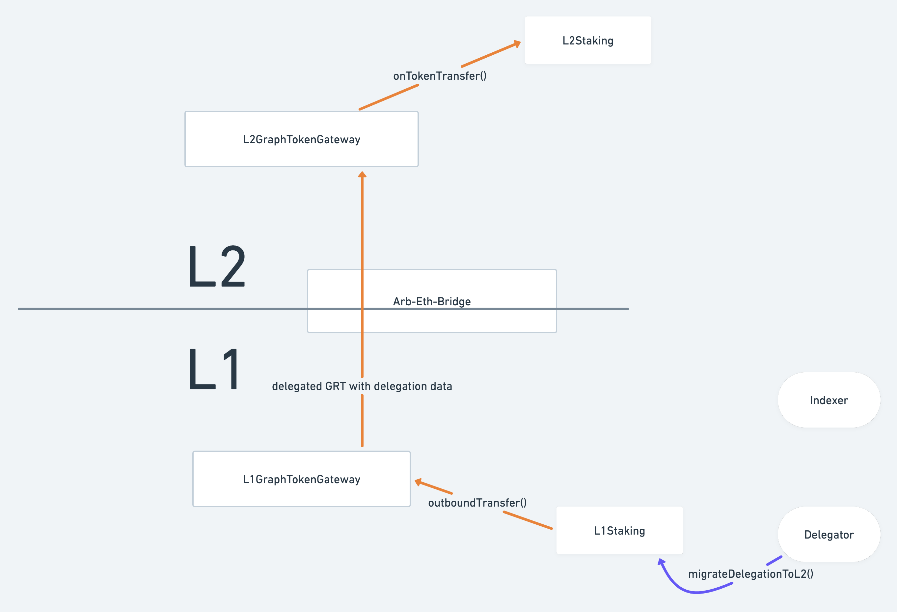

# Abstract

We present migration helpers to allow Indexers, Delegators, Subgraph Owners and Curators to move their tokens and state to the Arbitrum One network. These migration helpers require upgrades to the Staking and GNS contracts on L1 and L2, and will allow migrating with minimal friction and low cost. Even though they’re not part of the core protocol, the case of vesting contracts is also addressed by providing special functions in the Staking contract to migrate stake and delegation for accounts that are vesting contracts.

# Motivation

Since GIP-0031 / GIP-0040 have been deployed, The Graph now runs the protocol on both Ethereum Mainnet (L1) and Arbitrum One (L2). Participants are free to perform actions on either chain, and as GIP-0037 is rolled out, indexing rewards in L2 will make this chain more attractive for Indexers.

Without this improvement, people that want to move their activities to L2 would have to manually unsignal / unstake / undelegate and bridge the tokens using the Arbitrum GRT Bridge. This would require several transactions, going through thawing periods and potentially paying protocol taxes. Given the benefits of the low gas on Arbitrum would affect all protocol participants, we believe it’s desirable to ease this transition by providing a way to do this with lower cost and less transactions.

# Prior Art

We’ve used Livepeer as an inspiration for previous L2 GIPs; in this case they also have a relevant example in their [Migration Tool](https://explorer.livepeer.org/migrate).

# High Level Description

This proposal includes migration helpers for subgraphs, curation, Indexer stake, and delegation. In the following sections we’ll describe the user flow when using these helpers for each case.

## Subgraph migration

When a Subgraph Owner (i.e. the owner of the subgraph NFT corresponding to a subgraph ID) wants to migrate a subgraph to L2, they would have a CTA (call to action) to start this process on Explorer (and possibly Studio). This should open a migration helper pane / modal. In this pane, they can optionally set the desired address for the owner of the subgraph in L2. In case the owner is using an EOA, this can be the same address for L2 so it can be set as default. If the owner is using a contract wallet (e.g. a multisig), then a different address must be set, as most probably the contract does not exist in L2.

The Subgraph Owner confirms the first transaction, and the following will happen:

- The subgraph will be immediately deprecated in L1
- The curation signal owned by the Subgraph Owner will be burnt, and the resulting tokens will be sent to the Arbitrum GRT Bridge
- Together with the tokens, the L1 GNS will encode a callhook for L2 GNS to re-create the subgraph.

The Subgraph Owner must then wait for the transaction to propagate to L2, which can take about 20 minutes. The subgraph will be created in L2 in a disabled state: like a deprecated subgraph, it will not have a subgraph deployment associated to it and curating to it will not be possible yet. The Subgraph Owner then performs a second transaction to finalize the migration, using the wallet that was specified as the L2 owner of the subgraph. This second transaction includes the subgraph deployment ID and corresponding metadata for L2GNS to publish the subgraph.

Once this second transaction succeeds, the subgraph will be published in L2 and the owner will have an amount of signal corresponding to the amount of GRT that was sent from L1 (note this is different from the signal in L1 due to GIP-0039). No curation tax will be charged when minting this signal.

## Curation migration

Once a Subgraph Owner migrates a subgraph to L2, the L1 subgraph will appear as deprecated, but the L1 GNS will also record that it was migrated to L2.

Curators can therefore choose whether to burn and withdraw their signal in L1 (as currently happens when a subgraph is deprecated), or to send the signal to L2. This can be shown as a CTA in Explorer as well. When sending their signal to L2, they can specify an L2 Curator address, especially necessary if the L1 Curator is a contract (e.g. a multisig). A single transaction is needed in this case, and this will trigger a bridge transaction also including a message from L1 GNS to its L2 counterpart. Once the message propagates to L2 (again ~20 minutes), the tokens corresponding to the L1 signal will be used to mint signal in the migrated L2 subgraph (using the flat curve from GIP-0039), without charging a curation tax and without the need for any further user interaction.

## Indexer stake migration

Considering that indexing rewards will slowly grow in L2 while they are reduced in L1, it’s likely that Indexers will want to progressively migrate their stake to L2. The proposed migration helper will therefore allow sending parts or all of the Indexer’s L1 stake to an L2 beneficiary.

An Indexer wishing to migrate their stake would find a CTA to do this on Explorer. This would open a pane / modal where the Indexer can specify their L2 address.

Once they confirm the transaction, this will trigger a bridge callhook just like in the other helpers, and once the ticket is executed in L2 the Indexer will be staked and ready to allocate.

Since the Indexer must be over the minimum stake in L2, and there is no way to verify if the Indexer has already staked in L2, Indexers must send at least the minimum (100k GRT) when calling this function for the first time.

If the Indexer is not sending all of their stake, the contract will also validate that at least the minimum 100k is left behind in L1, and that the remaining stake and delegation (taking delegation ratio into account) is enough to cover the open allocations. So the Indexer might have to close some allocations before going through this process - the migration UI will make this evident.

If the Indexer is sending all of their stake, then they must close all their allocations before going through this process.

If the Indexer uses the helper several times, they must always specify the same L2 beneficiary.

## Delegation migration

Once an Indexer has migrated at least part of their stake to L2, the Indexer’s associated Delegators should be able to also migrate their delegated GRT to the same Indexer in L2. (Note that if the Indexer migrates *all* of their stake, Delegators will not accrue rewards anymore until they migrate).

If the Delegator does not want to migrate to L2, they can undelegate and withdraw without waiting for the undelegating period **only if the Indexer has migrated the full stake.** The UI can allow doing this in a single transaction making use of the multicall functionality in the Staking contract; under the hood this will be done by:

- Undelegating, which locks the tokens for withdrawal.
- Calling a new `unlockDelegationToMigratedIndexer` function which will unlock the tokens for withdrawal if the conditions are met, and
- Withdrawing the delegation now that it’s unlocked.

If the Indexer has only migrated part of their stake, so is still operating in L1, and the Delegator wants to undelegate, they must wait for the undelegating period as usual.

If instead the Delegator does want to migrate to L2, they can also do this through the Explorer UI, which uses a callhook like the other helpers, and also requires specifying an L2 beneficiary (in case the Delegator address does not exist in L2).

The delegation migration helper only allows sending the full delegated amount to L2.

## Special case: vesting contracts

Vesting contracts from The Graph’s [token-distribution repo](https://github.com/graphprotocol/token-distribution) are in use by many protocol participants to stake or delegate. While these contracts are not part of the core protocol, and therefore work outside the GIP process, it is important to provide a way for these participants to migrate to L2 as well. As things stand, they wouldn’t be able to use the proposed stake and delegation migration helpers, as this would allow them to escape the vesting lock in L2.

The full spec for the changes needed on the vesting contracts for them to migrate to L2 is out of scope for this GIP, but we will outline the high level overview and how we can support them with minimal modifications in the Staking contract.

Vesting contracts are instances (or more precisely, proxies) of a contract called `GraphTokenLockWallet`. These smart contract wallets allow releasing funds as the vesting periods pass, and they also allow certain functions in the protocol to be called, using an allowlist and the fallback function.

For vesting contracts to migrate to L2, we propose deploying an `L1GraphTokenLockMigrator` contract, that can be called by the GraphTokenLockWallet to deposit an arbitrary amount of GRT into a counterpart vesting contract in L2. This counterpart will be created through a callhook on the bridge that calls an `L2GraphTokenLockManager` contract on Arbitrum. This GIP therefore proposes allowing this migrator contract to be added to the bridge callhook allowlist (see GIP-0031 for details on how the callhooks work).

To prevent beneficiaries from escaping the vesting lock, the L2 vesting counterparts (`L2GraphTokenLockWallet`) will not allow releasing funds in L2 until the full vesting timeline is over; but beneficiaries will be able to bridge tokens back to the L1 vesting contract to release them there.

The only change needed in the core protocol, then, is for the Staking contract to allow migrating stake and delegation to L2 but restricting the L2 beneficiary to be the L2 vesting counterpart if the caller is a vesting contract. For this to work, there will be separate functions exposed in the Staking contract (`migrateLockedDelegationToL2` and `migrateLockedStakeToL2`) that will query the `L1GraphTokenLockMigrator` to get the L2 vesting contract address for the caller, and perform the same migration process described above but using this L2 address as beneficiary.

Vesting lock contracts do not forward ETH in their function calls, so it is necessary for the migration helpers to pull the ETH for the L2 ticket gas from somewhere else. We propose adding the ability for users to deposit the ETH into the `L1GraphTokenLockMigrator`, and then the Staking contract can pull the ETH from there.

As a result, vesting contract beneficiaries that want to migrate to L2 would have to:

1) Use the L1GraphTokenLockMigrator to deposit some ETH to pay for the L2 retryable tickets.
2) Use the L1GraphTokenLockMigrator to deposit an arbitrary amount of GRT in L2, and therefore initialize the L2 vesting contract.
3) Call `migrateLockedStakeToL2` or  `migrateLockedDelegationToL2` to migrate their stake or delegation.
4) (Optionally) Withdraw any remaining ETH from the L1GraphTokenLockMigrator.

These actions can also be surfaced in the Explorer UI when connected with a vesting contract wallet.

# Detailed Specification

## L1GNS spec

The GNS contract on L1 will be upgraded to a new L1GNS contract, that inherits from the original GNS but adds the following external functions:

- `sendSubgraphToL2()`: this function can be called by a Subgraph Owner. They must specify a subgraph ID and an address for the Subgraph Owner in L2, together with gas parameters for the L2 retryable ticket. This function will mark the subgraph as migrated and disable it. It will burn all the signal and send the GRT corresponding to the owner’s share, together with the subgraph’s information, to L2 through the L1GraphTokenGateway. The remaining GRT will be set as withdrawable so that Curators can withdraw them (or send them to L2).
- `sendCuratorBalanceToBeneficiaryOnL2()`: this function can be called by Curators that have signal deposited on a subgraph that was migrated to L2. They must specify the subgraph ID and the L2 beneficiary that will own the signal on the migrated subgraph. They must also specify gas parameters for the L2 retryable ticket. The function sends the GRT corresponding to the Curator’s share of the subgraph signal to L2 through the L1GraphTokenGateway. It reduces the subgraph’s withdrawable GRT accordingly.

## L2GNS spec

The GNS contract on L2 will be upgraded to a new L2GNS contract, that inherits from the original GNS but adds the following external functions and modifications:

- `onTokenTransfer()`: to conform to the bridge’s callhook interface (see GIP-0031), this function can only be called by the L2GraphTokenGateway, and validates that the L1 sender is the L1GNS. It accepts two types of encoded messages, identified by a `uint8` code in the ABI-encoded callhook data:
    - `RECEIVE_SUBGRAPH_CODE` will receive a subgraph ID and owner address and create the subgraph in a disabled state. The subgraph will not have a deployment ID or any metadata at this point, and the received GRT will not be used yet (but the amount will be recorded in storage, to be used in `finishSubgraphMigrationFromL1`).
    - `RECEIVE_CURATOR_BALANCE_CODE` will receive a subgraph ID and beneficiary address, and use the received GRT to mint signal on the subgraph for the beneficiary. Signal will be minted without charging curation tax. If the subgraph migration has not been finalized (i.e. the Subgraph Owner never called `finishSubgraphMigrationFromL1`, or for whatever reason the subgraph was never received in L2), the tokens will instead be returned to the beneficiary.
- `finishSubgraphMigrationFromL1()`: this function must be called by a Subgraph Owner after the subgraph was received from L1 through `onTokenTransfer`. The caller must specify the subgraph deployment ID, subgraph metadata and version metadata to publish the subgraph. The tokens received in the callhook will be used to mint signal on the subgraph deployment, initializing the (flat) curation pool for the subgraph. The corresponding subgraph signal will be owned by the Subgraph Owner. Since the curve is flat, there is no problem if someone has pre-curated on the subgraph deployment directly through the Curation contract (unlike in L1, where such a scenario would revert to prevent frontrunning).
- `publishNewVersion()`: this function is overridden from the original GNS implementation to allow updating to a pre-curated subgraph deployment. This reverted in the original implementation to avoid frontrunning; the flat curve implemented in GIP-0039 means we don’t need to prevent this scenario anymore.

## L1Staking spec

The Staking contract on L1 will be upgraded to a new L1Staking contract, that inherits from the original base Staking but adds the following external functions:

- `migrateStakeToL2()`: This function takes an L2 beneficiary address and an amount, and sends this amount from the caller’s Indexer stake to be staked for the beneficiary in L2. The caller must also specify gas parameters for the L2 retryable ticket.
- `migrateLockedStakeToL2()`: equivalent to `migrateStakeToL2`, but queries the L2 beneficiary from an external L1GraphTokenLockMigrator address configured on storage; it will revert if the migrator returns a zero address for the beneficiary (meaning the caller is not a GraphTokenLockWallet that has migrated to L2). It will pull the ETH for the retryable ticket from the L1GraphTokenLockMigrator using a call to `pullETH()`, checking that the migrator transferred the ETH to the Staking contract after the call.
- `migrateDelegationToL2()`: takes an Indexer address and an L2 beneficiary. Sends the caller’s delegation assigned to the specified Indexer through the bridge, to be delegated to the corresponding Indexer in L2. The Indexer must have previously migrated using one of the stake migration helper functions. The caller must also specify gas parameters for the L2 retryable ticket.
- `migrateLockedDelegationToL2()`: equivalent to `migrateDelegationToL2`, but queries the L2 beneficiary from an external L1GraphTokenLockMigrator address configured on storage; it will revert if the migrator returns a zero address for the beneficiary (meaning the caller is not a GraphTokenLockWallet that has migrated to L2). It will pull the ETH for the retryable ticket from the L1GraphTokenLockMigrator using a call to `pullETH()`, checking that the migrator transferred the ETH to the Staking contract after the call.
- `setL1GraphTokenLockMigrator()`: can only be called by the governor (i.e. the Council). Sets the address of the L1GraphTokenLockMigrator that will be queried by `migrateLockedDelegationToL2` and `migrateLockedStakeToL2`.
- `unlockDelegationToMigratedIndexer()`: this function can only be called by Delegators that are delegated to an Indexer that has migrated to L2 and has no stake left in L1. The Delegator must have previously locked tokens for undelegation using `undelegate` (though his could have been done in the same transaction using `multicall`). The function will set this delegation’s `tokensLockedUntil` to the current epoch, so that the Delegator can withdraw the locked tokens immediately after calling this (again, potentially on the same transaction using `multicall`).

## L2Staking spec

The Staking contract on L2 will be upgraded to a new L2Staking contract, that inherits from the original Staking but adds the following external function:

- `onTokenTransfer()` : to conform to the bridge’s callhook interface (see GIP-0031), this function can only be called by the L2GraphTokenGateway, and validates that the L1 sender is the L1Staking. It accepts two types of encoded messages, identified by a `uint8` code in the ABI-encoded callhook data:
    - `RECEIVE_INDEXER_STAKE_CODE` is used to receive an Indexer’s stake from L1. This function will stake the received tokens to the specified Indexer address.
    - `RECEIVE_DELEGATION_CODE` is used to receive delegation for a specific Indexer. An ABI-encoded struct contains the Indexer and Delegator’s addresses. The received tokens are delegated to the specified Indexer on behalf of the specified Delegator, without charging delegation tax.

## L2Curation spec

In order to support minting signal without charging curation tax (needed by L2GNS when receiving tokens for a Subgraph Owner or Curator from L1), the Curation contract on L2 will be upgraded to a new L2Curation contract.  Since this contract can be simplified (see below on the removal of the BancorFormula calls), the contract does not inherit from the original Curation but instead copies most of it, removing the unnecessary parts.

The contract adds the following external function:

- `mintTaxFree()`: can only be called by the L2GNS contract. This function behaves like the `mint()` function, minting signal for a subgraph deployment, but skips the curation tax. As the bonding curve is flat, this function does not include slippage protection, as it is not necessary.

## BancorFormula removal in GNS and L2Curation

Since GIP-0039 has flattened the bonding curve in L2, there is no need to use the BancorFormula contract in the L2 Curation contract. Therefore, as part of the implementation of the GNS migration helper, we propose removing the calls to this contract, to simplify the L2 Curation contract and make it more efficient.

Similarly, the GNS contracts on both L1 and L2 currently include the BancorFormula calls too, even though their internal bonding curve is also flat (it was included in the original protocol deployment in case this would change in the future). Since at this point it seems extremely unlikely that the protocol would re-introduce bonding curves at the GNS level, we also propose optimizing by removing these calls.

These two changes are part of the implementation PRs for this GIP.

## Bridge callhook allowlist changes

- L1GNS must be added to the bridge callhook allowlist.
- L1Staking must be added to the bridge callhook allowlist.
- `L1GraphTokenLockMigrator` [from the token-distribution repo](https://github.com/graphprotocol/token-distribution/pull/64) must be added to the bridge callhook allowlist.

## Changes to base Staking contract

The Staking contract is currently very close to the 24kB contract size limit on mainnet. To be able to deploy the new L1Staking, we will need to take some actions to keep the contract size within limits:

- Several functions, including all delegation-related functions and storage getters, are moved to a StakingExtension contract, called via delegatecall through a fallback.
- closeAllocationMany and closeAndAllocate are removed. Users can use multicall to get the same behavior.

To minimize divergence and keep the contracts more maintainable, this is done at the base Staking contract level, so the L2Staking will include the same changes.

To support the addition of the StakingExtension contract, a new `setExtensionImpl` function is added for the Council to set the address of the StakingExtension.

Finally, a `setCounterpartAddress()` is added as well; it allows the governor (Council) to set the address of the L2 Staking contract to which to send messages (in the L1Staking case) or the L1 Staking contract from which messages are received (in the L2Staking case).

# Backwards Compatibility

- closeAllocationMany and closeAndAllocate are removed from the Staking contract. Users can use multicall to obtain the same behavior. This breaks compatibility with older versions of Indexer Agent, but newer versions should already use multicall to perform these actions.

# Dependencies

- Depends on GIP-0031 and GIP-0040 (already deployed)
- GIP-0039 means curves in L2 are flat (already deployed)
- Related to GIP-0037 (but not directly dependent)
- Related to GIP-0043 (but not directly dependent)
- The implementation for the stake and delegation helpers also implements GIP-0044 (allocating requires being over minimum stake).

# Risks and Security Considerations

Adding more contracts to the bridge callhook allowlist naturally increases the bridge’s attack surface, though the bridge has been designed to minimize the associated risk. It is particularly important that callhook receivers validate that the L1 sender address is the expected one, to mitigate the impact of a compromised L1 callhook sender. See GIP-0031 for more details.

Some other relevant risks are identified in the following risk register, together with our proposed mitigation approach:

## Risk register

| Risk | Impact | Likelihood | Severity | Mitigation |
| --- | --- | --- | --- | --- |
| Migration helper callhook reverts continuosly | Migrated signal / subgraph / stake / delegation is lost | Low/Medium? | Critical | Audits should reduce likelihood of this. Monitoring to alert on reverted bridge transactions. Relevant contracts can be upgraded with a fix if needed, and we can keep the retryable tickets alive if needed while implementing the fix. As a last resort, an upgrade could add a governance function to restore any lost assets. |
| Contract or bridge vulnerability allows a malicious actor to migrate someone else’s assets to themselves | Migrated signal / subgraph / stake / delegation is stolen | Low | Critical | Audits should reduce likelihood of this. For some cases, a protocol pause and update should allow fixing and returning the assets to their rightful owner, as any malicious activity should be evident on chain. |
| Curation signal is migrated, but the subgraph was never received / published in L2 | Signal tokens locked in the GNS contract. | Medium | High | Mitigated through code: the L2GNS contract will return the tokens to the beneficiary. The UI will also not allow migrating signal until the subgraph migration is finalized. |
| Delegation is received in L2, but the Indexer migration never succeeded in L2 | Delegation is locked on a non-existent Indexer until the Delegator undelegates. | Medium | Low | Avoiding failed callhooks (see “Migration helper callhook reverts continuosly” above) should mitigate this scenario as well. The UI should not allow migrating delegation until the Indexer migration is complete. |

# Validation

- Audits for all relevant PRs.
- Testing the deployment plan for all contract upgrades on testnet.
- Testing all migration processes on testnet.

# Rationale and Alternatives

The main design decision in this GIP involves how to treat GRT from some of the participants, namely Curators and Delegators. One possible approach was to send all the GRT signaled on a subgraph when the subgraph is migrated, and all the delegation for an Indexer when the Indexer’s stake is migrated. However, we believe the approach proposed here, with each participant deciding when to migrate their GRT (or whether to stay in L1) is better, as it doesn’t force anyone to move to L2 if they don’t want to. The other approach would also still require each participant to “claim” their balance in L2, so it wouldn’t save them from having to perform a manual action. Moreover, in the case of curation, moving all Curators from the L1 bonding curve to a flat one could potentially benefit some Curators at the expense of others, so we also believe the proposed approach is fairer and doesn’t introduce any economic risks for participants that they haven’t already accepted (as subgraphs can already be deprecated, and the behavior from migration is identical to deprecation).

# Copyright Waiver

Copyright and related rights waived via [CC0](https://creativecommons.org/publicdomain/zero/1.0/).
