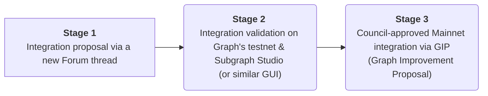

# Abstract

This GIP proposes a governance-based process for teams seeking Graph protocol integration for a new data source like a new blockchain. Protocol support on the decentralized network for a new data source comes after ensuring a performant and reliable integration with Graph Node (validated on Graph's testnet) and developer-focused GUIs like [Graph Studio](https://thegraph.com/studio/). The GIP specifies how teams move through the proposed 3-stage process. 

# Motivation

Following the [MIPs (Migration Infrastructure Providers) program's](https://thegraph.com/migration-incentive-program/) success, The Graph Foundation proposes a new governance-based approach for new chains to be integrated into the protocol and supported on mainnet. Given the protocol is blockchain-agnostic, and we’re entering a new [world of data services](https://forum.thegraph.com/t/gip-0042-a-world-of-data-services/3761), adopting a more open, transparent, and scalable process is necessary. In addition, as the protocol’s mission is to allow anyone to index and access the world’s data in a decentralized, verifiable, and performant way, onboarding new blockchains must also be as open, decentralized, and transparent as possible. 

For this reason, this GIP proposes a lightweight process targeting teams seeking protocol integration (integrators) for decentralized access to new on-chain data sources. The GIP details how integrators would follow a governance-based 3-step process for the new blockchain to be eligible for indexing rewards on The Graph’s decentralized network. Specific requirements can be found below. 

# High-Level Description

At a high level, the integration follows a 3-stage process:

1. Teams manifest interest in protocol integration by creating a new thread in [The Graph's Forum](https://forum.thegraph.com/), under `Governance & GIPs` > `New Data Sources` ([direct link](https://forum.thegraph.com/c/governance-gips/new-chain-support/71)).
2. The integration is tested in at least one GUI facilitating subgraph testing and publishing to the network such as [Graph Studio](https://thegraph.com/studio/), and The Graph's testnet.
3. The team writes a GIP proposing support for indexing rewards on The Graph's decentralized network (mainnet). The Council will review the GIP, taking into account the success of Stage 2 and the Indexer community feedback.

Mainnet support for a new `data source`, such as a new blockchain, means, in the current state of the protocol, having the chain recognized by the Council, on mainnet, as a new `data source` with detailed support for rewards and arbitration. This is defined in [GIP-0008](https://snapshot.org/#/council.graphprotocol.eth/proposal/0xbdd884654a393620a7e8665b4289201b7542c3ee62becfad133e951b0c408444) using the protocol’s [Feature Matrix Support](https://github.com/graphprotocol/indexer/blob/main/docs/feature-support-matrix.md). An example of a Council-ratified feature matrix [here](https://snapshot.org/#/council.graphprotocol.eth/proposal/0xd40fe605ecc3d0faca07d6c8d85a3f0d66106ef9e206aa57397de776f0a76a2c). 

## Stages’ requirements

### Stage 1

An initial blockchain extraction and ingestion solution compliant with Graph Node’s protocol must exist. For Graph Node to ingest blockchain data, it must connect to an **EVM JSON RPC API** or a **Firehose-enabled blockchain**. General documentation on this integration [can be found here](https://thegraph.com/docs/en/new-chain-integration/). If the chain exposes an EVM JSON-RPC, integration with Graph Node may be tested [by a simple Graph Node configuration change](https://thegraph.com/docs/en/new-chain-integration/#testing-an-evm-json-rpc). For non-EVM, a Firehose-enabled chain is required. Information on how to add Firehose support to a new chain [can be found here](https://thegraph.com/docs/en/firehose/integrate-new-chains/design-principles). Firehose support is optional but highly recommended for both [substreams](https://thegraph.com/docs/en/substreams/README/) and [Substreams-powered subgraphs](https://thegraph.com/docs/en/cookbook/substreams-powered-subgraphs/). 

Integrators must provide the open-sourced solution with documentation for Indexers and Developers and a subgraph showcasing the type of data Graph Node can ingest. This is the minimum information required for a first validation by core developers or community members like IndexerDAO. Other general information required on the new data source must be provided when creating the Forum post (included in the template), such as minimum hardware requirements for Indexers (RPC node and/or Firehose-enabled stack), the usual upgrade frequency of underlying nodes, and, if applicable, how Indexers may be notified of future planned hard-forks should they lead to breaking changes.

If a Firehose implementation is non-existent, and the integrator or core developers of the underlying node do not want to build one, a GRP (Graph Requests for Proposals) should first be shared in the Graph’s Forum. This way, community members could apply as lead developers and maintainers. Alternatively, integrators can reach out to the [StreamingFast team](mailto:integrations@streamingfast.io), the lead developers and maintainers of the Firehose stack for support on development. To avoid fragmentation and potentially poorly maintained forks, the instrumentation of the blockchain’s node/client for Firehose support should happen on the recommended canonical node or client, with the help of core maintainers of such code facilitating upstream merging. 

### Stage 2

[Subgraph Studio](https://thegraph.com/studio/) facilitates onboarding of users to the Graph's decentralized network, by also providing developers and consumers with an environment for subgraph testing, debugging and consumption in a rate-limited fashion (not recommended for production environments). For this reason, integrations will need to be supported by Subgraph Studio or similar GUIs and Gateways by either:

1. Providing the backend required for subgraph indexing (endpoints to the implemented solution from Stage 1) free of charge.
2. Providing a grant for infrastructure operators to run the required infrastructure. 

Integrators must express their preference when creating the Forum thread. For #2, and assuming integration with the existing Subgraph Studio, Graph Foundation and Edge & Node will collaborate closely with the team to ensure a smooth integration process. Community members familiar with operating Firehose infrastructure at scale can provide integrators with the required help; [Pinax](https://pinax.network), a core contributor to the Graph, is one example.
 
In addition, testing on Graph's testnet is also required. Core developers and Indexers will benchmark the solutions’ stability and performance by syncing different subgraphs and monitoring KPIs such as data freshness, node uptime and latency. [POIs](https://thegraph.com/docs/en/network/indexing/#what-is-a-proof-of-indexing-poi) on testnet will be monitored to ensure 0% divergence, which is a hard requirement for the Council to approve support for indexing rewards on The Graph’s decentralized network. All data determinism issues found must be resolved during this stage, led by the team seeking protocol integration. 

### Stage 3

The last stage is supporting the new blockchain on mainnet with some level of support for arbitration and indexing rewards. For this, integrators must:
1. Open a PR,updating the `[feature-matrix-support.md](http://feature-matrix-support.md)` [here](https://github.com/graphprotocol/indexer/blob/main/docs/feature-support-matrix.md) to include support for the new data source.
2. Publish a GIP [template here](https://github.com/graphprotocol/graph-improvement-proposals/blob/main/gips/0000-template.md) as the formal process to request Graph protocol integration. The GIP must include the proposed update to the Feature Matrix Support (the open PR) and data gathered during Stage 2 on performance, stability, and data determinism.

> **Note on the blockchain naming convention**
>
> The name of the data source to be included in the feature matrix support must follow the naming convention as specified in [GIP-0047](https://github.com/graphprotocol/graph-improvement-proposals/blob/main/gips/0047-chain-aliases.md). The Graph has adopted [CAIP-2 identifiers](https://github.com/ChainAgnostic/CAIPs/blob/master/CAIPs/caip-2.md), and it's important the name remains consistent across the protocol: feature matrix support, Graph Node, EBO, Graph Tooling, etc. 
> 
>Known CAIPs for a variety of chains can be found in the [Chain Agnostic Namespace repository](https://github.com/ChainAgnostic/namespaces).

Afterward, the Graph Foundation will post the GGP (Graph Governance Proposal) on the [Graph’s Council snapshot page](https://snapshot.org/#/council.graphprotocol.eth). The GGP will follow the principles agreed upon in [GIP-008: Subgraph API Versioning and Feature Support](https://github.com/graphprotocol/graph-improvement-proposals/blob/main/gips/0008-subgraph-api-versioning-and-feature-support.md). The Graph Foundation will ensure the GGP is created and reviewed by the Graph Council. Council's ratification of the GGP will officially mark the support for the new data source on The Graph's mainnet.

> **Note on governance**
>
> The GGP vote may be preceded by a community poll, providing no rough consensus on readiness and value-added for the protocol.
> 
> Core developers’ and Indexers’ confidence in the integration stability, performance, reliability, and overall demand (the focus of Stage 2) will provide the Council with the required information to proceed with the GGP vote.

## Summarized Requirements & Exit Criteria

| | Requirements | Exit Criteria |
| --- | --- | --- |
| Stage 1 |✓ A [new Forum topic](https://forum.thegraph.com/c/governance-gips/new-chain-support/71) if Graph Node integration exists; new GRP if otherwise (for one to be built). ✓ Open PRs in [Graph Node](https://github.com/graphprotocol/graph-node), [graph-ts](https://github.com/graphprotocol/graph-tooling/tree/main/packages/ts) and [graph-cli](https://github.com/graphprotocol/graph-tooling/tree/main/packages/cli) repositories, if applicable `ᵉ`. ✓ Docker and bare metal Indexer guides for Firehose stack and EVM RPC.`ᵇ` ✓ Example subgraph with docs.`ᶜ`   ✓ Open-sourced Firehose implementation, if applicable. |→ Chain's node and/or Firehose runs reliably.`ᵃ`.  → Example subgraph syncs successfully.|
| Stage 2 |✓ Free of charge backend (Firehose / EVM RPC) integration with GUIs and Gateways like [Subgraph Studio](https://thegraph.com/studio/), or a grant for teams to operate such backend.| → At least 2 subgraphs on Graph's testnet synced by >=5 Indexers. → 0% POI divergence`ᵃ` → Community validation on the integration.`ᵈ` → Graph Studio's integration uptime >99%.  → Merged PRs from Stage 1. |
| Stage 3  |✓ GIP for mainnet integration.  ✓ Updated [Feature Support Matrix](https://github.com/graphprotocol/indexer/blob/main/docs/feature-support-matrix.md) (open Pull Request) |→ Council-approved GIP (GGP vote). |

> _Notes_
> - `ᵃ` validated by community members like IndexerDAO
> - `ᵇ` with the help of IndexerDAO, as appropriate
> - `ᶜ` reproducible deployment to Graph Node
> - `ᵈ` via a poll, if no rough consensus on the Forum
> - `ᵉ` more info [here](https://github.com/graphprotocol/graph-node/blob/master/docs/implementation/add-chain.md)

# Frequently Asked Questions 
**1. How does this relate to the [World of Data Services GIP](https://forum.thegraph.com/t/gip-0042-a-world-of-data-services/3761)?**

This process is related to the Subgraph Data Service, applicable only to new Subgraph `Data Sources`. 

**2. What happens if Firehose & Substreams support comes after the network is supported on mainnet?**

This would only impact protocol support for indexing rewards on Substreams-powered subgraphs. The new Firehose implementation would need testing on testnet, following the methodology outlined for Stage 2 in this GIP. Similarly, assuming the implementation is performant and reliable, a PR on the [Feature Support Matrix](https://github.com/graphprotocol/indexer/blob/main/docs/feature-support-matrix.md) would be required (`Substreams data sources` Subgraph Feature), as well as a new GIP for protocol support for indexing rewards. Anyone can create the PR and GIP; the Foundation would help with Council approval.

**3. How much time will this process take?** 

The time to mainnet is expected to be several weeks, varying based on the time of integration development, whether additional research is required, testing and bug fixes, and, as always, the timing of the governance process that requires community feedback. 

Protocol support for indexing rewards depends on the stakeholders' bandwidth to proceed with testing, feedback gathering, and handling contributions to the core codebase, if applicable. This is directly tied to the integration's maturity and how responsive the integration team is (who may or may not be the team behind the RPC/Firehose implementation). The Foundation is here to help support throughout the whole process.
 
 **4. How will priorities be handled?** 

Similar to #3, it will depend on overall readiness of the integration and community feedback. For example, a new chain with a brand new Firehose implementation may take longer than integrations that have already been battle-tested or are farther along in the governance process. This is especially true for chains previously supported on the [Hosted Service](https://thegraph.com/hosted-service) or those relying on already tested stacks.

# Dependencies

No engineering work is required to make this process work. However, a proper integration test suite will be required for Stages 1 and 2. The details of such are not in the scope of this GIP.

# Copyright Waiver

Copyright and related rights waived via [CC0](https://creativecommons.org/publicdomain/zero/1.0/).
