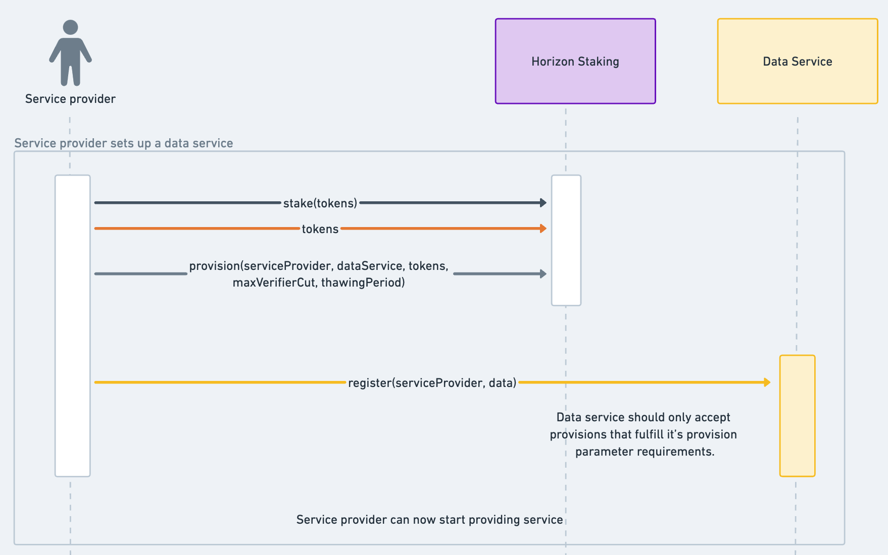
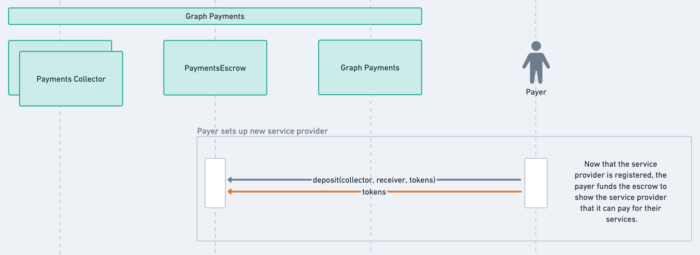

# Abstract

In this proposal we present our design for Graph Horizon, a data services protocol which is the next evolution of The Graph. We also introduce the Data Service framework, a library and set of guidelines to develop data services using Graph Horizon primitives; and the Subgraph Service, the first data service built to support the current use case of The Graph, indexing subgraphs. 

These changes require a complete redesign, upgrading most of the protocol contracts. A companion GIP-0068 (<link to GIP>) will cover the details of the Subgraph Service. Note however that both GIPs should be treated as a unit, meaning one cannot be implemented without the other.

Finally, the Graph Council has expressed support for the the [brownfield approach](https://forum.thegraph.com/t/graph-horizon-explained-a-proposal-for-the-evolution-of-the-protocol/5169#two-ways-to-get-there-brownfield-or-greenfield-11) so we propose a way of safely transitioning from the current version of the protocol to Graph Horizon. 

# Motivation

The Graph launched over two years ago with the objective of being an efficient and censorship-resistant protocol that can scale to organize all of the world’s public data and information. Since then there have been significant changes in the ecosystem and we’ve learned from conversations with many users and contributors. [GIP-0042](https://forum.thegraph.com/t/gip-0042-a-world-of-data-services/3761) introduced the concept of data services, recognizing that other approaches besides subgraphs are possible. [Graph Horizon](https://forum.thegraph.com/t/graph-horizon-explained-a-proposal-for-the-evolution-of-the-protocol/5169) expands on this idea, presenting a modular, composable and permissionless staking and payments protocol that can be leveraged by different data service implementations to offer a wide range of solutions to satisfy all data needs.

Graph Horizon is the result of reconsidering the mechanisms of The Graph from first principles, it’s about iterating upon the existing protocol to ensure The Graph fulfills its mission and remains core and reliable infrastructure for web3.

# Prior Art

This proposal is the result of almost two years of work from researchers and developers from various core dev teams in The Graph ecosystem, it ties up a few ideas outlined in [The Graph R&D roadmap](https://thegraph.com/blog/the-graph-roadmap-new-era/) and enables others. Some of them have already surfaced in one form or another, see: [GIP-0042](https://forum.thegraph.com/t/gip-0042-a-world-of-data-services/3761), [GIP-0054](https://forum.thegraph.com/t/gip-0054-timeline-aggregation-protocol/4405), [GIP-0058](https://forum.thegraph.com/t/gip-0058-replacing-bonding-curves-with-indexing-fees/4425) and [Graph Horizon explained](https://forum.thegraph.com/t/graph-horizon-explained-a-proposal-for-the-evolution-of-the-protocol/5169). Reading the “*Graph Horizon Explained*” forum post before this proposal is highly encouraged to understand the context and rationale behind the ideas we describe. 

# High-Level Description

Graph Horizon aims to facilitate permissionless competition of data services, it’s a *data services protocol* composed of two complementary components: *staking and payments*. In this section we outline the design and target state of the protocol, later sections will deal with how we get there considering the current state as the starting point.

Before we start, a few definitions:

- ***data service***, a service designed to run on Graph Horizon that makes data available for consumers. In general data services will be comprised of both offchain and onchain components, with each one having it’s own smart contracts at the chain level. Potential examples include: Subgraphs, Firehose, Substream, SQL or LLM queries. A data service doesn’t need to be restricted to a data response-request type of service, and can include other types of applications like oracles, challenge systems, and others. Essentially, data services are new protocols built on top of The Graph. We focus on data as the natural extension of subgraphs, but a lot of DePIN use-cases could be served by the same primitives.
- ***service provider**,* the entity providing the service. In the case of the Subgraph Service they are known as indexers. For most data services this is probably also the case, however to accommodate any future data services where the indexing term might not make sense we utilize a generic term, “service provider”.
- ***data consumer**,* the customer, i.e. the entity consuming the data.
- ***payer***, the entity paying for the usage of a data service. Intuitively this would be the data consumer ******itself, though for many data services it’s expected that consumers will use a gateway or some sort of intermediary between them and the service providers to manage payment.
- ***receiver***, the entity receiving a payment. This is typically the service provider.

Here is a high level overview of how Graph Horizon will be utilized by a data service:

- A service provider stakes GRT, at this point the stake is deposited into the Staking contract but it’s not being utilized or locked in any way.
- The service provider assigns part of their stake to a specific data service, in Horizon this assignment is called *a provision,* making that stake slashable by the data service. The circumstances under which the slashing occurs and the amount to be slashed are up to the data service to define, but the entire stake assigned to a specific data service is slashable. This is what provides the economic security for the service being offered. Once funds are committed to a data service they cannot be withdrawn immediately, they are subject to a thawing period also defined by the data service.
- The service provider registers itself on the data service for discoverability and any additional setup that might be required.
- The service provider can now start providing the service to the data consumers, collecting some form of receipt or voucher that allows them to later redeem fees through the protocol.

## The staking protocol

At it’s core, Graph Horizon includes a staking protocol designed to provide economic security for the exchange of data between a data provider and a data consumer***.*** The staking primitives allow for arbitrary data services to be built leveraging the economic security that Horizon mandates. Next, we will describe the most important features of the staking protocol.

### Provisions

The main abstraction that enables composability in the staking protocol are provisions. A ***provision*** is stake assigned to a specific data service. Like many other staking protocols, provisioned stake is locked for an undetermined period of time during which it acts as economic security. Wrongdoings can be punished by slashing the stake and at any point the stake can be thawed to be removed on a later stage from the provision.

A quick side note about terminology: in “*Graph Horizon Explained*” forum post we discussed *allocations* as the general term for stake assigned to a data service. This, however, would cause issues with backwards compatibility as *allocation* is currently a per-subgraph-deployment amount of stake. We now use the term *allocation* for subgraph allocations of stake on the Subgraph Service and *provision* as the term for stake assigned for a specific data service.

When the service provider creates a provision there are a few considerations to make. They need to specify the slashing authority for the provision and the thawing period for withdrawing the provisioned stake. While setting these parameters is entirely under the service provider’s control it’s expected that data services will only accept provisions that fulfill their operational requirements (namely, that the data service contract is the slashing authority and that the thawing period is greater than whatever the data service requires).

It’s important to note that, while similar, provisions are not what the current protocol defines as allocations but rather a generalized version that operates at a higher level. The provision primitive guarantees that a certain amount of service provider stake is locked as economic security to provide a service. How this security is used is up to the data service implementation, the staking protocol offers a set of interfaces to perform common operations like thawing provisioned stake, managing stake delegations, etc.

[https://imgr.whimsical.com/object/75zMoTtke13RZepWVyHfkm](https://imgr.whimsical.com/object/75zMoTtke13RZepWVyHfkm)

In the context of a world of data services, a service provider will typically have several provisions, one per data service being offered. Then, each data service can leverage the provisioned stake the way they see fit. For example, the Subgraph Service might further split the provisioned stake into per-subgraph-deployment allocations; another data service might use a “stake-to-fees ratio” model to require certain amount of stake when collecting fees from them. 

Different data services will likely have different ways of managing their stake, with potentially different levels of strictness around the economic security guarantees. In the permissionless landscape of data services, understanding these underlying operational mechanisms becomes increasingly important to gauge the risks associated when interacting with a data service. The Graph core dev are developing an initial set of data services and will take an active role in promoting the emergence of open community standards. The Data Service framework (covered in later sections) will be utilized to establish these standards and best practices when designing a data service, ensuring alignment with The Graph principles and interoperability with other data services and the rest of the protocol.

### Delegation

Delegation is a key feature of the staking protocol. It allows participants to get a share of service provider’s revenue to increase the economic security of a data service without directly engaging in the operational and technical aspects of running infrastructure. 

Delegation is built into the protocol with the following features:

- **Delegation is per data service**
    
    When delegating, the delegator must specify both the service provider and the data service they want to delegate to. This ensures the delegated stake can only be used for data services that have been vetted by the delegators, preventing service providers to use it for other data services where they might not have expertise and hence they wouldn’t have been delegated to in the first place. Additionally this ensures delegator funds are safe from service providers colluding with malicious data services.
    
- **Delegation is slashable**
    
    For the added economic security to be meaningful the delegation must be subject to slashing. To protect delegators from a malicious service provider their delegated stake will be at risk *only after the entire service provider’s stake in the provision has been slashed*. More details on the slashing mechanism can be found in the following sections.
    
- **No delegation tax**
    
    Delegation is not taxed by the protocol, all the delegated stake will be deposited into the staking contract. The inclusion of slashable delegation is enough deterrent for certain attacks that call for delegation taxes in other types of designs.
    
- **Withdrawal**
    
    Delegators can always remove their stake by un-delegating which is subject to a thawing period determined by the data service (actually, the underlying provision) they delegated to. Multiple un-delegation requests can be initiated and exist simultaneously, each one will have to go through the thawing period independently but they won’t affect each other. While thawing, delegated stake does not earn delegation fees but it remains slashable to ensure slashing events can’t be front run by delegators.
    
    It’s worth noting that *“[Graph Horizon explained](https://forum.thegraph.com/t/graph-horizon-explained-a-proposal-for-the-evolution-of-the-protocol/5169#a-new-approach-to-delegation-7)”* and previous designs of delegation in Graph Horizon allowed for a more dynamic mechanism where un-delegation periods could potentially be shorter than the thawing period, even permitting instant un-delegation under some circumstances. This idea while interesting has proven to be quite challenging to implement without over complicating the core design of the staking protocol, so we have decided against it. Future development of arbitration mechanisms with zk proofs and other cryptographic technologies will eventually allow data services to use shorter thawing periods, improving the delegator UX. For the Subgraph Service we are also planning on setting a dispute period that is shorter than the current undelegation period.
    
- **Delegation Cuts**
    
    Horizon allows service providers to define delegation cuts for any payment type defined in the payments protocol. This ensures delegators can be rewarded differently depending on the type of work they are supporting with their delegation. For more details see the payments protocol section.
    

Note that additional functionality can be built on top of these core mechanisms. We’ve seen that happen already in the current iteration of The Graph, ideas like liquid delegation, delegation aggregators or pools, etc, could be implemented by third parties or core dev teams in a later stage.

### Slashing

In order for provisioned stake to be considered useful economic security it needs to be slashable. The fact that stake is at risk disincentivizes service providers from ill intentioned behavior, furthermore, the slashing mechanism uses part of the slashed stake as a reward for reporting faults. It then follows that *all stake* that is being used as economic security for a service should be slashable, not just a portion of it. Graph Horizon leaves it to the data service to decide why and when a service provider is slashed and what the slashed amount is. As far as the staking protocol is concerned a data service could slash the entire provisioned stake (both from the service provider and delegators) in a single slashing event. Graph Horizon’s guarantees that part of the slashed amount will be burnt and another part sent back to the data service as the reward. It's important to be aware that a compromised or malicious data service could potentially misuse this mechanism to access funds. Community standards and best practices such as those described by the Data Service framework should help curate and identify those that are safe to use.

As described before, the slashing risk applies both to stake provisioned by the service provider and delegated stake. To mitigate the risk of service providers misappropriating delegator funds by using a malicious data service via slashing, we introduce a few protections for delegators. First, the staking contract ensures that all ****service provider stake will be slashed before the delegator’s stake is touched. Since a portion of the slashed amount is burned it greatly reduces the economic viability of an attack. Moreover, when slashing delegators the tokens can only be burned and not used as slashing reward, this means that a malicious data service cannot profit directly from slashing delegators. In general, the more stake the service provider has on a provision the safer delegators will be. This protections in combination with per data service delegation make delegators safe from these types of attacks.

The following diagram illustrates an example of the protection for delegators. In both cases the service provider was found to be at fault and is getting slashed for 200k GRT. In the first case, the service provider doesn’t have enough stake to cover the slashed amount, so the delegators are also slashed. In the second case that’s not the true however and the delegator’s funds are safe.

[https://imgr.whimsical.com/object/7qzUcriG5NrYFJzftewFHg](https://imgr.whimsical.com/object/7qzUcriG5NrYFJzftewFHg)

This example might lead the reader into the false conclusion that delegating to the service provider with the highest amount of stake is the safest option. It’s worth noting that in the example we assumed the slashed amount is the same for both cases. In a real world scenario it’s up to each data service to establish their slashing rules that determine what the slashing amount is. The Data Service framework establishes some rules but additional policies might be implemented as well, for instance delegation ratio can be taken into consideration when choosing the slashed amount, or repeated offenses can be punished more severely. Choosing the a service provider to delegate to should be a balancing act that looks at different variables like the service provider’s stake, the delegation ratio, fee cuts for delegation, etc. We expect tools to emerge that will expose this information and provide a simple way for delegators of knowing how aligned service providers and data services are with The Graph standards. Similar tools exist already in the current version of the protocol but they are mostly aimed towards indexer operations (for example, Graphtronauts, Graphscan, Indexer Tools, etc).

### Operators

A service provider can choose to allow other accounts to manage their provisions on their behalf, they won’t be able to withdraw any funds from the protocol but they have complete authority over the service provider’s provisions. These operator accounts are meant to be used on the day to day operations of service providers to safeguard the keys for their main account. Operator access is granted on a data service basis to prevent a compromised operator to steal funds via a malicious data service.

## The payments protocol

The other side of the coin in Graph Horizon is the payments protocol. The main function of a data service is to provide a service for a data consumer. Naturally the service providers expect to be paid in return. The most common payments schema we anticipate for data services is through an intermediary payer where the consumer establishes a relationship with a payer who will take care of service payments for them. This allows designing a much better UX for the consumer while retaining the trust-less-ness properties of Graph Horizon. Note that the means by which the payer recovers those funds from the consumer are not relevant to the payments protocol so they are out of scope of this proposal.

To address this common payments flow we propose generalizing the Timeline Aggregation Protocol (TAP) presented in [GIP-0054](https://forum.thegraph.com/t/gip-0054-timeline-aggregation-protocol/4405). These are the main features of the payments protocol:

- Provides data services with a means of handling payments between service providers and payers in a trust minimized way. Service providers don’t need to trust that payers will pay their debts, payments are pre-collateralized with an on chain escrow to guarantee that. Conversely, payers don’t need to trust that more funds than what are owed are taken from the escrow.
- Since the payments protocol is aware of the staking primitives it takes care of distributing payment cuts to all relevant parties: the service provider, its delegators, the data service itself and a protocol tax.
- Support multiple types of payments, each with it’s own distribution cuts configuration.

### Overview

The following diagram shows how the payments protocol works:

[https://imgr.whimsical.com/object/Q6U2KVq8hYMbx7eoW6wHnd](https://imgr.whimsical.com/object/Q6U2KVq8hYMbx7eoW6wHnd)

1. First the payer needs to deposit GRT into Graph Payments contract to show the service provider that they can pay for their services. These deposits are per service provider and are used to settle payer’s debts. They are also subject to a thawing period that protects service providers from being rug pulled. If a payer starts thawing it’s expected that the service provider would immediately collect any outstanding payments and stop doing business with them.
2. Next the service provider starts providing the service to a data consumer using the payer as the intermediary. In return the service provider should get from the payer a receipt, voucher or any other evidence that demonstrates the outstanding debt. 
3. Finally, to collect the payment, the service provider presents the evidence to the data service which in turn uses the payments protocol to verify the validity of the claim before distributing the funds.
4. As payments are collected, payers should monitor their deposits and periodically top up their balance to ensure they can keep paying for their services.

The verification of the evidence and payment collection need to happen through “Payment Collectors”. These are special contracts in the payments protocol whose job is to ensure the evidence being presented is valid. How this is verified will depend on the specifics of the collector being used but it should be tightly coupled with how it’s created. For example, the payer and service provider agree to use receipts with the owed amount signed by the payer. The payment collector should then verify that the signature of the receipt indeed matches the payer address to allow the collection.

Payers are required to individually whitelist collectors since they are delegating the payment verification and collection to them. This necessitates either a high level of trust in the collector or a thorough review of it’s inner workings. We expect just a handful of collectors should be able to cover most use cases for data services reducing the burden on the payer (it’s also worth remembering that “payer” does not refer to the data consumer but the intermediary).

### TAP Collector

While the payments protocol allows for an arbitrary number of payment collectors we initially propose implementing a TAP based collector. This collector should be reusable for any request-response type data service looking to manage payments using a receipt based system. The TAP collector integrates with the existing TAP proposal described in [GIP-0054](https://forum.thegraph.com/t/gip-0054-timeline-aggregation-protocol/4405) with a few minor changes to the voucher definition. A RAV (Receipt Aggregate Voucher, a voucher signed by the payer) in TAP should now contain the following information:

- the data service - only the data service the RAV was issued to can collect it, this ensures RAVs can not be replayed across data services.
- the service provider - this establishes who is the entity that is owed.
- a timestamp - indicating the timestamp of the latest TAP receipt in the RAV (see GIP-0054 specification for clarification on TAP receipts vs RAVs).
- the value aggregate - the total amount owed to the service provider since the beginning of the payer-service provider relationship, *including* all debt that is already paid for.
- a metadata field - allows adding arbitrary data to a RAV to extending functionality if a data service requires it. For example, in the Subgraph Service this is used to pass a unique id that groups receipts and vouchers by it’s source of debt generation, in this case this is the allocation id and it is required to correctly distribute curator fees.

It’s worth clarifying the value aggregate in a RAV should not be reset each time a collection happens, it’s a monotonically increasing value. The TAP collector will keep track of all the payments that were already made to a service provider and compare to the RAV value aggregate to calculate the actual amount to be paid.

## The role of governance

So far we’ve not discussed the topic of governance. One of the design principles of Graph Horizon is to improve censorship resistance on the protocol by reducing the impact the governance body has over it. 

The end state for both the staking and payments protocols is to achieve an immutable set of contracts with no privileged roles that can exert control over protocol parameters or functionality. Graph Horizon’s endgame is fully permissionless however there are some hurdles we need to overcome before getting there:

- **Staking protocol**
    
    No privileged roles are contemplated for the staking protocol in the long term, all functionality is fully permissionless. However, the contracts will initially remain upgradeable and the Graph Council will retain the ability to modify a few global parameters. This is mainly to deal with the transition period between the current iteration of the protocol and Horizon, and to allow security and bugfixes until the contracts code is sufficiently battle tested.
    
- **Payments protocol**
    
    The contracts for the payments protocol will for the most part be non-upgradeable and permissionless. Payment collectors can be deployed permissionlessly and the escrow functionality will reside on a non upgradeable contract also with no privileged roles. The funds distribution functionality however will live on an upgradeable contract under the control of the Graph Council. The reason for this is that this is an active area of research: there is ongoing work on using protocol fees as incentives for different roles, which will likely require upgrading the contracts in the payments protocol.
    

Note that for all cases, the upgradeability of a contract can always be renounced to, there is already precedent for this in The Graph ecosystem with the `L2GraphToken` contract which was initially upgradeable but it’s now not.

The permissionless nature of Horizon means everything is *allowed* within the simple rules established by the staking and payments protocols, but there will be a set of incentives and guidelines so that specific approaches that benefit the ecosystem are *encouraged.* Outside of staking and payments, protocol governance retains control over the GRT token issuance and distribution. Issuance can be used to incentivize service providers to serve specific data services, for example currently indexing rewards ensure subgraphs are indexed consistently. To qualify for these incentives governance might require data services to conform to protocol and operating requirements, for example like those laid out by the Data Service framework. Additionally, endorsement of conformant data services could give them better discoverability via exposure on the core dev products (the Graph explorer for instance).

A final note on issuance: this GIP does not propose changing either the amount of token issuance or the distribution of minted tokens via the Subgraph Service. 

## Data Service framework

With a permissionless protocol comes an increase in individual accountability and responsibility for all actors involved, data service design needs to protect against actors with intentions that are not aligned with The Graph but rather try to steal user funds, disrupt operations for service providers and many other attack vectors. The Data Service framework mitigates these problems by setting some standards that ensure the staking and payments primitives are being utilized as intended. The framework consists of two components:

- A generalized flow, describing how a data service should integrate with the staking and payments protocols.
- A contracts library, providing a base layer from where to build any data service.

### Data service flow

We will describe the main flows between the core Graph Horizon components and a generic Data Service. Implementors are encouraged to follow these guidelines, many of which are intentionally loose to allow for greater flexibility when designing a data service. 

This specification covers the following interactions which should roughly happen in this order:

- Payer sets up payments for a new payments collector
- Service provider sets up a new data service
- Payer sets up a new service provider
- Service provider starts/stops providing a service
- Service provider redeems fees
- Service provider is slashed by the data service

**Payer sets up payments for a payments collector**

The payments protocol allows service provider payments to be committed in advance by using an escrow contract. The only entities allowed to access those funds are payment collectors. Payers need to individually approve collector contracts similar to how ERC20 allowances work. After approving, the payer can start intermediating with data services that use the collector in question by issuing the relevant debt evidence to service providers.

**Service provider sets up a new data service**

Before registering itself on a new data service, the service provider must first stake and create a provision in the Horizon staking contract. By registering to a data service the service provider manifests it’s intention of providing that type of service to data consumers. During the registration, the data service should validate that the associated provision is within the data service’s spec. For example, the data service might require a minimum amount of provisioned tokens or a minimum thawing period. It’s crucial that the data service validates the provision parameters and accepts the in the staking contract (this is done via an internal call), otherwise the data service will not be able to provide economic security guarantees for the data consumer. Once the registration is complete the service provider is ready to start providing the service.

A few notes on the diagram below:

- **data** is a generic `bytes` parameter that most interfaces in the Data Service framework accept to extend functionality. In this case it could be used for additional metadata which could also be subject to validation and possibly result in a registration rejection. In the case of the Subgraph Service for instance it could be used to record the service provider’s `geoHash` and a `url` where they can be reached.
- the tuple **(serviceProvider, dataService)** is sufficient to uniquely identify a provision. There is no concept of provision ids.

**Payer sets up a new service provider**

A payer offering its intermediation services for a particular data service should be watching its registrations. Payers can establish their own heuristic to decide who and when to collateralize a service provider, but ultimately to signal that they can pay for services they need to make a deposit to the payments protocol escrow. This sets the stage for the “service provider - payer” relationship, everything is now setup for the service provider to provide a service and get paid in return.

**Service provider starts/stops providing a service**

The initial registration is a mandatory step to ensure the staking protocol can provide proper economic security, however data services might also require an additional step to indicate service provider’s readiness for providing the service. The data service framework provides two interfaces to signal this: start and stop service. These take an arbitrary bytes parameter which can be used by the implementation for any purpose. For a subgraphs service for example these would be the familiar “allocate” and “close allocation” function calls. Note that this onchain signaling is optional, data services can opt for other offchain solutions like status endpoints.

**Service provider redeems fees**

Collecting fees for a service provided is one of the main features a data service should enable. The Data Service framework requires the data service implementation to use the payments protocol for that. Collection is initiated by presenting the debt evidence on the data service (note the call takes again an arbitrary bytes argument) which should run any validations and checks it requires, this includes ensuring the payment being collected is properly backed by the provisioned stake. Once validated, the service initiates the payment collection on the payments protocol by interacting with the appropriate collector. Note that a data service might allow collecting different types of fees by means of different collectors. Fees are then distributed to all relevant parties according to the payment type rules and execution returns to the data service for any additional accounting, cleanup or further re-distribution of it’s own cut.

**Service provider is slashed by the data service**

As mentioned in the staking protocol section, if the data service has evidence a service provider acted maliciously they can slash them. The amount to be slashed is determined by the data service, several factors can be taken into account. As a general guideline however, the Data Service framework proposes the slashing amount should be proportional to the provisioned stake at the time a dispute is raised. This ensures that provisioned stake can be used as a measure of the economic security being provided. 

An important consideration to note is that the economic security provided by a provision depends on the ability of it being slashed. If for some reason a data service prevents the slashing from happening, for example because the data service is paused or simply because it does not implement a slashing mechanism, then the provisioned stake will offer no economic security at all since it could be removed from the protocol without risk. For pausable data services it’s highly encouraged that slashing is allowed even when the data service is in a paused state.

### Contracts library

To facilitate building data services we propose creating a data services contracts library. The library provides a base data service contract which provides basic functionality that should be common for all data services and can be inherited by an implementation. Similarly to OpenZeppelin’s contracts, this library also contains extension contracts that work as add-ins to the base contract adding specific functionality.

A high adoption of these standards means building tooling that interacts with data services is simpler (for example subgraphs, clis, uis, etc). It’s important to note, using these contracts does not guarantee good intent from the developer, a data service can inherit all these base contracts while still having malicious code in it. 

**Base contract**

An abstract contract (`DataService`) implementing the following functionality:

- Access to `GraphDirectory`, an address book containing the addresses for all protocol contracts (staking, payments, GRT, etc). These addresses are stored at deploy time and are immutable, this should result in safer and more consistent data services.
- Provides some provision related utilities: access control modifiers for provisions and helpers to verify certain parameters are within a valid range (provision parameters, delegation ratio and provisioned tokens).
- Inherits `IDataService` interface, this ensures consistency in data services by forcing them to implement a common set of interfaces (mostly those defined by the Data Service framework), and making common events and errors available for the developer.

**Extension contracts**

The following contracts add specific functionality, they can be combined together but all require the base contract being inherited first:

- `DataServicePausable`: adds a pause guardian role, functions to toggle a paused state, and modifiers to query for the paused status. Can be used to implement an emergency stop for the data service.
- `DataServiceRescuable`: adds functionality to allow withdrawing arbitrary ERC20 tokens from the data service. Can be used to retrieve data service cuts from fees for example.
- `DataServiceFees`: implements stake claims functionality. Stake claims represent stake locked by a data service as economic security with an unlock timestamp after which stake can permissionlessly be released. Allows easily implementing a stake backing mechanism for fees on a data service.
- `DataServiceUpgradeable`: allows upgrading the implementation of a data service but using a timelock to minimize governance effects.

# Detailed specification

A full specification for the Graph Horizon contracts can be found here: 

[Graph Horizon technical specification v2.1](https://www.notion.so/Graph-Horizon-technical-specification-v2-1-16b83bfebc734062bd32af478617eaed?pvs=21)

# **Backward Compatibility**

<aside>
⚠️ We use the term `Staking` to refer to the current version of the staking contract, and `HorizonStaking` to refer to the upgraded version of the staking contract with Horizon changes. They are different versions of the same contract.

</aside>

Much of the complexity with this proposal relies on how we safely transition from the current version of the protocol to Graph Horizon. We’ve taken a lot of care to design a solution that can be safe while requiring the least amount of work from network participants. To understand how we can make this transition we first need to understand what is changing. We can very broadly categorize the existing features in the current `Staking` contract into a few different areas:

- stake management
- allocation management
- delegation
- operators
- transfer tools

This proposal *has breaking changes* in all categories, but the most significant one is on the allocation management side. Allocations will no longer exist on the `HorizonStaking` contract but rather on the `SubgraphService` data service. After the upgrade, service providers can set up shop in the `SubgraphService` and start operating allocations in there. However this raises the question of what happens with existing allocations and how do we migrate those. Fortunately allocations in the current protocol usually only exist for approximately 28 epochs. This provides service providers a natural “migration” window. Once the upgrade hits, they can keep their existing allocations on the `Staking` contract, close them when they are ready, and then re-open new allocations on the `SubgraphService` as needed. Going further we will refer to allocations that exist on the `Staking` contract as “legacy allocations”, while the term “allocation” will be used exclusively for `SubgraphService` allocations.

The existence of legacy allocations call however for a transition period. During the transition the staking contract should expose both old and new functionality, otherwise legacy allocations would never be able to be closed. The following image shows what function calls will be available on each period, we’ll untangle each one separately stating what changes, how it changes and what state migration is required if any.

The transition period’s end will be marked by a configuration change made by the Graph Council on the `HorizonStaking` contract.

**Stake management**

Staking functionality remains mostly the same except stake in Horizon is not bound to a specific data service until a provision is created. After the upgrade, service providers won’t have to migrate their stake however they will need to assign it to the data service of their choice. 

There is one problem to consider with legacy allocations. Since Horizon does not enforce a thawing period on idle stake, service providers would be able to immediately remove their stake after closing a legacy allocation, making their stake un-slashable in the event of a dispute. To prevent this and ensure proper economic security is in place, *idle stake will not be immediately withdrawable during the transition period.* This means the statue of limitations of the Arbitration Charter sets the lower bound for the transition period (56 epochs, though in practice we can reduce it in accordance with the Arbitration Council). After the transition period ends, the staking contract will automatically remove the idle stake withdrawal restriction.

**Allocation management**

After the upgrade the `HorizonStaking` contract will not allow opening new (legacy) allocations. The only valid operations on a legacy allocation will be to close them or to collect query fees. Service providers interested in indexing subgraphs will need to create a provision for the `SubgraphService` and allocate in there.

Note that allocation state will not be migrated from the `Staking` contract to the `SubgraphService` contract. There will be however a permissioned method to allow importing allocation id’s into the `SubgraphService` to prevent allocation ids from being reused across contracts.

**Delegation**

In the case of delegation the upgrade transition is quite straight forward. Once the staking contract is upgraded Horizon delegation rules will apply, though as usual there are some caveats, let’s go over the features that require clarification:

- **Delegation is per data service:** All existing delegation in the `Staking` contract will be automatically converted into delegation for the `SubgraphService` in the `HorizonStaking` contract.
- **Delegation is slashable:** In order to give delegators enough time to adjust to this change delegation will not be initially slashable. The Council will need to make a configuration change to enable it. We propose delegation to become slashable after a three month period since Graph Horizon is live.
- **Delegation cut:** Legacy allocations will not use the new payments protocol, they will continue to use the now deprecated delegation parameters. Note however that it won’t be possible to create new legacy allocations, so this applies only to those allocations created before the upgrade which should not last past the transition period.

**Operators**

Operators are special accounts that have the ability to perform actions on behalf of service providers. Any existing operators in the current version of the protocol will be automatically converted into operators for the `SubgraphService`, they will not have any privileges on other data services.

**Vesting contracts**

TODO: @Tomás Migone 

## Summary of changes

Here is a summary of the changes proposed in this GIP. Note that some changes related to the Subgraph Service are covered in detail in the companion GIP.

|  | Current protocol | Transition period | Graph Horizon |
| --- | --- | --- | --- |
| Service provider | Stake subject to thawing period. | Stake Subject to thawing period. | Idle stake immediately withdrawable. |
|  | Allocations managed at the staking contract. | Legacy allocations: can only be closed or collected at the staking contract

New allocations: managed at the SubgraphService contract. | New allocations: (same as transition period) |
| Delegators | Delegated stake not slashable. | Delegated stake not slashable. | Delegated stake eventually slashable (but not right after the end of the transition period). |
|  | Stake delegated to a service provider. | Stake delegated to a specific service provider and data service pair. | (same as transition period) |
|  | Delegators get taxed when they initially delegate. | No delegation tax. | (same as transition period) |
|  | Only a single undelegation request at a time. | Multiple simultaneous undelegation requests supported (maximum of 100).

Thawing period determined by each data service. In the case of the Subgraph Service it will likely go down from current ~28 days to ~14 days. | (same as transition period) |
| Service payment | Determined by exponential rebates. | Legacy allocations: determined by exponential rebates.

New allocations: depend on the data service usage of Graph Payments.
For the SubgraphService, payments need to be collateralized by locking stake for a period of time. | New allocations: (same as transition period) |
| Delegation cuts | Determined by delegation parameters in the staking contract. | Legacy allocations: Determined by delegation parameters in the staking contract.

New allocations: determined by the delegation cut the service provider sets for each payment type on each data service. | New allocations: (same as transition period) |
| Curators | Curation used to signal subgraphs that are worth indexing. Indexing rewards proportional to curation signal. | Curation used to signal subgraphs that are worth indexing. Indexing rewards proportional to curation signal. | No changes proposed in this GIP. Direct Indexer Payments (DIPs) and/or other initiatives address the evolution of curation.
However worth noting curation only affects the Subgraph Service. |

## Summary of contract changes

The following is a list of all contracts in The Graph and how they will evolve with Graph Horizon:

| Contract name | Details |
| --- | --- |
| GraphToken | No changes. |
| Staking | Upgraded to support the staking protocol and remove subgraph functionality. Renamed to HorizonStaking |
| GraphPayments | New contract to support the payments protocol. |
| PaymentsEscrow | New contract to support the payments protocol. |
| TAPCollector | New contract to support the payments protocol. |
| RewardsManager | Upgraded to allow issuing rewards from the SubgraphService |
| BridgeEscrow
GraphTokenGateway
EpochManager
GraphProxyAdmin
Controller | No changes. |
| SubgraphService
DisputeManager | New contracts to support subgraph indexing. See companion GIP. |
| Curation | Upgraded to allow SubgraphService to distribute query fees to curators. Now considered part of the SubgraphService. |
| GNS
SubgraphNFT | No changes. Now considered part of the SubgraphService. |
| ServiceRegistry
DisputeManager(old) | Deprecated. |