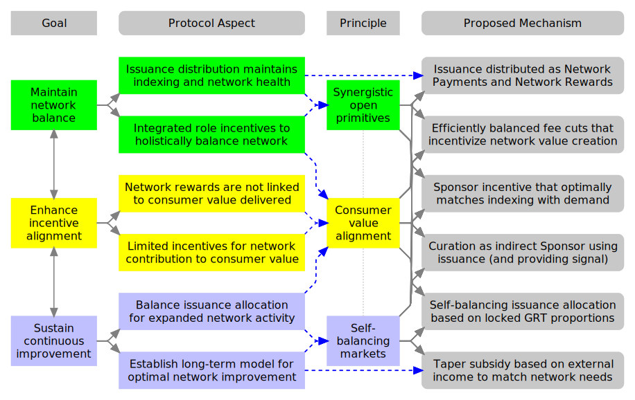
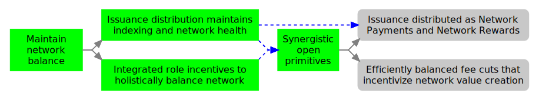
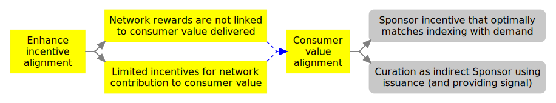
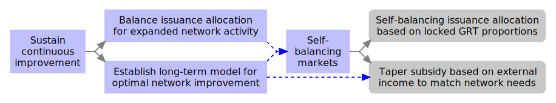
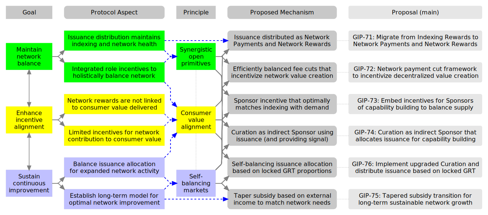
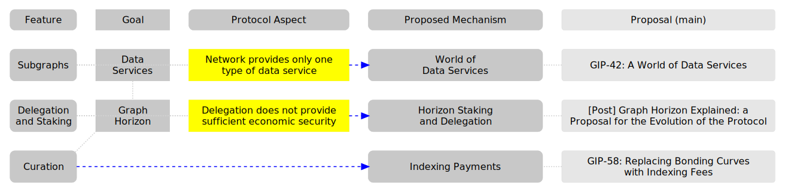

<!-- markdownlint-disable MD033 --><!-- Allow inline HTML. -->

## Abstract <!-- omit in toc -->

We present a high-level target vision for The Graph Protocol that coherently combines the original Graph Protocol and the Graph Horizon evolution paradigms to:

1. Engage the community in shaping the ongoing protocol evolution.
2. Provide context for evaluating and aligning mechanism proposals with the shared vision.
3. Initiate a roadmap to advance The Graph’s mission of organizing and serving the World’s public information.

## Contents <!-- omit in toc -->

<!-- ToC is automatically generated; manual updates are likely to be lost. -->

- [Motivation](#motivation)
- [Prior Art](#prior-art)
- [Goals](#goals)
  - [Maintain network balance](#maintain-network-balance)
  - [Enhance incentive alignment](#enhance-incentive-alignment)
  - [Sustain continuous improvement](#sustain-continuous-improvement)
- [Principles](#principles)
  - [Synergistic open primitives](#synergistic-open-primitives)
  - [Consumer value alignment](#consumer-value-alignment)
  - [Self-balancing markets](#self-balancing-markets)
- [Design](#design)
  - [Issuance distributed as Network Payments and Network Rewards](#issuance-distributed-as-network-payments-and-network-rewards)
  - [Efficiently balanced fee cuts that incentivize network value creation](#efficiently-balanced-fee-cuts-that-incentivize-network-value-creation)
  - [Sponsor incentive that optimally matches indexing with demand](#sponsor-incentive-that-optimally-matches-indexing-with-demand)
  - [Curation as indirect Sponsor using issuance (and providing signal)](#curation-as-indirect-sponsor-using-issuance-and-providing-signal)
  - [Self-balancing issuance allocation based on locked GRT proportions](#self-balancing-issuance-allocation-based-on-locked-grt-proportions)
  - [Taper subsidy based on external income to match network needs](#taper-subsidy-based-on-external-income-to-match-network-needs)
- [Rationale](#rationale)
  - [Rationale: Issuance distributed as Network Payments and Network Rewards](#rationale-issuance-distributed-as-network-payments-and-network-rewards)
  - [Rationale: Efficiently balanced fee cuts that incentivize network value creation](#rationale-efficiently-balanced-fee-cuts-that-incentivize-network-value-creation)
  - [Rationale: Sponsor incentive that optimally matches indexing with demand](#rationale-sponsor-incentive-that-optimally-matches-indexing-with-demand)
- [Summary](#summary)
- [Graph Horizon context](#graph-horizon-context)
- [Copyright waiver](#copyright-waiver)

## Motivation

The initial success of The Graph Network is built on a protocol foundation of Staking and Delegation, Subgraphs, Curation, and Indexing Rewards. These mechanisms were not designed in isolation, they are an integrated set of mechanisms to balance participant incentives, and to balance supply to match demand.

Graph Horizon made an important paradigm shift for The Graph Protocol, with Horizon Staking and Delegation improving the economic security model of the protocol while also providing a more modular foundation better able to support other use cases. This modular approach provides a foundation for World of Data Services to extend the range of Data Services available on The Graph Network.

With the protocol consisting of integrated mechanisms designed to work together, the changes to Staking, Delegation, and Subgraphs require that changes also be made to Curation and Indexing Rewards to complete the change and paradigm shift of Graph Horizon, for a coherent and holistically balanced target state. However, when [GIP-0058: Replacing Bonding Curves with Indexing Fees](https://forum.thegraph.com/t/gip-0058-replacing-bonding-curves-with-indexing-fees/4425) was proposed there was concern because that proposal in isolation did not propose how issuance would be distributed to incentivize indexing, as Indexing Rewards currently do. There was also no incentive structure to effectively balance supply to demand or opportunity articulated, nor a replacement mechanism or incentive to provide signal for subgraphs of interest.

The motivation for this proposal is to provide a target state representing a holistically designed protocol upgrade consisting of coherently integrated mechanisms. The design goals include enhancing the incentive structure to support diverse value contribution, providing effective balancing of supply on the network to match both known demand and anticipated opportunity, and to build long-term sustainability into the core protocol. In pursuing those goals, we focus on maintaining the foundational network balance of the original protocol, while enhancing incentive alignment and designing for the long-term sustainability of The Graph.

The diagram below summarizes the scope of the proposal. Subsequent sections elaborate on the details.

## Prior Art

- [Graph Horizon Explained: a Proposal for the Evolution of the Protocol](https://forum.thegraph.com/t/graph-horizon-explained-a-proposal-for-the-evolution-of-the-protocol/5169)
- [GIP-0058: Replacing Bonding Curves with Indexing Fees](https://forum.thegraph.com/t/gip-0058-replacing-bonding-curves-with-indexing-fees/4425)
- [Introducing Graph Horizon - A data services protocol](https://forum.thegraph.com/t/gip-0066-introducing-graph-horizon-a-data-services-protocol/5989)

## Goals

All protocol design is anchored on the purpose of creating value for users of The Graph and the trusted serving of the World's public data through The Graph Network. For this we first identify what value can be created, then how diverse decentralized contributions can create that value, and finally how to fairly distribute rewards to effectively incentivize such value creation.

To improve value creation on that basis in the context of the existing protocol, this proposal focuses on design goals to [**Maintain** network balance](#maintain-network-balance), [**Enhance** incentive alignment](#enhance-incentive-alignment), and [**Sustain** continuous improvement](#sustain-continuous-improvement).

### Maintain network balance

The Graph Protocol holistically balances global incentives across all network activities. It is crucial to maintain this established global incentive balance during protocol upgrades.

<table>
<tr><td>

</td></tr><tr><td>

<strong id="maintain-subsidy">Issuance distribution maintains indexing and network health</strong>

While we aim to improve incentive alignment through value delivered and with Horizon Staking and Delegation mechanisms, protocol upgrades must continue to maintain and integrate mechanisms that distribute issuance to incentivize indexing.

</td></tr><tr><td>

<strong id="maintain-balance">Integrated role incentives to holistically balance the network</strong>

While we strive to improve incentive alignment at the micro level (such as individual subgraphs and local consumer demand), protocol upgrades must preserve the holistic balance established at the macro level between the overall supply of indexing and global demand.

</td></tr></table>

### Enhance incentive alignment

Where incentive alignment gaps exist, we aim to enhance the overall incentive structure of The Graph Protocol. Our goal is to ensure local decisions are more aligned with creating consumer value while extending incentive coverage across all network contributions that generate consumer value.

<table>
<tr><td>

</td></tr><tr><td>

<strong id="enhance-value">Network rewards are not linked to consumer value delivered</strong>

While Indexing Rewards incentivize global indexing supply, and Curation signals interest in subgraphs and incentivizes indexing:

Rewards are not linked to the quality of service delivered to users at query time.
Curation neither provides predictable indexing nor effectively matches consumer needs.

</td></tr><tr><td>

<strong id="enhance-contribution">Limited incentives for network contribution to consumer value</strong>

Currently, query fee cuts incentivize and reward Curation; however:

1. There is no equivalent mechanism for Data Services or Indexing Payments.
   1. No corresponding cut exists to incentivize indexing payments or reward indexing signals.
   2. The Data Services Framework neither requires nor facilitates such a cut.
2. The mechanism is inflexible and tightly coupled to subgraph indexing.
   1. It could potentially apply to other data modules but less easily to other capability-building use cases.
   2. The fixed cut proportion is typically suboptimal, creating either inadequate incentives or excessive overhead.
3. It provides limited coverage of the value network required to create or enhance value.
   1. For example, it does not incentivize creators and maintainers of subgraphs.
   2. It also fails to incentivize user support or collaboration.

</td></tr></table>

### Sustain continuous improvement

The Graph Network has successfully established itself, with [The New Era of The Graph](https://thegraph.com/blog/the-graph-roadmap-new-era/) demonstrating a continued trajectory of decentralized value creation. In upgrading The Graph Protocol’s incentive structure, we should anticipate and build into the protocol long-term provisions for sustaining healthy ongoing innovation.

<table>
<tr><td>

</tr></td>
</table>

## Principles

This proposal unites the principles of Graph Horizon and the original protocol, resolving initially incompatible incentive structures between the two paradigms.

### Synergistic open primitives

Developing flexible and interconnected primitives ensures The Graph ecosystem can evolve and expand while remaining cohesive. This flexibility allows for scalable growth and innovation without compromising the integrity of the network.

1. Develop flexible, synergistic primitives that work together seamlessly, enabling open, reusable components to create a coherent ecosystem.
2. Ensure holistic integration, allowing each primitive to combine with others, providing an extendable, cohesive network.
3. Support diverse applications by ensuring the system remains flexible and harmonized, capable of evolving while maintaining cohesion.

### Consumer value alignment

Aligning incentives with the creation of consumer value ensures contributors are rewarded based on the real-world impact they provide, driving quality, relevance, and efficiency across the network.

1. Link incentives to tangible delivered value, ensuring contributors are rewarded based on actual value provided to consumers.
2. Align incentives with the creation of consumer value, emphasizing quality, relevance, and efficiency.
3. Incentivize decentralized value creation, encouraging network participants to collaboratively contribute to maximizing consumer value.

### Self-balancing markets

Empowering local decisions and dynamic parameter adjustments allows participants to respond to specific local conditions, maintaining balance without relying on fixed global parameters. This adaptability ensures stability and sustainable value optimization and supports varied use cases and propositions.

1. Align incentives for decentralized local decisions to optimally match consumer needs.
2. Avoid globally fixed parameters, favoring dynamic local parameter selection to maintain equilibrium between supply and demand.
3. Rely on decentralized self-regulation, minimizing central oversight while reinforcing stability and market balance.

## Design

The design goals are to maintain network balance, enhance incentive alignment, and sustain continuous improvement of The Graph.

Existing protocol aspects are linked to proposed mechanisms based on the design principles of synergistic open primitives, consumer value alignment, and self-balancing markets.

Each proposed mechanism is explained and linked to the GIP planned to subsequently provide more detail.

### Issuance distributed as Network Payments and Network Rewards

The current system of distributing issuance through Indexing Rewards does not align rewards with the value delivered to consumers.

We propose migrating the distribution of issuance for rewards to a combination of Network Payments and Network Rewards.

1. Network Payments are direct payments for indexing and query services.
2. Network Rewards provide rewards for Indexers similar in nature to Indexing Rewards, but will incorporate qualifying criteria based on service quality to improve incentive alignment.

This distribution model will better link rewards to service delivery, aligning Indexer incentives with service quality to improve customer service and network health.

**Proposed approach**:

1. Distribute part of issuance subsidy using Network Payments. The issuance subsidy will be paid to Indexers via network payments for services they provide, through indexing and query fees, and balanced to promote the health of the network.
   1. Indexers will be selected to provide service based on service quality and history, available stake allocation, and pricing.
2. Distribute remainder of issuance subsidy as Network Rewards.
3. Indexer selection will be distributed and governed to ensure fair and appropriately distributed selection while also rewarding service quality.

**Notes**:

1. Migration from Indexing Rewards to Network Payments and Network Rewards will be gradual, allowing participants and the network time to adjust, and for the mechanisms to be tuned for optimum performance.
   1. Anticipated to be proposed as: [GIP-0071](https://github.com/graphprotocol/graph-improvement-proposals/blob/main/gips/0071.md): *Migrate from Indexing Rewards to Network Payments and Network Rewards* (TBC)
2. The distribution mechanism and selection algorithm will involve careful design and governance to ensure fair distribution and network health.
   1. Planned as [GIP-0077](https://github.com/graphprotocol/graph-improvement-proposals/blob/main/gips/0077.md): *Governance and distribution of issuance via Network Payments* (TBC)
   2. Regarding centralization concerns raised about the impact of removing Indexing Rewards in response to [GIP-0058: Replacing Bonding Curves with Indexing Fees](https://forum.thegraph.com/t/gip-0058-replacing-bonding-curves-with-indexing-fees/4425):
      1. That risk was inherently greater for reasons that do not apply to this proposal:
         1. There was no proposal to replace distribution of issuance; this proposal is based on distributing issuance and can therefore maintain (and potentially enhance) resistance to centralization.
         2. There was no proposal to replace Curation; this proposal is based on having a replacement Curation mechanism that is resistant to centralization.
      2. This is designed to work in combination with [Sponsor incentive that optimally matches indexing with demand](#sponsor-incentive-that-optimally-matches-indexing-with-demand).
      3. GIP-0077 mentioned above will be designed to address remaining risks and concerns.
         1. Even with the above factors inherently reducing the risk, this remains a major design consideration and criteria.
3. This mechanism addresses how issuance is distributed, not how much issuance is provided for subsidy.

### Efficiently balanced fee cuts that incentivize network value creation

Creating and optimizing consumer value depends on contributions from many actors. The protocol and network should facilitate and incentivize diverse contributions to enhance consumer value.

**Proposed approach**:

1. Embed standard framework for fee cuts into payment flows for all Data Services.
2. Avoid fixed fee cuts in favor of involved participants dynamically setting local fee cuts.
   1. Sponsor cut set by sponsoring agreement between Sponsor and Indexer (or another provider).
   2. Include cuts for network creators and supporters, such as for subgraphs, set as a small proportion of Sponsor cut.

### Sponsor incentive that optimally matches indexing with demand

The initial Indexing Payments proposal creates a free-rider problem where consumers can query based on the indexing paid for by others without contributing to the cost. There are inadequate incentives to contribute towards indexing for shared use. This proposal introduces a Sponsor mechanism that aligns incentives for the supply of indexing to match demand.

The Sponsor incentive is a critical component of creating a holistic coherent protocol upgrade and is analyzed from the perspectives of incentivizing value contribution, holistic network balance, and as a synergistic open primitive.

The Sponsor incentive (combined with the new Curation mechanism) provides an equivalent to the original Curation mechanism for self-balancing equilibrium between supply and demand.

**Approach**:

1. Sponsor Role: A Sponsor is any party that makes indexing payments, this could be a Gateway (on behalf of user), a dApp developer, or any participant requiring indexing.
   1. The Sponsor is expected to generally be either:
      1. A Gateway acting on behalf of users.
      2. [Issuance distributed as Network Payments and Network Rewards](#issuance-distributed-as-network-payments-and-network-rewards)
2. Indexer Pricing: Indexers post their service pricing parameters.
3. Indexer Selection: A potential Sponsor selects from available Indexers based on price, latency, and service history, and other factors.
   1. Selection will generally be done algorithmically by a Gateway.
4. The Sponsor initiates indexing by placing sponsorship into escrow, with conditions, including cut.
5. An Indexer confirms acceptance of (and commits to) the contract and starts indexing.
6. Subsequent queries of the indexed data will have the agreed cut returned to Sponsors.
   1. Presuming sufficient queries, Sponsors will be repaid up to a multiple (TBC, double) of sponsorship paid.
   2. Repayments will be split across repaying newest and oldest outstanding sponsorship.
7. Sponsorship terms are open to revision, with reasonable notice periods built-in (TBC).
   1. The mechanism provides a competitive advantage for the current Sponsor to maintain sponsorship.

**Notes**:

For familiarity the approach is explained in terms of indexing. The mechanism will be a modular primitive usable for any network capability building. Indexing is the main use case currently but there will be others in future, for example content creation for Knowledge Graph spaces.

### Curation as indirect Sponsor using issuance (and providing signal)

Curation was designed to work in combination with Indexing Rewards to:

1. Maintain a balance of indexing on network.
2. Act as a signal for which subgraphs should be indexed.
3. Incentivize such identification and curation.

Because Curation is tightly coupled to Indexing Rewards, migrating from Indexing Rewards to Network Payments for indexing subsidy means that Curation needs to be updated to integrate with and complement Network Indexing Payments.

An upgraded Curation mechanism is proposed that integrates with new protocol mechanisms while maintaining the essential properties of Curation.

**Approach**:

1. Curator locks GRT to indirectly (using issuance) Sponsor a capability of interest.
2. This causes an amount of the available issuance pool, in proportion to the locked Curation GRT relative to the total locked GRT, to become available to Sponsor indexing (or other capability building).
3. This Sponsorship becomes available, to be matched to the most suitable available Indexer.
   1. Note that while the Curator can set requirements, unlike a direct Sponsor the Curator will not be able to choose which Indexer. This is to prevent Curators inappropriately self-dealing issuance to themselves.
4. As the indirect Sponsor, the subsequent Sponsor cut from queries is given to the Curator to repay their Sponsorship. This is similar in concept to the existing Curation cut.
5. In addition to the issuance provided for Sponsorship, Curation also acts as signal to the rest of the network. This can facilitate:
   1. Shared sponsorship across multiple participants with common indexing requirements.
   2. Triggering network payment subsidy of sponsorship. Subsidy will still need a tangible signal to identify indexing needs. Subsidy could however provide a multiple of such signaled Curation, thereby providing an alternative to the existing combination of Curation and Indexing Rewards to trigger indexing.
      1. Note that such apparently 'cheap' sponsorship of indexing via subsidy is not an attractive option for indexing of high usage subgraphs because of the high fee cut associated with subsidized indexing.

### Self-balancing issuance allocation based on locked GRT proportions

The proposed changes are broad in scope. The mechanism changes will require substantial effort to fully define, test, and implement. Many of the concepts need to be piloted and refined prior to full implementation. Additionally, network participants need to have an opportunity to learn and adjust to mechanism changes. This proposal should not be implemented as a big bang switch, and (as far as is practical) individual aspects should be decoupled for parallel refinement and implementation.

We should start transitioning as soon as is practical, and with minimal coupling between aspects, so that we can rapidly improve incentive alignment, expand the network, and increase consumer value.

To support both such migration to new mechanisms and expansion of activity in The Graph ecosystem, the allocation of issuance will need to change over time to maintain an appropriate balance both across new mechanisms and (during the transition period) between existing mechanisms and new mechanisms.

Based on the principle of [self-balancing markets](#self-balancing-markets), allocation should not be based on fixed proportions, and it is proposed to self-balance issuance allocation in proportion to locked stake. Locked stake includes Indexer self-stake, Delegation, and Curation. While we expect long-term allocation to be based fully on proportion of locked stake, we expect that during the transition period there will be minimum stake level set for the indexing subsidy, to ensure the subsidy for indexing is maintained at an appropriate level even if there is a large-scale shift from Delegation to Curation. Details would be part of a subsequent GIP.

**Approach**:

1. Establish community acceptance and governance approval of this proposal as our protocol vision and target.
2. Establish (via community discussion and governance approval, based on a more detailed GIP) the high level parameters such as:
   1. The high-level locked GRT categories and mechanism.
   2. The subsidy taper Indexer Income Target (as per [Taper subsidy based on external income to match network needs](#taper-subsidy-based-on-external-income-to-match-network-needs)).
   3. The transition period minimum stake level for allocating to the indexing subsidy.
3. Implementation and deployment of top-level issuance allocation.
   1. Each allocation category would need a distribution mechanism.
      1. The initial distribution mechanisms could be very basic, potentially simply defaulting to feeding into the Indexing Rewards pool.
      2. For each allocation category, the distribution mechanism would subsequently go through standard governance for updates.
      3. The vast majority (likely over 99%) of issuance would initially be allocated for distribution via existing Indexing Rewards.
         1. This category would subsequently transition to a new distribution model as per [Issuance distributed as Network Payments and Network Rewards](#issuance-distributed-as-network-payments-and-network-rewards).
         2. At time of writing:
            1. Curation signal represents less than 0.03% of total locked stake, representing a tiny proportion.
            2. Query fees collected are less than 1.2% of issuance, which would be halved for an impact on reducing allocation to this category by just 0.6%.
            3. Eventually we expect the Indexer Income Target (which has not been set yet) to play a role in capping allocation, as per [Taper subsidy based on external income to match network needs](#taper-subsidy-based-on-external-income-to-match-network-needs).
4. Issuance allocation now self-balances between changing demand levels for different network uses.
5. Ongoing implementation and transition of distribution mechanisms for each allocation can be pursued in parallel.

### Taper subsidy based on external income to match network needs

Network Rewards were crucial to attract, develop, and maintain high-quality Indexers and establish The Graph Network, and continue to be critical to maintaining network health. To achieve this, rewards subsidize indexing and thereby Indexer participation. This has been incredibly successful, with high-quality Indexers maintaining the health of our network and collectively helping us pursue The Graph vision.

While this need for indexing subsidization has not yet reduced significantly, in our protocol design and evolution we should transparently establish how the network will gradually transition to a longer-term operating model less dependent on subsidy. The transition should be transparent, avoid surprises or sudden changes, and be done in a fair way in which all participants benefit from (and are incentive aligned with) network growth.

Long-term subsidy of the network should avoid subsidizing areas of established consumer demand; in these cases, consumer payment for service should pay the entire value network involved in delivering the service, either directly or indirectly. While issuance can initially be used to bootstrap new services, established services should transition to be paid for by consumers.

**Approach**:

1. When transitioning from Indexing Rewards to Indexer Payment Subsidy, an Indexer Income Target will be set.
   1. Likely to need a component that is externally denominated, for example in USD. Details TBD.
2. In the absence of external income (external consumer payments), the protocol would seek to maintain Indexer income at the level of the Indexer Income Target via subsidization from issuance.
   1. External consumer payments refer to payments originating outside of the network, and excludes payments made from issuance.
3. The target will be reduced by half of the external income for service, until reduced to zero.
   1. Reducing by half is a natural balance between reducing the subsidy while remaining incentive aligned on network growth. Such a reduction means that Indexers will earn more income as the network grows.
4. After a period of running with no subsidy due to high external income, the Indexer Income Target would be deemed obsolete and the mechanism disabled.
   1. This would happen when external income is maintained at a level of at least twice the Indexer Income Target.
   2. It is likely that some indexing will still be subsidized to support network health and/or common goods. This will be determined by governance based on network health and public goods needs, rather than as a guaranteed subsidy.
5. Issuance not required for the Indexer Income Target would be available to subsidize other network growth or otherwise support network health.
   1. How (or if) available issuance is used will be determined by governance and is outside the scope of this proposal.

Income as percentage of the Indexer Income Target:

| External Income | Subsidy Level | Indexer Income |
| --------------: | ------------: | -------------: |
|              0% |          100% |           100% |
|             50% |           75% |           125% |
|            100% |           50% |           150% |
|            150% |           25% |           175% |
|            200% |            0% |           200% |
|            250% |            0% |           250% |

## Rationale

### Rationale: [Issuance distributed as Network Payments and Network Rewards](#issuance-distributed-as-network-payments-and-network-rewards)

<table>
  <tr>
    <th>Type</th>
    <th>Requirement</th>
    <th>Implication</th>
  </tr>
  <tr>
    <td>Goal</td>
    <td><a href="#maintain-network-balance">Maintain network balance</a></td>
    <td rowspan="2">
      Maintain issuance distribution to incentivize sufficient indexing capacity, diverse high-quality Indexers, and healthy network operations.
    </td>
  </tr>
  <tr>
    <td>Aspect</td>
    <td><a href="#maintain-subsidy">Issuance distribution maintains indexing and network health</a></td>
  </tr>
  <tr>
    <td>Goal</td>
    <td><a href="#enhance-incentive-alignment">Enhance incentive alignment</a></td>
    <td rowspan="3">
      Align distribution of reward to tangible consumer value delivered, including query service quality.
      It is not enough for data to be indexed, consumer value is realized at query time and determined by the quality of service delivered at query time. There should be incentives alignment on such quality of service, which is not the case for Indexing Rewards.
    </td>
  </tr>
  <tr>
    <td>Aspect</td>
    <td><a href="#enhance-value">Network rewards are not linked to consumer value delivered</a></td>
  </tr>
  <tr>
    <td>Principle</td>
    <td><a href="#consumer-value-alignment">Consumer value alignment</a></td>
  </tr>
  <tr>
    <td>Principle</td>
    <td><a href="#synergistic-open-primitives">Synergistic open primitives</a></td>
    <td>
      Align issuance with the design of open primitives, distributing issuance via standard payment flows to:
      <ol>
        <li>Coherently align issuance use with overall network operation.</li>
        <li>Leverage self-balancing mechanisms built into primitives for network equilibrium.</li>
        <li>Incentivize and facilitate participant sponsorship of established subgraphs.</li>
        <li>Facilitate seamlessly reducing dependency on subsidy in response to increasing external demand.</li>
      </ol>
    </td>
  </tr>
  <tr>
    <td>Principle</td>
    <td><a href="#self-balancing-markets">Self-balancing markets</a></td>
    <td>
      <ol>
        <li>Optimize selection of Indexers to optimize Indexer efficiency, diversity, and network equilibrium.</li>
        <li>Incentivize and facilitate participant sponsorship of established subgraphs.</li>
        <ol>
          <li>Focus distribution of issuance on expanding and improving the network rather than on subsidizing services for consumers.</li>
        </ol>
      </ol>
    </td>
  </tr>
</table>

### Rationale: [Efficiently balanced fee cuts that incentivize network value creation](#efficiently-balanced-fee-cuts-that-incentivize-network-value-creation)

<table>
  <tr>
    <th>Type</th>
    <th>Requirement</th>
    <th>Implication</th>
  </tr>
  <tr>
    <td>Goal</td>
    <td><a href="#maintain-network-balance">Maintain network balance</a></td>
    <td rowspan="2">
      Maintain integrated role incentives to collectively optimize service, including an equivalent of Curation that incentivizes the network to find an appropriate equilibrium between supply and demand.
    </td>
  </tr>
  <tr>
    <td>Aspect</td>
    <td><a href="#maintain-balance">Integrated role incentives to holistically balance network</a></td>
  </tr>
  <tr>
    <td>Goal</td>
    <td><a href="#enhance-incentive-alignment">Enhance incentive alignment</a></td>
    <td rowspan="2">
      Enhance incentives for network contributions that add consumer value, particularly for contributions not directly involved in the delivery transaction.
    </td>
  </tr>
  <tr>
    <td>Aspect</td>
    <td><a href="#enhance-contribution">Limited incentives for network contribution to consumer value</a></td>
  </tr>
  <tr>
    <td>Principle</td>
    <td><a href="#consumer-value-alignment">Consumer value alignment</a></td>
    <td>
      <ol>
        <li>The protocol needs to ensure all required contributions to value creation are incentivized and facilitate optimizing consumer value.</li>
        <li>To realize the value delivered at query time requires contribution from parties not directly involved in the payment flow.</li>
        <li>That necessarily, for alignment of incentive to tangible consumer value, requires a cut of the payment to be distributed to other parties.</li>
      </ol>
      Contributions to value creation need to be incentivized by distributing a cut from payment flows to value contributors not involved in the delivery transaction.
    </td>
  </tr>
  <tr>
    <td>Principle</td>
    <td><a href="#self-balancing-markets">Self-balancing markets</a></td>
    <td>
      Dynamically adjust local fee cuts to balance service supply and demand, ensuring the system remains in equilibrium.
      <ol>
        <li>The appropriate level of cut depends on local circumstances; fixed and global cuts will be inappropriate.
          <ol>
            <li>The existing protocol compromises by setting a fixed cut. Such a fixed cut will invariably be sub-optimal.</li>
            <li>Horizon recognized the inability of the protocol to set an appropriate global cut and delegated the decision to Data Service developers.</li>
            <li>However, individual data services are not well-placed to establish such global cuts.</li>
            <li>Yet, without there being a cut, there are limited incentives for network contributions to consumer value.</li>
          </ol>
        </li>
        <li>Rather than either the protocol or data services setting global cuts, the protocol should instead facilitate participants' finding the optimal local equilibrium.</li>
      </ol>
    </td>
  </tr>
  <tr>
    <td>Principle</td>
    <td><a href="#synergistic-open-primitives">Synergistic open primitives</a></td>
    <td>
      The primitives should facilitate diverse value contribution including:
      <ol>
        <li>Protocol evolution to support ongoing innovation, expansion of value creation, and alignment of incentives.</li>
        <li>Data service development, enhancement, maintenance, and support.</li>
        <li>Data module definition, enhancement, maintenance, and support.</li>
        <li>Indexing or other advance preparation of content in anticipation of future demand.</li>
        <li>Serving data to satisfy queries.</li>
      </ol>
      Note that such stages of value creation can involve:
      <ol>
        <li>Chaining (serially) through multiple contributors.</li>
        <li>Composition (horizontally) across multiple contributors.</li>
        <li>Decentralized collaboration to pool expertise, continuously improve service, and optimize value.</li>
      </ol>
    </td>
  </tr>
  <tr>
   <th colspan="2">Summary</th>
   <td>
      1. Optimizing consumer value requires incentivization of contributors not involved in the service transaction.
      2. To align incentives to delivering tangible consumer value, incentives should be linked to payment for delivered value; incentivization should flow from payments for service, by distributing a proportion of payments to contributors.
      3. The appropriate cut rate is best determined locally rather than being fixed or global; the protocol should not seek to fix cuts but instead allow the market to dynamically set local fee cuts.
   </td>
  </tr>
</table>

### Rationale: [Sponsor incentive that optimally matches indexing with demand](#sponsor-incentive-that-optimally-matches-indexing-with-demand)

<table>
   <tr><th>Type</th><th>Requirement</th><th>Implication</th></tr>
   <tr><td>Goal</td><td><a href="#maintain-network-balance">Maintain network balance</a></td><td rowspan="2">

   Maintain incentive structure to globally balance supply of indexing with demand, including to avoid free-rider incentives to consumers without contribution to shared resources.

      </td>
   </tr>
<tr><td>Aspect</td><td><a href="#maintain-balance">Integrated role incentives to holistically balance network</a></td></tr>
<tr><td>Goal</td><td><a href="#enhance-incentive-alignment">Enhance incentive alignment</a></td><td rowspan="3">

Enhance incentive structure to optimize supply of indexing to match consumer needs.

</td></tr>

<tr><td>Aspect</td><td><a href="#enhance-value">Network rewards are not linked
to consumer value delivered</a></td></tr>
<tr><td>Principle</td><td><a href="#consumer-value-alignment">Consumer value alignment</a></td><td>

</td></tr>
<tr><td>Principle</td><td><a href="#self-balancing-markets">Self-balancing markets</a></td><td>

<ol>
<li>Directly select providers to match consumer needs, optimizing service provision to maintain market balance.</li>
<li>Encourage decentralized participation, allowing the market to self-regulate without central oversight, reinforcing balance.</li>
</ol>

</td></tr>
<tr><td>Principle</td><td><a href="#synergistic-open-primitives">Synergistic open primitives</a><td>

The primitives should facilitate diverse value contribution including:

1. Protocol evolution to support ongoing innovation, expansion of value creation, and alignment of incentives.
2. Data service development, enhancement, maintenance, and support.
3. Data module definition, enhancement, maintenance, and support.
4. Indexing or other advance preparation of content in anticipation of future demand.
5. Aligning with and supporting indexing payment proposals.

</td></tr>
<tr><th colspan="2">Summary</th><td>

1. To align incentives to delivering tangible consumer value, incentives should be linked to payment for delivered value.
2. Optimizing consumer value requires incentivization of contributors not involved.
3. Such incentivization should flow from payments for service, by distributing a proportion of payments to contributors.
4. The appropriate cut rate is best determined locally rather than being fixed or global.
5. The protocol should not seek to fix cuts but instead allow the market to dynamically set local fee cuts.

</td></tr>
</table>

## Summary

Fundamental protocol changes are proposed to provide a coherent upgrade that maintains balance while enhancing incentive alignment, sustainability, and stability.

Although the proposed mechanisms are significantly different, they collectively satisfy the goals of existing mechanisms. While there are important nuances, the proposed equivalents to existing mechanisms being replaced are summarized as follows:

<table>
  <tr>
    <th>Existing</th>
    <th>Proposed</th>
    <th>Explanation</th>
  </tr>
  <tr>
    <td>Indexing Rewards</td>
    <td>
      <ol>
        <li><a href="#distribute-network-rewards-as-network-service-payments">Distribute network rewards as network service payments</a>, using:</li>
        <ol>
          <li>Indexing Payments</li>
          <li><a href="#sponsor-incentive-to-match-indexing-supply-to-demand">Sponsor incentive to match indexing supply to demand</a></li>
        </ol>
      </ol>
    </td>
    <td>
      
The issuance subsidy will migrate to being paid through Network Payments instead of as Indexing Rewards. Network Payments include both indexing and query payments made to Indexers on The Graph Network.

      
Network Payments improve the linking of indexing supply to consumer and network value by:

      <ol>
        <li>Matching available Indexers to the best indexing demand, thereby improving service quality and Indexer efficiency.</li>
        <li>Aligning network incentives with service quality.</li>
      </ol>
    </td>
  </tr>
  <tr>
    <td>Curation</td>
    <td>
      <ol>
        <li><a href="#curation-as-indirect-sponsor-using-issuance-and-signal">Curation as indirect Sponsor using issuance (and signal)</a>, using:</li>
        <ol>
          <li><a href="#sponsor-incentive-to-match-indexing-supply-to-demand">Sponsor incentive to match indexing supply to demand</a></li>
          <li><a href="#taper-and-match-subsidies-to-network-growth-needs">Taper and match subsidies to network growth needs</a></li>
        </ol>
      </ol>
    </td>
    <td>
      
With the migration of the issuance subsidy from Indexing Rewards to Network Payments, Curation will migrate to an upgraded mechanism of acting as an indirect Sponsor rather than as a signal for Indexing Rewards.

      
Upgraded Curation will still involve locking GRT to Curate, but with the new mechanism issuance, as a proportion to curation relative to total curation of the available curation sponsorship issuance pool, will become available to Sponsor.

      
Such Curation Sponsorship will be made available to be matched to suitable participants on the network. Unlike for direct Sponsorship, to avoid self-dealing of issuance, the Curator can only specify the criteria for Sponsorship and cannot directly choose the provider.

    </td>
  </tr>
</table>

## Graph Horizon context

While not part of this proposal, the context of Graph Horizon is a key input that might be of interest for some readers. For this purpose, a brief summary of relevant context is provided.

|Mechanism|Key Consideration|Response|
|-|-|-|
|Subgraphs|Network provides only one type of data service|World of Data Services|
|Delegation and Staking|Delegation does not provide sufficient economic security|Horizon Staking and Delegation|
|Curation|Supply of indexing not well matched to consumer demand|Match supply to demand by direct Indexing Payments|

|Response|Benefits|Limitations|
|-|-|-|
|World of Data Services|<li>Permissionless creation of data services to enhance the network.</li>|<li>Limited and inconsistent value chain incentivization.</li>|
|Horizon Staking and Delegation|<li>Efficient economic security.</li><li>Modular reusable mechanism.</li>|<li>Delegation has principal risk.</li>|
|Match supply to demand by direct Indexing Payments|<li>Direct matching of supply to demand.</li><li>Predictable outcomes.</li>|<li>Does not incentivize indexing Sponsors.</li><li>Limited balancing of global supply and demand.</li><li>Does not use issuance for indexing.</li><li>Does not replace Indexing Rewards.</li><li>No replacement for signal mechanism.</li>|

While Graph Horizon introduced an important paradigm shift to improve the original Graph Protocol, there was not yet clarity on how the following aspects of the original protocol would be maintained:

- Distribution of issuance to incentivize indexing.
- Incentivization of curation to support indexing.
- Embedding of incentives for indirect network value contributors.

These are all important to the success of the network. We intend the target state of this proposal to articulate mechanisms to maintain or provide appropriate replacements for these. We have sought not merely to provide adequate replacements, but to improve the incentive alignment for each of these through the combined application of Graph Horizon and original protocol paradigms.

## Copyright waiver

Copyright and related rights waived via [CC0](https://creativecommons.org/publicdomain/zero/1.0/).
