## Abstract

This GIP introduces a simple Issuance Allocator contract. In this iteration the Issuance Allocator operates based on fixed proportions, while future iterations can introduce self-balancing of issuance as outlined in GIP-0070. No change to issuance distribution is proposed in this GIP. This GIP also specifies the Rewards Manager upgrades that integrate with the Issuance Allocator mechanism.

## Introduction

The Graph community has shown strong support for upgrading network economics as outlined in [GIP-0070](0070.md). This proposal introduces a flexible issuance allocation mechanism through an "Issuance Allocator" contract that enables governance to configure how issuance is distributed across multiple targets.

This implementation takes an iterative approach to pursuing the long-term vision, creating a design that allows for new mechanisms to be piloted in parallel to existing distribution by the Rewards Manager before being integrated into the main issuance stream.

The Issuance Allocator contract design is made in combination with the Rewards Manager upgrade specified in this GIP.

## Contents <!-- omit in toc -->

<!-- ToC is automatically generated; manual updates are likely to be lost. -->

- [Abstract](#abstract)
- [Introduction](#introduction)
- [Prior Art](#prior-art)
- [High-Level Description](#high-level-description)
  - [Architecture Overview](#architecture-overview)
- [Detailed Specification](#detailed-specification)
  - [1. Issuance Allocator Contract](#1-issuance-allocator-contract)
  - [2. Direct Allocation](#2-direct-allocation)
  - [3. Rewards Manager Integration](#3-rewards-manager-integration)
  - [4. Governance and Monitoring](#4-governance-and-monitoring)
- [Alternatives](#alternatives)
- [Copyright Waiver](#copyright-waiver)

## Prior Art

This proposal builds on [GIP-0070](0070.md), which outlines a long-term vision for evolving The Graph Protocol economics.

## High-Level Description

The implementation creates a flexible issuance allocation system with three main components:

1. **Issuance Allocator Contract**: A governance-controlled contract that can split issuance between multiple configurable targets with adjustable allocation percentages.

2. **Target Integration Framework**: Supports both self-minting targets (like the existing Rewards Manager) and allocator-minting targets (like Direct Allocation contracts).

3. **Integration with existing Rewards Manager**: The Rewards Manager can optionally source its issuance rate from the IssuanceAllocator (detailed in section 3).

### Architecture Overview

The following diagram illustrates how the components interact using an illustrative example of a Pilot Allocation (not proposed in this GIP):

```mermaid
flowchart TB
  Governance["🏛️ Governance<br/>(The Graph Council)"]
  IssuanceAllocator["📊 Issuance Allocator"]
  RewardsManager["💰 Rewards Manager<br/>(Self-Minting)"]
  PilotAllocation["🧪 Pilot Allocation<br/>(Illustrative)<br/>(Allocator-Minting)"]

  %% Governance and allocation flows
  Governance -->|"Sets allocation<br/>percentages"| IssuanceAllocator
  IssuanceAllocator -->|"Provides calculated<br/>issuance rate"| RewardsManager
  IssuanceAllocator -->|"Mints tokens<br/>directly"| PilotAllocation

  %% Styling
  classDef allocator fill:#6F4CFF,stroke:#0C0A1D,stroke-width:2px,color:#0C0A1D
  classDef allocation fill:#4BCA81,stroke:#0C0A1D,stroke-width:2px,color:#0C0A1D

  class IssuanceAllocator allocator
  class RewardsManager,PilotAllocation allocation
```



1. Governance sets allocation percentages in the Issuance Allocator.
2. The Issuance Allocator calculates issuance for all targets.
3. For allocator-minting targets (e.g., a Direct Allocation instance for a pilot), the Issuance Allocator mints tokens directly.
4. For self-minting targets (Rewards Manager), the Issuance Allocator provides the issuance rate, and the target mints tokens itself.
5. Rewards Manager integration details are specified in section 3.

## Detailed Specification

### 1. Issuance Allocator Contract

Note: This allocation mechanism is distinct from subgraph allocations. The Issuance Allocator operates at the protocol level to manage overall token issuance, whereas subgraph allocations relate to indexer-specific allocations for individual subgraphs.

**The Mechanism**: A new top-level smart contract that provides flexible issuance allocation:

- Maintains existing total issuance per block rate
- Supports multiple configurable targets with governance-controlled allocation percentages
- Can add, remove, or adjust target allocations through governance
- Functions to set allocation percentages and distribute issuance to configured targets

No specific new targets are proposed. The mechanism supports any number of targets with governance-approved allocation percentages. In this iteration it can simply set the Rewards Manager's proportion; future GIPs may configure additional targets.

#### 1.1 Issuance Allocator Interface

The Issuance Allocator contract is responsible for allocating token issuance to different components of the protocol. It calculates issuance for all targets based on their configured proportions and handles minting for allocator-minting targets.

The contract distinguishes between two types of targets:

1. **Self-Minting Targets**: These are contracts that have their own minting authority (like the existing Rewards Manager). The Issuance Allocator calculates issuance for these targets but does not mint tokens directly to them. Instead, these contracts call `getTargetIssuancePerBlock()` to determine their issuance amount and mint tokens themselves.

2. **Allocator-Minting Targets**: These are contracts that cannot mint tokens themselves. The Issuance Allocator calculates issuance for these targets and mints tokens directly to them.

The self-minting feature is intended only for backwards compatibility with the existing Rewards Manager. New targets are expected to be allocator-minting, as this provides more robust control over token issuance.

#### 1.2 Pause and Accumulation System

The IssuanceAllocator includes a pause and accumulation system for operational safety:

- **When paused**: Distribution stops for allocator-minting targets, but issuance accumulates and will be distributed when unpaused
- **Self-minting targets**: Continue to operate (for backward compatibility with Rewards Manager)
- **Governance functions**: Remain available during pause for configuration changes
- **Recovery**: Accumulated issuance is distributed proportionally when unpaused or via manual `distributePendingIssuance()`

This system enables rapid response to operational issues while preserving issuance integrity.

#### 1.3 Roles and Access Control

The IssuanceAllocator uses role-based access control:

- **GOVERNOR_ROLE**: Can set issuance rates and manage target allocations
- **PAUSE_ROLE**: Can pause/unpause contract operations for emergency response

### 2. Direct Allocation

A generic Direct Allocation contract implements the `IIssuanceTarget` interface and serves as an allocator-minting target. When configured, the Issuance Allocator mints tokens directly to this contract, and an authorized operator can send them to designated addresses.

The contract is pausable, and when paused, tokens cannot be sent. Future GIPs may propose specific Direct Allocation instances for various purposes such as pilot programs or other network initiatives.

### 3. Rewards Manager Integration

The Rewards Manager is upgraded to optionally integrate with the IssuanceAllocator. Changes are minimal and backwards compatible.

#### 3.1 Issuance Configuration

The Rewards Manager can optionally source its issuance rate from an IssuanceAllocator. If the issuanceAllocator address is set, it queries the allocator for its self-minting issuance rate; otherwise it uses the existing internal issuancePerBlock.

```solidity
function getRewardsIssuancePerBlock() public view returns (uint256) {
    if (issuanceAllocator != address(0)) {
        return IIssuanceAllocator(issuanceAllocator).getTargetIssuancePerBlock(address(this)).selfIssuancePerBlock;
    }
    return issuancePerBlock;
}
```

Governance function to set the IssuanceAllocator address (only governor):

```solidity
function setIssuanceAllocator(address _allocator) external onlyRole(Roles.GOVERNOR) {
    issuanceAllocator = _allocator;
}
```

#### 3.2 Allocation-Change Hook

To maintain correct accounting when allocations change, Rewards Manager implements `IIssuanceTarget.beforeIssuanceAllocationChange()`, which the IssuanceAllocator calls before modifying allocations to update internal state.

#### 3.3 Roles and Access Control

- **GOVERNOR_ROLE**: Can set the IssuanceAllocator address
- **IssuanceAllocator**: Can call the `beforeIssuanceAllocationChange()` hook when registered
- All existing Rewards Manager roles and permissions remain unchanged

#### 3.4 Backward Compatibility

When issuanceAllocator is unset, Rewards Manager operates unchanged using its existing internal issuance rate. No changes are required to existing participants.

#### 3.5 Configuration

Governance can set/unset the issuanceAllocator address. Rewards Manager must be registered as a self-minting target in the IssuanceAllocator if integration is desired.

### 4. Governance and Monitoring

Protocol governance approves allocation percentages, with regular community reporting and adjustments based on results and feedback. The allocation mechanism can evolve toward the long-term self-balancing vision described in [GIP-0070](0070.md).

#### 4.1 Change Notification System

Before allocation changes, targets are notified via `IIssuanceTarget.beforeIssuanceAllocationChange()` to update internal state to the current block, prepare for the allocation change, and ensure consistency in reward calculations.

#### 4.2 Gas Limit Recovery

The contract includes mechanisms for handling gas limit issues:

- Pause functionality for emergency stops
- Individual target notification via `notifyTarget()`
- Force parameters to skip distribution requirements
- Target removal capabilities for malfunctioning contracts

## Alternatives

Alternatives considered include:

1. **Full Implementation of Self-Balancing Mechanism**: Implementing the complete self-balancing mechanism described in [GIP-0070](0070.md). This was rejected because it would take longer to implement and realize the benefits.
2. **No Change**: Continuing with the current issuance model. This was rejected as it does not address the needs to improve network economics, enhance incentive alignment, and accelerate innovation.
3. **Fixed Allocation Percentages**: Establishing fixed percentages for allocations without the flexibility of governance control. This was rejected because it would not allow for adjustments based on changing network needs and priorities.
4. **Complete Redesign**: Completely redesigning the issuance mechanism from scratch. This was rejected due to the significant development effort, security risks, and potential disruption to the network.

## Copyright Waiver

Copyright and related rights waived via [CC0](https://creativecommons.org/publicdomain/zero/1.0/).
