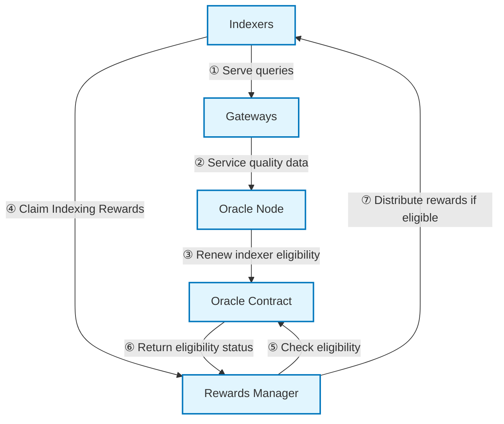

## Abstract

This GIP proposes the implementation of a Rewards Eligibility Oracle System that enforces minimum service quality requirements for indexers to receive indexing rewards. The system consists of an on-chain Oracle Contract that tracks indexer eligibility and off-chain Oracle Nodes that assess service quality and report eligible indexers to the Contract. This GIP also includes the necessary RewardsManager upgrades to integrate with the Oracle Contract. We anticipate that this mechanism will improve the overall reliability and performance of The Graph network and help the network better compete against other data service providers by aligning indexing incentives with service quality.

## Contents

<!-- ToC is automatically generated; manual updates are likely to be lost. -->

- [Abstract](#abstract)
- [Contents](#contents)
- [Motivation](#motivation)
- [High-Level Description](#high-level-description)
  - [System Flow](#system-flow)
- [Detailed Specification](#detailed-specification)
  - [Oracle Contract](#oracle-contract)
  - [RewardsManager Integration](#rewardsmanager-integration)
  - [Operational Flow](#operational-flow)
  - [Oracle Node Responsibilities](#oracle-node-responsibilities)
  - [Roles and Access Control](#roles-and-access-control)
  - [Configuration Parameters](#configuration-parameters)
- [Off-chain Logic](#off-chain-logic)
- [Backward Compatibility](#backward-compatibility)
- [Risks](#risks)
- [Copyright Waiver](#copyright-waiver)

## Motivation

The Graph Protocol currently distributes indexing rewards to all indexers regardless of their service quality or if actually serving queries. This creates a misalignment between protocol incentives and network utility, where indexers can claim rewards without providing meaningful service to data consumers.

The Rewards Eligibility Oracle System addresses this by making eligibility for Indexing Rewards dependent on indexers meeting service quality requirements. This improves incentive alignment for indexers to maintain reliable infrastructure and serve end-user query traffic.

## High-Level Description

This GIP introduces a service quality enforcement system consisting of two main components:

1. **Oracle Contract**: Tracks indexer eligibility based on service quality assessments from Oracle Nodes
2. **RewardsManager Integration**: Enforces eligibility checks before distributing indexing rewards

### System Flow



**① Serve queries**: Indexers serve queries via Gateways, generating query performance data.

**② Service quality data**: Gateways collect query performance metrics.

**③ Renew indexer eligibility**: Oracle Nodes evaluate indexer performance against quality thresholds and renew eligibility for qualifying indexers in the Oracle Contract.

**④ Claim Indexing Rewards**: Indexers attempt to claim indexing rewards (by closing allocations).

**⑤ Check eligibility**: The Rewards Manager queries the Oracle Contract to verify whether the claiming indexer is currently eligible for rewards.

**⑥ Return eligibility status**: The Contract returns the indexer's current eligibility status (eligible/not eligible) based on Oracle Node updates and expiration times.

**⑦ Distribute rewards if eligible**: The Rewards Manager distributes rewards to eligible indexers and denies rewards to ineligible ones.

This creates a system where indexers must maintain service quality standards for continued rewards eligibility.

## Detailed Specification

### Oracle Contract

The Oracle Contract provides the core functionality for tracking indexer service quality eligibility. It allows authorized Oracle Nodes to renew indexer eligibility to receive rewards, with eligibility expiring after a configurable period.

1. **Role-based Access Control**: Only accounts with the `OPERATOR` role can grant the `ORACLE` role to trusted Oracle Nodes.
2. **Time-based Eligibility**: Indexer eligibility expires after a configurable period, requiring regular reverification.
3. **Global Eligibility Validation Toggle**: Enables/disables eligibility validation network-wide.
4. **Oracle Update Timeout**: Safety mechanism that treats all indexers as eligible if no Oracle Node updates occur within a configurable period.

#### Interface

```solidity
interface IRewardsEligibilityOracle {
    function isEligible(address indexer) external view returns (bool);
}
```

#### Key Functions

- **`renewIndexerEligibility(address[] calldata indexers)`**: Renews eligibility for multiple indexers to receive rewards (ORACLE role required)
- **`isEligible(address indexer)`**: Returns whether an indexer is currently eligible for rewards
- **`setEligibilityPeriod(uint256 period)`**: Sets the eligibility duration (OPERATOR role required)
- **`setOracleUpdateTimeout(uint256 timeout)`**: Sets the Oracle Node update timeout (OPERATOR role required)
- **`setEligibilityValidation(bool enabled)`**: Enables/disables eligibility validation globally (OPERATOR role required)

### RewardsManager Integration

The RewardsManager is upgraded to optionally enforce service quality before distributing rewards. This integration is backward compatible and only activates when an Oracle Contract is configured.

1. **Optional Integration**: When an Oracle Contract is configured, the RewardsManager checks eligibility before reward distribution.
2. **Eligibility Verification**: Calls the Oracle Contract's `isAllowed()` function during reward claims.
3. **Reward Gating**: Only eligible indexers receive rewards; ineligible indexers are denied rewards.
4. **Backward Compatibility**: When no Oracle Contract is configured, operates exactly as before.

#### Service Quality Enforcement

```solidity
function takeRewards(address _allocationID) external returns (uint256) {
    // ... existing logic ...

    if (address(rewardsEligibilityOracle) != address(0)) {
        address indexer = allocations[_allocationID].indexer;
        if (!rewardsEligibilityOracle.isEligible(indexer)) {
            emit RewardsDeniedDueToEligibility(indexer, _allocationID);
            return 0;
        }
    }

    // ... continue with reward distribution ...
}
```

#### Configuration

```solidity
function setRewardsEligibilityOracle(address _oracle) external onlyRole(Roles.GOVERNOR) {
    rewardsEligibilityOracle = IRewardsEligibilityOracle(_oracle);
    emit RewardsEligibilityOracleSet(_oracle);
}
```

#### Events

```solidity
event RewardsEligibilityOracleSet(address indexed oracle);
event RewardsDeniedDueToEligibility(address indexed indexer, address indexed allocationID);
```

#### Interface Requirements

The RewardsManager expects the Oracle Contract to implement:

```solidity
interface IRewardsEligibilityOracle {
    function isEligible(address indexer) external view returns (bool);
}
```

### Operational Flow

1. Oracle Nodes regularly assess indexer service quality through off-chain mechanisms.
2. Indexers meeting minimum service requirements have their eligibility renewed to receive indexing rewards in the Oracle Contract.
3. Eligibility for indexing rewards expires after a configurable period (initially 14 days), requiring reverification at regular intervals for continued eligibility.
4. When an indexer claims rewards, the RewardsManager checks with the Oracle Contract to verify eligibility.
5. Only eligible indexers receive rewards, creating a direct incentive to maintain service quality.

### Oracle Node Responsibilities

Oracle Nodes play a critical role in the Rewards Eligibility Oracle System:

1. **Service Quality Assessment**: Oracle Nodes are responsible for assessing indexer service quality through off-chain mechanisms.
2. **Eligibility Renewal**: Oracle Nodes renew indexer eligibility in the Oracle Contract by calling the `renewIndexerEligibility` function.
3. **Transparency**: Oracle Nodes should provide transparency about their assessment methodology and results.

Oracle Nodes are expected to regularly update indexer eligibility to ensure the system reflects current service quality. The frequency of updates should be less than the configured eligibility period to ensure continuous eligibility for qualifying indexers.

### Roles and Access Control

**RewardsEligibilityOracle Contract:**

- **GOVERNOR_ROLE**: Admin of all other roles; can grant/revoke OPERATOR_ROLE and PAUSE_ROLE
- **OPERATOR_ROLE**: Can grant/revoke the ORACLE role to trusted Oracle Nodes, and can modify configuration parameters (eligibility period, Oracle Node update timeout, eligibility validation toggle)
- **ORACLE_ROLE**: Can renew indexer eligibility for rewards via `renewIndexerEligibility()` function
- **PAUSE_ROLE**: Can pause/unpause contract operations

**RewardsManager Integration:**

- **GOVERNOR_ROLE**: Can set the RewardsEligibilityOracle address via `setRewardsEligibilityOracle()`
- **Existing roles**: All current RewardsManager roles and permissions remain unchanged
- **RewardsEligibilityOracle**: Provides read-only eligibility information when configured

### Configuration Parameters

The Oracle Contract includes several configurable parameters:

1. **Eligibility Period**: The period for which indexer eligibility lasts after being renewed (default: 14 days).
2. **Oracle Update Timeout**: The period after which all indexers are considered eligible if no Oracle Node updates occur (default: 7 days).
3. **Eligibility Validation Enabled**: A flag to enable or disable eligibility validation network-wide (default: disabled initially, to be enabled by operator when ready).

These parameters can be adjusted by operators to balance strictness and leniency based on network needs and maturity.

## Off-chain Logic

The Oracle Node logic for determining indexer service quality includes a conservative quality metrics assessment framework, designed to identify and exclude underperforming indexers from receiving indexing rewards, while providing a foundation for economic incentivization of further indexing service quality improvements as requirements are updated. We plan to refine requirements over the coming months/years to build upon this foundation such that indexers are encouraged to provide competitive subgraph indexing services that benefits network data consumers and upgrades the overall health and decentralization of the network.

1. **Quality Metrics Assessment**

   At launch, Oracle Nodes will monitor a range of metrics designed to assess whether an indexer is providing sufficient indexing service quality to be eligible to claim indexing rewards from the protocol. The metrics sampled will evolve over time and indexers will need to ensure that their infrastructure is capable of meeting the latest requirements to be eligible for rewards.

   Our goal is to encourage sustained network participation from indexers and to discourage indexers from attempting to claim rewards without serving queries. We believe that serving queries is a critically important part of being an indexer and want to encourage indexers to compete for query volume.

2. **Measurement Methodology**

   The initial implementation of Oracle Nodes builds upon pre-existing data pipelines (from our geographically distributed gateways into Google BigQuery) and queries that data directly. In this way, Oracle Nodes are able to utilize comprehensive query performance metrics that we already collect.

   The system processes data through a rolling 28-day evaluation window, analyzing internal query logs to identify qualifying indexers. This methodology focuses on identifying indexers that have consistent patterns of service delivery over a 28-day rolling window, rather than identifying indexers based on one-off peak performance. In this way we recognize that sustained and consistent uptime provides more value to data consumers and shows greater commitment from indexers than intermittent bursts of high performance.

   Oracle Node operations are automated with daily processing at consistent times of day, ensuring regular eligibility updates. The system incorporates comprehensive logging, health monitoring, and automatic retry mechanisms to maintain operational reliability while preserving complete audit trails for transparency and governance oversight. System failures are designed to be graceful, meaning that indexers are not left unable to claim rewards.

3. **Eligibility Criteria**

   Please see [Eligibility Criteria](https://github.com/graphprotocol/rewards-eligibility-oracle/blob/main/ELIGIBILITY_CRITERIA.md#eligibility-criteria) for the latest eligibility criteria.

   Initial thresholds are intentionally set conservatively to establish quality enforcement principles without disrupting existing network operations. This approach recognizes that indexers may need some time to optimize their infrastructure and acclimatize to new requirements, while ensuring that only severely underperforming or inactive indexers are excluded from rewards. The 5-day requirement set out in the document linked above represents only approximately 18% uptime over the 28-day evaluation period, establishing a deliberately low threshold that accommodates maintenance windows, temporary technical issues, and gradual participation ramp-up.

   Each threshold reflects practical operational requirements: The "200 OK" status requirement encourages indexers to ensure that their infrastructure is capable of serving successful queries; the 5-second response time accommodates infrastructure latency variations, while excluding severely degraded responses from counting towards eligibility; the 50,000 block synchronization requirement provides a generous buffer for sync issues, while encouraging indexers to sync to chain head; and the 500 GRT curation signal requirement puts up an economic barrier that indexers would have to overcome to game the system with self made subgraphs.

   As The Graph network adapts to quality-based rewards and indexer performance improves, thresholds can be gradually refined through progressive Oracle Node configuration updates, without requiring additional governance proposals. This evolutionary approach encourages quality improvements while providing indexers adequate time to enhance their service. We are highly motivated to ensure that indexers have sufficient time to adapt to new requirements before they roll out and will be proactive with our communications regarding any updates to the eligibility requirements.

4. **Oracle Node Operation**

   Oracle Nodes are scheduled for daily execution. This daily cadence ensures timely reflection of service quality changes while providing indexers multiple opportunities to qualify for rewards within each evaluation period. Eligible indexer wallet addresses have their eligibility renewed in the Oracle Contract.

   Oracle Nodes incorporate multiple failover mechanisms including automatic RPC provider switching, exponential backoff retry logic, and comprehensive health monitoring. All operations generate detailed logs for operational oversight, while historical eligibility data is preserved for a retention period for internal audit in dated directories. These measures ensure continuous Oracle Node operation.

## Backward Compatibility

The Rewards Eligibility Oracle System is designed to be backward compatible with the existing Graph Protocol:

1. **Optional Integration**: The RewardsManager can operate with or without the Oracle Contract configured.
2. **Gradual Adoption**: Eligibility validation can be disabled initially to allow for testing and observation.
3. **Safety Mechanisms**: The Oracle Node update timeout ensures that rewards continue to flow if the Oracle Node system fails.

## Risks

1. **Oracle Node Centralization**: Authorized Oracle Nodes have significant power over reward distribution. This is mitigated by:

   - Multiple Oracle Nodes can be authorized
   - Oracle Node actions are transparent and on-chain
   - Oracle update timeout ensures rewards continue if Oracle Nodes fail

2. **False Negatives**: Indexers might be incorrectly denied rewards. This is mitigated by:
   - Regular verification opportunities
   - Transparent eligibility criteria
   - Oracle Node update timeout as a safety mechanism

## Copyright Waiver

Copyright and related rights waived via [CC0](https://creativecommons.org/publicdomain/zero/1.0/).
