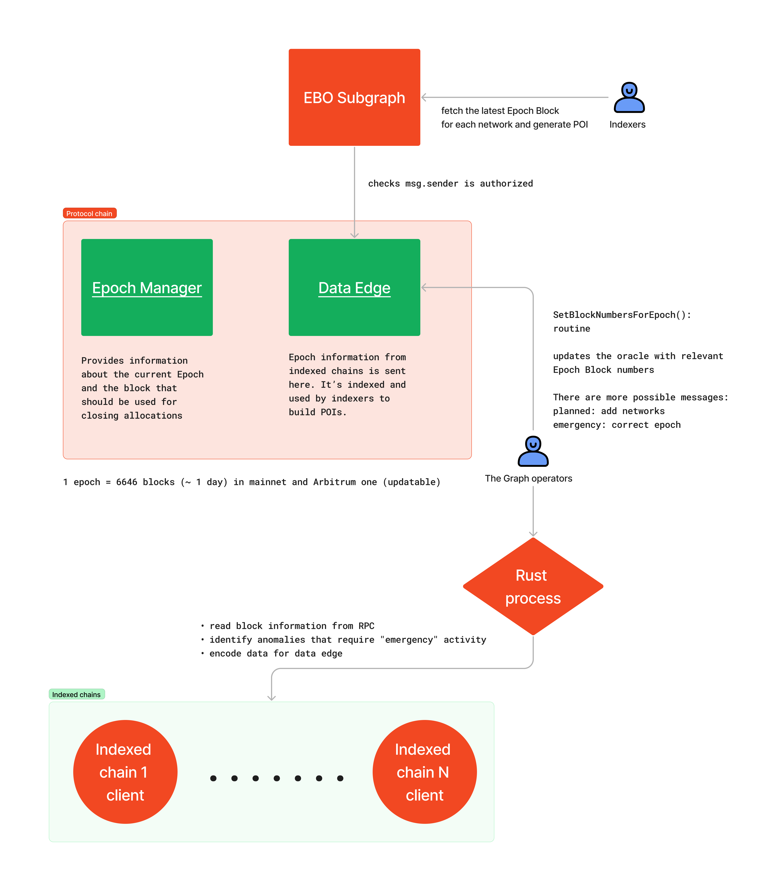
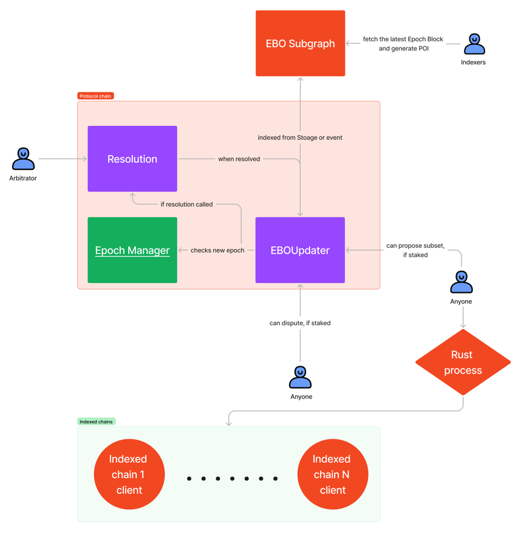
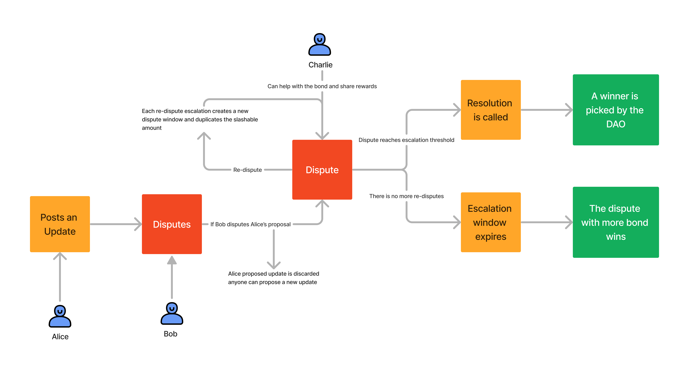
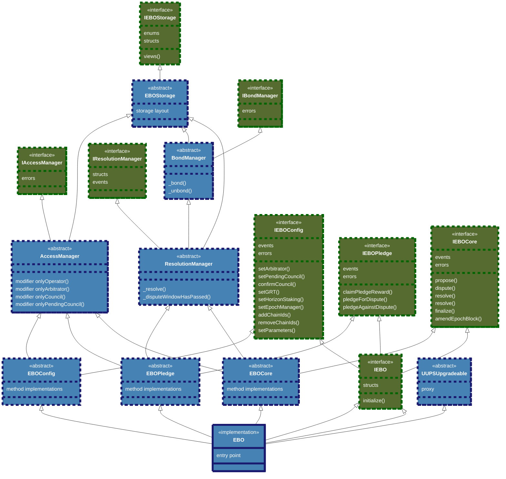
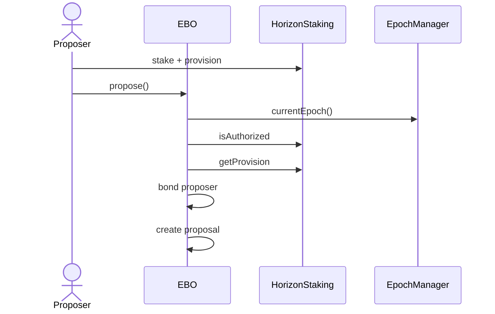
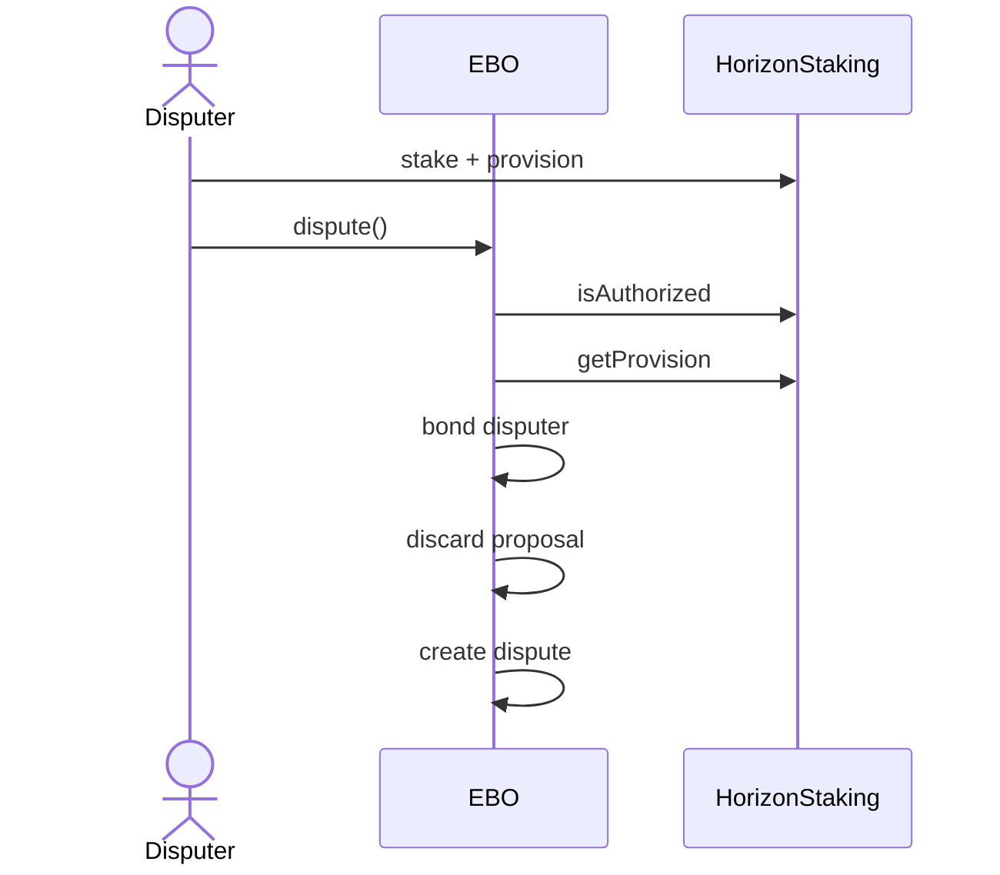
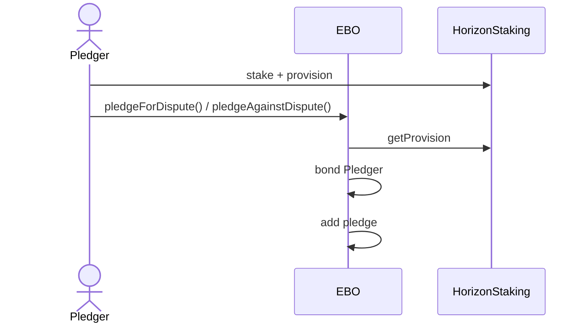
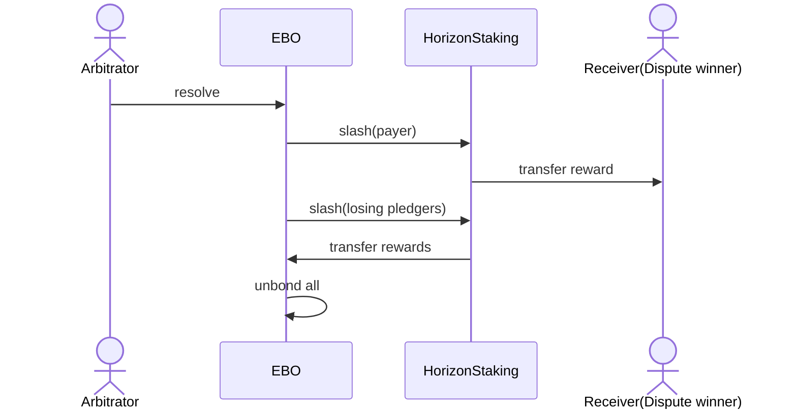
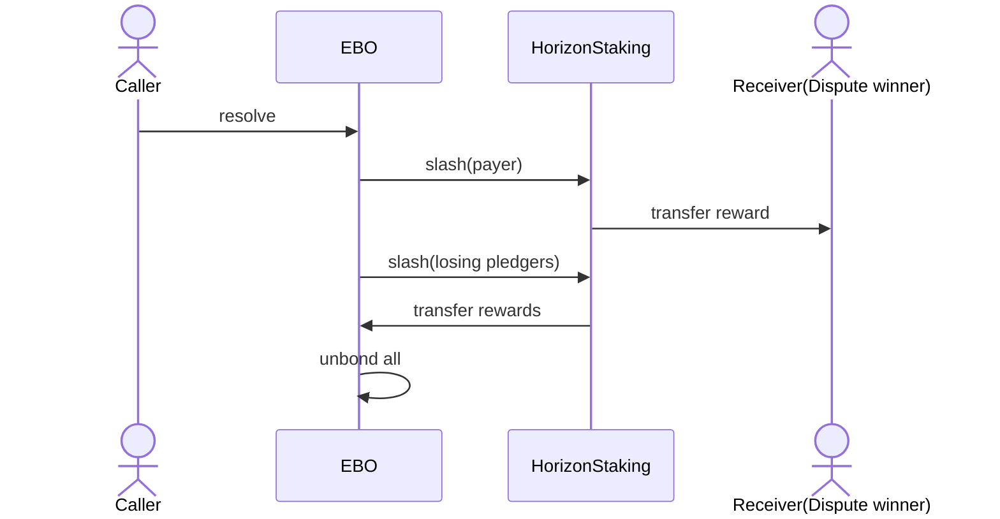

# **Abstract**

This GIP proposes using an optimistic oracle to translate epochs from any chain to Arbitrum One. This approach replaces the current Epoch Block Oracle (EBO) design with a new optimistic version, called Optimistic EBO, which synchronizes the clock across indexed chains supported by The Graph.

# **Motivation**

The first version of the EBO, introduced in [GIP-0038](https://forum.thegraph.com/t/gip-0038-epoch-block-oracle/3323), prioritized simplicity but introduced a potential single point of failure. With the protocol's [migration to Arbitrum](https://forum.thegraph.com/t/gip-0043-activate-indexing-rewards-in-the-graph-network-on-arbitrum-one/3999) and the upcoming [Horizon update](https://forum.thegraph.com/t/gip-0066-introducing-graph-horizon-a-data-services-protocol/5989), which will enable the integration of arbitrary data services, The Graph should continue its progressive decentralization efforts by further decentralizing the Epoch Block Oracle.

# **Prior Art**

Several approaches have been proposed to improve the oracle process within The Graph protocol:

- [Submitting recent blocks for POIs](https://forum.thegraph.com/t/require-that-more-recent-pois-are-submitted-in-order-to-collect-indexing-rewards-multi-blockhain-pois/2500)
- [On-chain epoch oracle](https://hackmd.io/KHLuc4haR5uCnmpMu0Ce7Q)

> Before adopting the optimistic approach, expanding the number of EBO operators to 3-5 Council-authorized organizations was considered. However, the design proposed in this GIP provides greater decentralization, reducing the potential for coordinated corruption and the reliance on the Council as a single point of failure.
> 

## Current status of Epoch Block Oracle

The EBO defines the source of truth for the block number corresponding to a new epoch in each indexed chain. It fetches the block for each epoch on each chain and records it on-chain on the protocol chain (Arbitrum One). An epoch is a period determined by the [EpochManager](https://github.com/graphprotocol/contracts/blob/main/contracts/epochs/EpochManager.sol), which lasts approximately one day but is measured in blocks.

Indexers use the EBO subgraph to get the block number for each chain and use it to build the POI (Proof Of Indexing), which is published when closing allocations to claim rewards.

If a dispute arises, an indexer who publishes a POI for the wrong block may be disputed by a fisherman and penalized by the Arbitrator.

The EBO is composed of 3 parts:

- A Rust process that reads information from RPCs.
- A [Data Edge](https://github.com/graphprotocol/block-oracle/blob/main/packages/contracts/contracts/DataEdge.sol) contract where updates get posted (compressed and encoded).
- A [Subgraph](https://github.com/graphprotocol/block-oracle/tree/main/packages/subgraph) that indexes the Data Edge allowing indexers to easily craft their POI.

### Current design

The current system is run by a single Operator, which is the largest trust assumption of the EBO.

### The Risks

- **Single Operator risk**: The current system is run by a single operator, which is the most prominent trust assumption of the EBO. There have been discussions around increasing the committee of validators/proposers.
- **Liveness risks**: If the owner fails to update the EBO, indexers won’t have a reference block to build their POIs, preventing them from closing their allocations or risk slashing if they register a POI for an incorrect block. The system must be redundant to mitigate this risk.
- **Fork risks**: There might be uncertainty around the correct fork choice when updating the EBO since it is not a fork oracle. For future verifiability efforts, it will likely be necessary to include blockhash in addition to the block number in the EBO’s output, making this even more important.

# **High-Level Description**

## Optimistic EBO Solution Considerations

The goal of this solution is to decentralize the EBO while keeping the structure open for future modifications.

**Key improvements:**

- **Optimistic operators:** Adopting an open and permissionless model will improve decentralization, redundancy, and scalability
- **Timestamp comparison:** Instead of querying each RPC when detecting a new epoch, a delay is introduced to compare timestamps, reducing time sensitivity and improving the precision of fork selection
- **Escalating bond mechanism:** An escalating bond dispute system is introduced to reduce Arbitrator intervention and enable lower initial stakes without compromising security
- **Secure Source of Truth:** The Council-owned multisig is kept as the source of truth for dispute resolution, ensuring security in the initial phase while allowing for future upgrades

### Optimistic Design

### **Optimistic operators**

The optimistic approach allows off-chain agents to propose updates to the Optimistic EBO. Other participants can dispute these updates, which triggers an escalation period during which votes can be cast for or against the dispute. If a maximum number of escalations is reached, the dispute is resolved by an arbitrator appointed by The Graph's Council.

The process works as follows:

- Any bonded actor can submit a proposal, which remains open for disputes for a set period. If no disputes are raised within that window, the proposal can be finalized
- If a bonded actor believes the proposal is incorrect, they can start a dispute, which automatically discards the original proposal. Disputers are incentivized to submit a corrected proposal
- Once a dispute starts, bonded actors can vote `for` or `against` it by pledging their support. The winning side is determined by having more votes, surpassing the opposing side by a configurable margin. Each vote resets the voting time window
- In the event of a dispute, the resolution mechanism is triggered. The winning side's voters are rewarded with the bonds from the losing side. If both sides reach the maximum number of escalations, the dispute is escalated to an arbitrator
- Once the dispute is resolved, the valid proposal is finalized

<aside>

Operators can update the block number of one chain at a time, allowing for ongoing disputes and resolutions for each updated chain. This improves the system's scalability.

</aside>

### Timestamp Comparison

Implementing a slight delay in timestamp comparison allows for safer EBO operations, significantly reducing risks related to RPC liveness and fork choice (finality) in exchange for a slight they delay in reward distribution:

- **Check the timestamp from the first block of the new epoch in the protocol chain (Arbitrum One).**
- **Check the block number for each indexed chain at that timestamp.**

The following methods can be used to prove that a specific block number corresponds to a claimed timestamp:

- Check the timestamps of two consecutive blocks $t_N$ and $t_{N+1}$. If the timestamp value from the protocol chain $t_0$ lives in the range $[t_N,t_{N+1}]$, then $N$ is the first block corresponding to the new epoch.
- Check a single block timestamp $t_N$ and an average block measure defined per chain $\Delta_i$. If the timestamp value from the protocol chain $t_0$ lives in the range $[t_N,t_N+\Delta_i]$, then $N$ is the first block corresponding to the new epoch.

### Escalating Bonds System

To reduce the number of calls to The Graph's Arbitrator, we propose implementing an escalating bond system.

- Any bonded actor can create a proposal.
- A proposal can only have one dispute.
- Any bonded actor can create a dispute if they believe the proposal value is incorrect. Once disputed, the proposal will be automatically discarded, and any bonded actor can submit a new one. The disputing party must stake sufficient funds in the - HorizonStaking contract to cover the bondSize.
- Disputing parties are incentivized to submit a new proposal since they have already computed the query.
- The winner of the resolution will receive the loser's bond. The Council should be incentivized to participate to support the protocol's integrity.
- Any bonded actor can vote for or against a dispute by calling the pledge function.
- The side with more pledges will win the dispute.
- Pledgers on the winning side will be proportionally rewarded with the bonds from the losing side.
- The contract is designed to minimize draws, thereby reducing the need for arbitrator intervention. When executing the pledge function, the total number of votes on one side must exceed the opposing side by an amount equal to the pledgeBondSize value. This parameter is configurable and updatable by the protocol.
- Each dispute has a refreshable time window during which votes can be cast for or against. Calling the pledge function refreshes the time window, allowing the opposing side to submit additional votes.
- If no disputes are raised within the predefined dispute window, the proposal is considered valid, and the finalize function can be invoked.
- The system supports a maximum number of escalations (maxNumberOfEscalations) representing the highest number of pledges allowed for either the for or against side.
- A draw can only occur when both the for and against sides reach the maximum number of escalations.
- If a draw occurs, the dispute will escalate, and the arbitrator will decide the final outcome.
- A proposal is considered valid once the finalize method is called for its ID, and the Finalize event is emitted.

<aside>

The escalating bond mechanism functions similarly to the justice system's appeal process, with the Council taking on the role of the Supreme Court.

</aside>

**Source of Truth**

If the escalating bond mechanism cannot resolve a dispute, the Arbitrator will be the final instance and ultimate source of truth, though this could change in the future.

There are other possible sources of truth for the protocol to verify the timestamp of a block on-chain:

- **Canonical bridges**: This is the most secure option since it shares the chain’s security, but on optimistic chains, it can introduce significant delays due to the mainnet withdrawal period
- **Third-party bridges**: Less secure but varying in their levels of trust.
    - **Light client-based bridges**: These use light clients to update block headers with timestamps, but no battle-tested solutions exist yet.
    - **Bridge aggregators**: Combine results from multiple bridges, like [Hashi](https://github.com/gnosis/hashi) or [LayerZero](https://docs.layerzero.network/v2/home/modular-security/security-stack-dvns) for EVMs, although it requires additional development
    - Other bridges require case-by-case analysis.

> Using an Arbitrator (a Council of qualified individuals selected by the governance) is the simplest way to launch the system at this early stage and manage all the chains with a single resolution mechanism. This approach allows for greater decentralization in the future, as the source of truth can be easily migrated.
> 

**Some considerations**:

- Implementing multiple resolution systems by chain or type (rollups, L1s, etc) adds complexity.
- The Council should upgrade the system to accommodate future improvements.
- Disputes should be managed per-chain to prevent a single dispute from impacting the entire system.

**Some considerations**:

- Implementing multiple resolution systems by chain or type (rollups, L1s, etc) adds complexity.
- The Council should upgrade the system to accommodate future improvements.
- Disputes should be managed per-chain to prevent a single dispute from impacting the entire system.

# **Detailed Specification and Parameters**

## **Contract Architecture**

<aside>

EBO will be a single proxy contract that inherits all interfaces and modules, and it will be deployed on Arbitrum.

</aside>

## **Contracts Description**

### **Abstract contracts for Common Functionality**

- **`EBOStorage`**: Provides the storage layout data and constants for `EBO`.
- **`AccessManager`**: Provides access control modifiers for the `operator`, `arbitrator`, `council`, and `pending council`.
- **`BondManager`**: Contains reusable logic for bond functionality and interacts with the `HorizonStaking` contract.
- **`ResolutionManager`**: Contains the logic for dispute resolution functionality.

### **Abstract Modules**

- **`EBOConfig`**: Contains the EBO configuration logic, with functions for setting variables required by the arbitrator and council.
- **`EBOPledge`**: Contains the logic for dispute resolution functionality (pledging).
- **`EBOCore`**: Contains the core logic for EBO (proposing, disputing, resolving, etc.).

### **Main Contract**

- **`EBO`**: It’s the only non-abstract contract and the entry point. It’s a proxy that contains all the EBO logic.

## **Subgraph**

The EBO subgraph will contain the indexed data generated by the events emitted in the EBO contract. It includes an `amendEpochBlock` function for the arbitrator to correct errors.

## **Main Flows**

<aside>

The following sequence diagrams represent, at a high level of abstraction, the most critical aspects of the contract's work during flow execution. However, they do not capture all the steps performed, so they should be considered a general overview.

</aside>

### Propose Flow

### **Dispute Flow**

### **Pledge Flow**

### **Resolve Flow (Arbitrator)**

### Resolve Flow (Permissionless)

## Proposal Lifecycle

### **Definitions**

- **Proposal bond size**: the amount staked and provisioned in `HorizonStaking` needed to create or dispute a proposal.
- **Pledge Bond Size:** The amount staked in `HorizonStaking` that represents a single pledge. One pledge is required when calling the pledge function for the **`first`** time. Subsequent calls will require exactly **`two`** pledges to surpass the opposing party, unless the maximum **`maxPledgesNumber`** is reached with the last pledge.
- **Proposal Creation**: The block timestamp when a proposal is created.
- **Dispute Window**: The period users can challenge a proposal before it is finalized and deemed valid.
- **Pledge Window**: If a proposal is disputed, this represents the minimum duration during which users can pledge either in support of or against the dispute (provided that the maximum number of pledges for both sides has not been reached beforehand).
- **Max Number of Pledges:** The maximum number of pledges permitted per side in a dispute.
- **Pledge Refresh Window:** This window opens after a user places a pledge, allowing others to pledge on the opposing side. It operates independently of the pledge time window and can remain open as long as the previous Pledge Refresh Window is active, up to the maximum number of pledges.
- **Arbitrator Resolution Window**: The time required for the arbitrator to resolve an escalated dispute.
- **Min Thawing Period**: The minimum duration a user must wait to thaw their tokens in the `HorizonStaking` contract, ensuring compatibility with EBO's most extended possible proposal life cycle scenario.

### **Parameters, Formulas, and Recommendations**

**Minimum Thawing Period Calculation**

To determine the `Minimum Thawing Period` (`minThawingPeriod`), the maximum possible duration of a proposal's lifecycle is calculated. This calculation is based on the longest-case scenario, which assumes every action (disputing, pledging) is taken at the last possible moment.

The `maxProposalLifecycleDuration` is the sum of `disputeWindow`, `pledgeWindow`, `maxCumulativePledgeRefreshWindow` (the sum of all pledge refresh windows), and `arbitratorResolutionWindow`. The `minThawingPeriod` must always be greater than or equal to this maximum duration

**Recommendation Values and Example**

The following initial parameter values are suggested:

- **Dispute Window**: 12 hours
- **Pledge Window**: 2 days
- **Pledge Refresh Window**: 1 day
- **Proposal Bond Size**: 15K GRT
- **Pledge Bond Size**: 15K GRT
- **Max Number of Pledges**: 4

<aside>

**Goal:** We are aiming for approximately five rounds (pledge calls). Applying these values to the calculation, the total `_maxProposalLifecycleDuration` is `12h + 48h + 96h (4*24h) + 168h (7*24h) = 324h`, which equals 13.5 days. Therefore, the `_minThawingPeriod` must be greater than or equal to 13.5 days.

</aside>

**Bond Flow Recommendations**

The following table details the bond flow and cumulative time for a full dispute scenario with the suggested values.

| Calls | Proposerbond per call | Disputer bond per call | Max duration | Description | Proposerpledges numberby call | Disputer pledges Numberby call | State after call | CumulativeProposercompromised stake | CumulativeDisputercompromisedstake | Cumulative time |
| --- | --- | --- | --- | --- | --- | --- | --- | --- | --- | --- |
| Proposal bond | 15K GRT |  | 12hs | The dispute window opens |  |  |  | 15K |  | 12hs |
| Dispute call |  | 15K GRT | 2 days | The current state is (0-0) No resolution |  |  | No Resolution |  | 15k | 60hs |
| Pledge call  1 |  | 15K GRT | 1 day | The first pledge call is always the cheapest since there is no existing pledge to surpass |  | 1 | Disputer Won |  | 30k | 84hs |
| Pledge call 2 | 30K GRT |  | 1 day | The counterparty must exceed the total pledges of the opposite side by one pledge | 2 |  | Disputer Lost | 45K |  | 108hs |
| Pledge call 3 |  | 30K GRT | 1 day |  |  | 2 | Disputer Won |  | 60k | 132hs |
| Pledge call 4 | 30K GRT |  | 1 day |  | 2 |  | Disputer Lost | 75k |  | 156hs |
| Pledge call 5 |  | 15K GRT | Call Arbitrator | The maximum number of pledges has been reached by both parties, and the arbitrator is called |  | 1 | Dispute Escalated |  | 75k | - |
| Arbitrator resolution |  |  | 7 Days |  |  |  |  |  |  | 324hs |
| Totals | 75K GRT | 75k GRT | 13 days and 6-12hs |  | 4 pledges | 4 pledges |  |  |  |  |

<aside>

The total bond at stake (75k GRT) represents 75% of the minimum stake required by The Graph for Indexers

</aside>

## Off-Chain Agents

### **Architecture and Role**

The EBO Agent is a standalone process that monitors events on the protocol chain (Arbitrum) and responds to them to automate EBO workflows. Its primary responsibility is to interact with the EBO smart contracts and perform the necessary block calculations to propose, validate, or dispute responses on the chains supported by The Graph.

### **Capabilities**

- Create requests for new epochs.
- Propose responses (block numbers).
- Dispute incorrect proposals.
- Participate in the dispute escalation process (pledging).
- Finalize proposals that do not escalate to the arbitrator.

### **Modular Design**

The agent consists of two main modules to separate concerns:

- **DisputeModule**: Manages all dispute-related activities, operating reactively to on-chain events.
- **BlockNumberModule**: Is exclusively responsible for computing the block number corresponding to a specific timestamp for any supported chain.

### **Limitations**

The system is not designed to handle disputes that escalate to the Arbitrator for final resolution, as this process is handled directly by The Graph's Arbitrator.

## **External Contracts Integration**

EBO's integration focuses on two main external contracts: `HorizonStaking` and `EpochManager`. In the context of EBO, the `service provider` is the actor posting a bond (proposer, disputer), while the `verifier` is always the EBO contract itself.

### **`HorizonStaking` Integration**

- **Funding Provision**: Before interacting with EBO, participants must stake and provision GRT tokens in the `HorizonStaking` contract, specifying the EBO contract as the `verifier`.
- **Provision Verification**: EBO uses the `getProvision` function from `HorizonStaking` to verify that an actor's provision meets the minimum requirements, such as the `minThawingPeriod` and a `maxVerifierCut` of 100%.
- **Bond Validation**: To secure funds, EBO validates that an actor's committed bonds do not exceed their locked tokens that are not in the process of being thawed (`_tokensNotThawing`). The EBO contract internally tracks bonds to prevent double-spending of the same funds.
- **Slashing**: EBO calls the `slash` function on `HorizonStaking` to penalize actors who lose a dispute. The funds are transferred from the penalized actor to the corresponding winners.

### **`EpochManager` Integration**

EBO interacts with the `EpochManager` to validate epochs. When creating a proposal, it calls the `currentEpoch` function to ensure that the proposal corresponds to a valid (current or past) epoch and not a future one.

# **Dependencies**

The [horizon staking contract](https://github.com/graphprotocol/contracts/pull/944), as described in [GIP-0066](https://github.com/graphprotocol/graph-improvement-proposals/blob/main/gips/0066-graph-horizon.md), needs to be deployed to integrate with it.

# Who is Wonderland?

We’re a group of developers, researchers, and data scientists with one thing in common: we all love building cool sh*t. [DeFi sucks](https://wonderland.xyz/), but we are here to make it better.

Our mission is to discover, partner with, and empower innovators to create open, permissionless, decentralized financial solutions. We pledge to stand by our partners, working with and supporting them in every way possible.

We have partnered with some of the most successful and promising protocols in Web3 – including [Aztec](https://aztec.network/), [Optimism](https://www.optimism.io/), [Everclear](https://www.everclear.org/), [Safe](https://safe.global/), [Sky](https://sky.money/), [Gitcoin](https://www.gitcoin.co/), [Layer 3](https://layer3.xyz/), [Eigen Layer](https://www.eigenlayer.xyz/), [Keep3r](https://keep3r.network/), [Reflexer](https://app.reflexer.finance/#/), and [Yearn](https://yearn.fi/) – to find solutions to complex engineering challenges and help them reach their full potential.

# **Copyright Waiver**

Copyright and related rights waived via [CC0](https://creativecommons.org/publicdomain/zero/1.0/).