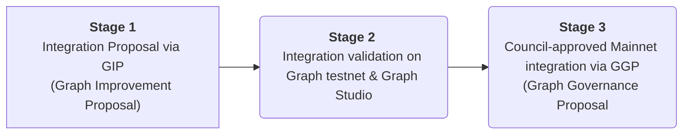

# Abstract

This GIP proposes a  governance-based approach for new blockchains to be integrated by the protocol and supported on The Graph Network mainnet.

# Motivation

Following the [MIPs (Migration Infrastructure Providers) program's](https://thegraph.com/migration-incentive-program/) success, The Graph Foundation proposes a new governance-based approach for new chains to be integrated into the protocol and supported on mainnet. Given the protocol is blockchain-agnostic, and we’re entering a new [world of data services](https://forum.thegraph.com/t/gip-0042-a-world-of-data-services/3761), adopting a more open, transparent, and scalable process is necessary. In addition, as the protocol’s mission is to allow anyone to index and access the world’s data in a decentralized, verifiable, and performant way, onboarding new blockchains must also be as open, decentralized, and transparent as possible. 

For this reason, this GIP proposes a lightweight process targeting teams seeking protocol integration (integrators) for decentralized access to new on-chain data sources. The GIP details how integrators would follow a governance-based 3-steps process for the new blockchain to be eligible for indexing rewards on The Graph’s decentralized network. Specific requirements can be found below. 

# High-Level Description

At a high level, the integration happens following a 3-stage process:

1. Integrators write a GIP and open a PR in [Graph Node](https://github.com/graphprotocol/graph-node).
2. The integration is tested and validated in both [Graph Studio](https://thegraph.com/studio/) and testnet.
3. The new blockchain is supported on Graph’s mainnet, pending Council approval and a successful Stage 2.

Mainnet support for a new `data source type`, such as a new blockchain, means, in the current state of the protocol, having the chain recognized by the Council, on mainnet, as a new `data source type` with detailed support for rewards and arbitration. This is defined in [GIP-0008](https://snapshot.org/#/council.graphprotocol.eth/proposal/0xbdd884654a393620a7e8665b4289201b7542c3ee62becfad133e951b0c408444) using the protocol’s [Feature Matrix Support](https://github.com/graphprotocol/indexer/blob/main/docs/feature-support-matrix.md). An example of a Council-ratified feature matrix [is here](https://snapshot.org/#/council.graphprotocol.eth/proposal/0xd40fe605ecc3d0faca07d6c8d85a3f0d66106ef9e206aa57397de776f0a76a2c). 

## Stages’ requirements

### Stage 1

An initial blockchain extraction and ingestion solution compliant with Graph Node’s protocol must exist. For Graph Node to ingest blockchain data, it must either connect to an **EVM JSON RPC API** or a **Firehose-enabled blockchain**. General documentation on this integration [can be found here](https://github.com/graphprotocol/docs/pull/433). EVM chains should start by [reviewing Graph Node requirements and doing a simple integration test](https://github.com/graphprotocol/docs/pull/433), which is the easiest way to ensure Graph Node compatibility. For non-EVM, a Firehose-enabled chain is required. Information on how to add Firehose support to a new chain [can be found here](https://github.com/graphprotocol/docs/pull/433). Firehose support is optional but highly recommended for [native substreams support](https://thegraph.com/docs/en/substreams/README/). 

Integrators must provide the open-sourced solution with documentation for Indexers and Developers and a subgraph showcasing the type of data Graph Node can ingest. This is the minimum information required for a first validation by core developers and community members like IndexerDAO. Additionally,  the documentation should also list minimum hardware requirements, the usual upgrade frequency of underlying nodes, and, if applicable, how Indexers may be notified of future planned hard-forks should they lead to breaking changes to the integration. 

If a Firehose implementation is non-existent, and the integrator or core developers of the underlying node do not want to build one, a GRP (Graph Requests for Proposals) should be shared in the Graph’s Forum. This way, community members could apply as lead developers and maintainers. To avoid fragmentation and potentially poorly maintained forks, the instrumentation of the blockchain’s node/client for Firehose support should happen on the recommended canonical node or client, with the help of core maintainers of such code facilitating upstream merging. 

### Stage 2

For ease of onboarding of users to the network, subgraph developers and consumers can currently deploy and consume subgraphs for free in a rate-limited environment through Graph Studio. This sandbox is often used for testing purposes (unsuitable for production environments) and is maintained by core developers of the protocol. To this end, integrators must ensure Graph Studio support for the new network by either:

1. Providing the backend required for subgraph indexing (endpoints to the implemented solution from Stage 1) free of charge.
2. Provide a grant for node operators. As with Stage 1, this should be done through a GRP (Graph Requests for Proposals) posted in The Graph’s Forum for anyone to apply. 

During this period, core developers and Indexers will benchmark the solutions’ stability and performance by syncing different subgraphs, and monitoring KPIs such as data freshness, node uptime, latency, and overall resource usage during stress tests. In addition, [POIs](https://thegraph.com/docs/en/network/indexing/#what-is-a-proof-of-indexing-poi) on testnet will be monitored to ensure 0% divergence, which is a hard requirement for the Council to approve support for indexing rewards on The Graph’s decentralized network.

### Stage 3

The last stage, supporting the new blockchain on mainnet with some level of support for arbitration and indexing reward, will come after a ratified GGP (Graph Governance Proposal) is posted on the [Graph’s Council snapshot page](https://snapshot.org/#/council.graphprotocol.eth). The GGP will follow the principles agreed upon in [GIP-008: Subgraph API Versioning and Feature Support](https://github.com/graphprotocol/graph-improvement-proposals/blob/main/gips/0008-subgraph-api-versioning-and-feature-support.md). 

Integrators must open a PR, updating the `[feature-matrix-support.md](http://feature-matrix-support.md)` [here](https://github.com/graphprotocol/indexer/blob/main/docs/feature-support-matrix.md). Afterward, the Graph Foundation will coordinate the creation of the GGP so the Council can vote and ratify the newly updated feature matrix, pending a successful Stage 2. The GGP vote may be preceded by a community poll, providing no rough consensus on readiness and value-added for the protocol. Core developers’ and Indexers’ confidence in the integration stability, performance, reliability, and overall demand (the focus of Stage 2) will provide the Council with the required information to determine how the new blockchain should be supported on mainnet.

## Summarized Requirements & Exit Criteria

| | Requirements | Exit Criteria |
| --- | --- | --- |
| Stage 1 |✓ GIP if Graph Node integration exists; GRP if otherwise. ✓ Open PRs in [Graph Node](https://github.com/graphprotocol/graph-node), [graph-ts](https://github.com/graphprotocol/graph-tooling/tree/main/packages/ts) and [graph-cli](https://github.com/graphprotocol/graph-tooling/tree/main/packages/cli) repositories. ✓ Open-sourced Firehose implementation, if applicable. ✓ Example subgraph with docs.`ᶜ` |→ Example subgraph syncs successfully. Chain's node and/or Firehose runs reliably`ᵃ`. → Docker and bare metal Indexer guides for Firehose stack and EVM RPC.`ᵇ` → Merged Stage 1 PRs. |
| Stage 2 |✓ Free of charge backend supporting Graph Studio integration or a grant for teams to operate such backend (GRP required for the latter).| → At least 2 subgraphs on Graph's testnet synced by >=5 Indexers.`ᵉ`  → 0% POI divergence`ᵃ` → Community validation on the integration.`ᵈ` → Graph Studio's integration uptime >99%.  |
| Stage 3  | GGP for mainnet integration | Council-approved GGP `` |

> _Notes_
> - `ᵃ` validated by IndexerDAO
> - `ᵇ` with the help of IndexerDAO
> - `ᶜ` reproducible deployment to Graph Node
> - `ᵈ` via a poll, if no rough consensus on the Forum
> - `ᵉ` to be deployed by IndexerDAO

# Dependencies

No engineering work is required to make this process work. However, a proper integration test suite will be required for Stages 1 and 2.

# Copyright Waiver

Copyright and related rights waived via [CC0](https://creativecommons.org/publicdomain/zero/1.0/).